# **Laporan Praktikum**
# **Jobseat 3 Array Of Objeck**

## **Data Mahasiswa**
><p>Nama : Alvian Nur Firdaus<p>
>Kelas : 1F<p>
>Prodi : D-IV Teknik Inormatika<p>
>Jurusan : Teknologi Inormasi<p>
>Politeknik Negri Malang
<br>

## 3.1 Tujuan Praktikum 
Setelah melakukan materi praktikum ini, mahasiswa mampu :

1. Memahami dan menjelaskan fungsi array yang berisikan variabel objek.
2. Mahasiswa mampu menangkap logika tentang permasalahan array of object dalam Java 
3. Mahasiswa mampu menerapkan pembuatan array of object dalam Java  

## 3.2 Membuat Array dari Object, Mengisi dan Menampilkan 
Didalam praktikum ini, kita akan mempraktekkan bagaimana membuat array dari object, kemudian mengisi dan menampilkan array tersebut.

## 3.2.1 Langkah-langkah Percobaan 

1. Buat Project baru, dengan nama “ArrayObjects”. Buat package dengan nama minggu3.<p>
    >membuat Project dengan nama ArrayObjects
    >>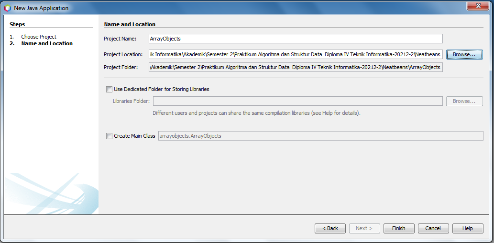
    >Membuat Package dengan nama minggu3
    >>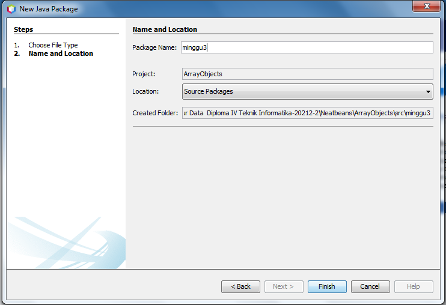

2. Buat class PersegiPanjang:
    >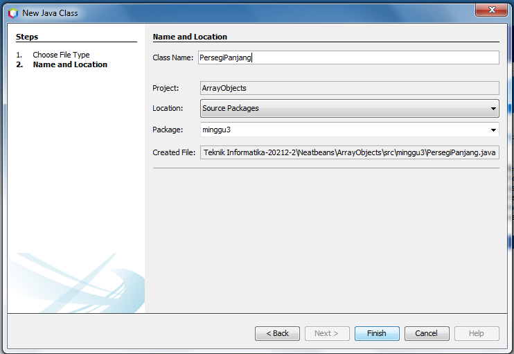<p>
    >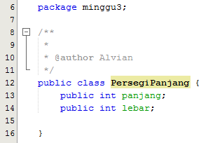

berikut adalah source codenya

```java
package minggu3;

/**
 *
 * @author Alvian
 */
public class PersegiPanjang {
    public int panjang;
    public int lebar;
    
}
```

3. Pada fungsi main yaitu pada class ArrayObjects, buatlah array PersegiPanjang yang berisi 3 elemen:
    >membuat class main <p>
    >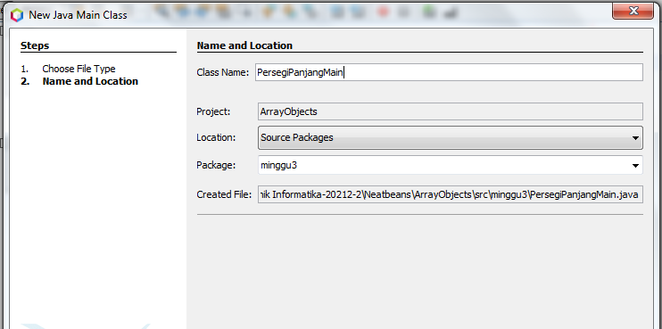
    >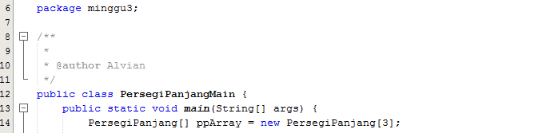
4. Kemudian isikan masing-masing atributnya: 
    >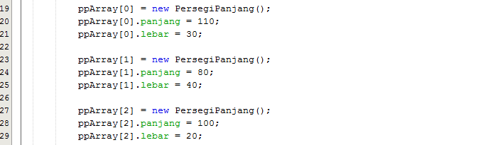

5. Cetak ke layar semua atribut dari objek ppArray:
    >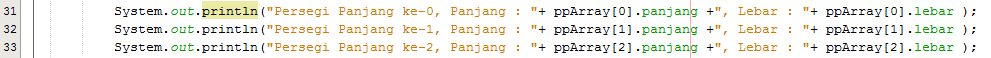

berikut adalah source kodenya

``` java
package minggu3;

/**
 *
 * @author Alvian
 */
public class PersegiPanjangMain {
    public static void main(String[] args) {
        PersegiPanjang[] ppArray = new PersegiPanjang[3];
        
        ppArray[0] = new PersegiPanjang();
        ppArray[0].panjang = 110;
        ppArray[0].lebar = 30;
        
        ppArray[1] = new PersegiPanjang();
        ppArray[1].panjang = 80;
        ppArray[1].lebar = 40;
        
        ppArray[2] = new PersegiPanjang();
        ppArray[2].panjang = 100;
        ppArray[2].lebar = 20;
        
        System.out.println("Persegi Panjang ke-0, Panjang : "+ ppArray[0].panjang +", Lebar : "+ ppArray[0].lebar );
        System.out.println("Persegi Panjang ke-1, Panjang : "+ ppArray[1].panjang +", Lebar : "+ ppArray[1].lebar );
        System.out.println("Persegi Panjang ke-2, Panjang : "+ ppArray[2].panjang +", Lebar : "+ ppArray[2].lebar );
    } 
}
```

6. Jalankan dan amati hasilnya.
    >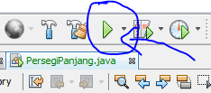

## 3.2.2 Verifikasi Hasil Percobaan 
Cocokkan hasil compile kode program anda dengan gambar berikut ini.

>setelah saya memasukkan source code diatas maka setelah saya  run keluar seperti gambar berikut ini, dan sama seperti yang ditampilkan pada jobseat
>>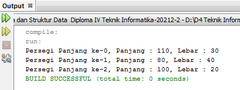

<br>

## 3.2.3 Pertanyaan 

1. Berdasarkan uji coba 3.2, apakah class yang akan dibuat array of object harus selalu memiliki atribut dan sekaligus method?Jelaskan!
    >**Jawab**<p>
    >Tidak selalu memiliki atribut dan method, karena pada uji coba 3.2 diatas yang wajib diisi hanyalah atributnya saja dan setelah dijalankan program tersebut tetap bisa dijalankan dan tampil output

2. Apakah class PersegiPanjang memiliki konstruktor?Jika tidak, kenapa dilakukan pemanggilan konstruktur pada baris program berikut :<p>
    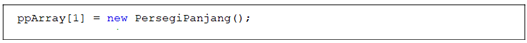<p>

    >**Jawab**<p>
    >Tidak memiliki konstruktor, karena jika itu tidak dilakukan maka akan memunculkan erorr NullPointerException pada saat program dijalankan. Hal tersebut dikarenakan pada index ppArray ke-1, belum dbuat objeck PersegiPanjang

3. Apa yang dimaksud dengan kode berikut ini:<p>
    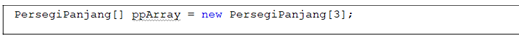<p>

    >**Jawab**<p>
    >kode diatas akan membuat array **ppArray** yang dapat menampung 3 objeckPersegiPanjang, namun perlu diperhatikan bahwa array tersebut masih kosong dan belum ada isinnya 

4. Apa yang dimaksud dengan kode berikut ini:<p>
    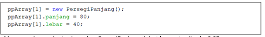<p>

    >**Jawab**<p>
    >kode diatas adalah lanjutan dari pembuatan array yang ada pada pertannyaan nomor 3, kode ini berfunsi untuk mengisikan sebuah persegi panjang pada array tersebut, dan membuat objecknya terlebih dahulu sepeti gambar pada nomor 4

5. Mengapa class main dan juga class PersegiPanjang dipisahkan pada uji coba 3.2?  
    >**Jawab**<p>
    >karena disaat class PersegiPanjang dan main class nya dipisahkan akan membuat sebuah source code tersebut lebih mudah diatur

<br>

## 3.3 Menerima Input Isian Array Menggunakan Looping 
Pada praktikum ini kita akan mengubah hasil program dari praktikum 3.2 sehingga program dapat menerima input dan menggunakan looping untuk mengisikan atribut dari semua persegi panjang yang ada di ppArray.

## 3.3.1 Langkah-langkah Percobaan 
1. Import scanner pada main class "persegi panjang" ArrayObjects.<p>
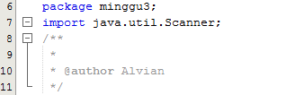<p>
Note: Letakkan kode import dibawah kode package.

2. Pada praktikum 3.2 poin nomor 4, ganti kodenya dengan kode berikut ini, yaitu membuat objek Scanner untuk menerima input, kemudian melakukan looping untuk menerima input:<p>
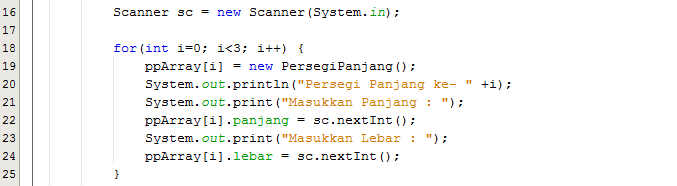<p>

3. Pada praktikum 3.2 poin nomor 5, ganti kodenya dengan berikut ini, yaitu melakukan looping untuk mengakses isi array ppArray dan menampilkannya ke layar:<p>
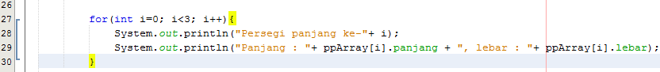<p>

berikut adalah source codenya

``` java
package minggu3;
import java.util.Scanner;
/**
 *
 * @author Alvian
 */
public class PersegiPanjangMain {
    public static void main(String[] args) {
        PersegiPanjang[] ppArray = new PersegiPanjang[3];
        
        Scanner sc = new Scanner(System.in);
        
        for(int i=0; i<3; i++) {
            ppArray[i] = new PersegiPanjang();
            System.out.println("Persegi Panjang ke- " +i);
            System.out.print("Masukkan Panjang : ");
            ppArray[i].panjang = sc.nextInt();
            System.out.print("Masukkan Lebar : ");
            ppArray[i].lebar = sc.nextInt();
        }
        
        for(int i=0; i<3; i++){
            System.out.println("Persegi panjang ke-"+ i);
            System.out.println("Panjang : "+ ppArray[i].panjang + ", lebar : "+ ppArray[i].lebar);
        }
    } 
}
```
4. Jalankan dan amati hasilnya.<p>
<p>

## 3.3.2 Verifikasi Hasil Percobaan 
Contoh verifikasi hasil percobaan ini.

>setelah saya melakukan run hasil yang didapatkan sama persis seperti yang ada di jobseat
>>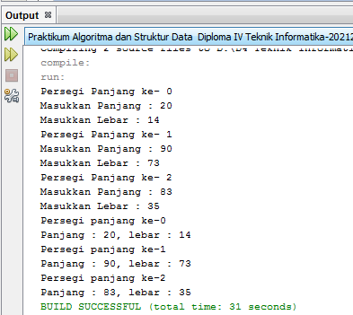

<br>

## 3.3.3 Pertanyaan 
1. Apakah array of object dapat diimplementasikan pada array 2 Dimensi?
    >**Jawab**<p>
    >iya / dapat, karena sesuai dengan namannya yaitu "Array of object" ada kata "array" dan array tersebut memiliki jenis :
    > - array 1 dimensi
    > - array 2 dimensi<p>
    >
    > jadi mengacu pada kalimat tersebut array of object dpat diemplementasikan pada array 2 dimensi<p>

2. Jika jawaban soal no satu iya, berikan contohnya! Jika tidak, jelaskan!
    >**Jawab**<p>
    >array of object dapat juga digunakan pada array 2 dimensi, penggunaan array 2 dimensi pada array of object kurang lebih sama seperti membuat array 2 dimensi pada umumnya, seperti pada contoh berikut ini<p>

membuat class DuaDimensi
``` java
package Pertanyan;

/**
 *
 * @author Alvian
 */
public class DuaDimensi {
    public int nilai;
}
``` 
membuat main class DuaDimensiMain
```java
package Pertanyan;

/**
 *
 * @author Alvian
 */
public class DuaDimensiMain {

    /**
     * @param args the command line arguments
     */
    public static void main(String[] args) {
        DuaDimensi[][] dua = new DuaDimensi[2][2];

        dua[0][0] = new DuaDimensi();
        dua[0][0].nilai = 80;
        
        dua[0][1] = new DuaDimensi();
        dua[0][1].nilai = 90;
        
        dua[1][0] = new DuaDimensi();
        dua[1][0].nilai = 85;
        
        dua[1][1] = new DuaDimensi();
        dua[1][1].nilai = 89;
        
        System.out.println("Contoh implementasinya");
        System.out.println("Nilai kuis 1 daspro "+dua[0][0].nilai);
        System.out.println("Nilai kuis 2 daspro "+dua[0][1].nilai);
        System.out.println("Nilai kuis 1 ASD "+dua[1][0].nilai);
        System.out.println("Nilai kuis 2 ASD "+dua[1][1].nilai);
    }
}
```
menghasilkan output seperti berikut ini<p>
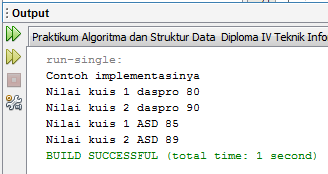

3. Jika diketahui terdapat class Persegi yang memiliki atribut sisi bertipe integer, maka kode dibawah ini akan memunculkan error saat dijalankan. Mengapa?<p>

    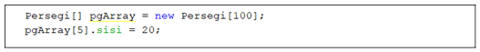 

    >**Jawab**<p>
    >karena tidak ada Deklarasi dan Instansiasi Array Of Object pada program tersebut sehingga menghasilkan eror 

4. Modifikasi kode program pada praktikum 3.3 agar length array menjadi inputan dengan Scanner! 
    >**Jawab**<p>

berikut adalah kode modifikasinya
``` java
package minggu3;
import java.util.Scanner;
/**
 *
 * @author Alvian
 */
public class PersegiPanjangMain {
    public static void main(String[] args) {
        Scanner sc = new Scanner(System.in);
        System.out.print("Masukkan Jumlah Persegi Panjang yang akan dihitung : ");
        int a = sc.nextInt();
        PersegiPanjang[] ppArray = new PersegiPanjang[a];
        System.out.println();
        
        for(int i=0; i<a; i++) {
            ppArray[i] = new PersegiPanjang();
            System.out.println("Persegi Panjang ke -" +i);
            System.out.print("Masukkan Panjang\t: ");
            ppArray[i].panjang = sc.nextInt();
            System.out.print("Masukkan Lebar \t\t: ");
            ppArray[i].lebar = sc.nextInt();
        }
        
        System.out.println();
        for(int i=0; i<a; i++){
            System.out.println("Persegi panjang ke-"+ i);
            System.out.println("Panjang : "+ ppArray[i].panjang + ", lebar : "+ ppArray[i].lebar);
        }
    } 
}
```

berikut hasil outputan modifikasinya<p>
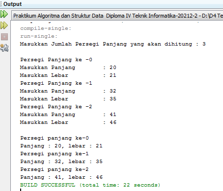 

5. Apakah boleh Jika terjadi duplikasi instansiasi array of objek, misalkan saja instansiasi dilakukan pada ppArray[i] sekaligus ppArray[0]?Jelaskan ! 
    >**Jawab**<p>
    >Tidak bisa, karena kedua nilai nya akan menjadi berbeda 

<br>

## 3.4 Operasi Matematika 
Atribut Object Array Pada praktikum ini kita akan melakukan pengoperasian matematika beberapa atribut pada masing-masing anggota array. 

## 3.4.1 Langkah-langkah Percobaan 
1. Buat package baru “ArrayBalok”.<p>
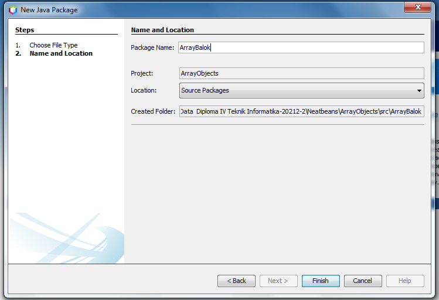

2. Buat class Balok:<p> 


``` java
package ArrayBalok;

/**
 *
 * @author Alvian
 */
public class Balok {
    public int panjang;
    public int lebar;
    public int tinggi;
    
    public Balok(int p, int l, int t){
        panjang = p;
        lebar = l;
        tinggi = t;
    }
    public int hitungVolume(){
        return panjang * lebar * tinggi;
    }
}
```

3. Pada fungsi main yaitu pada class ArrayBalok, buat array Balok yang berisi 3 elemen:<p>
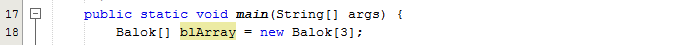

4. Kemudian tambahkan kode berikut ini untuk mengisi array blArray menggunakan konstruktor dari class Balok:<p>
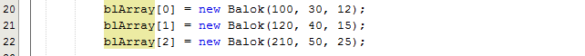

5. Tampilkan semua volume balok tersebut dengan cara memanggil method hitungVolume() di dalam looping seperti berikut ini:<p>
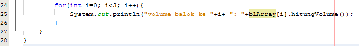

berikut adalah source code nya


6. Jalankan dan amati hasilnya.<p>
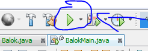

## 3.4.2 Verifikasi Hasil Percobaan
Cocokkan hasil compile kode program anda dengan gambar berikut ini.

## 3.4.3 Pertanyaan 
1. Dapatkah konstruktor berjumlah lebih dalam satu kelas? Jelaskan dengan contoh! 
    >**Jawab**<p>
    >Dapat, karena java mengijinkan lebih dari satu konstruktor (overloading) untuk setiap class, salah satu konstruktor yang ada, pasti akan dieksekusi pada saat pertama kali instance dari suatu class (new). konstruktor mana yang dipanggil dari parameter yang dilewatkan<p>
    >berikut adalah contoh penggunaan constructor overloading
```java
public class lagu {
    private String judul;
    private String penyanyi;
    
    public lagu(){
        judul = "Mars Polinema";
        penyanyi = "mahasiswa 1F";
    }
    public lagu(String judul){
        this.judul = judul;
        penyanyi = "mahasiswa 1F";
    }
}
```
    
2. Jika diketahui terdapat class Segitiga seperti berikut ini:,<p>
    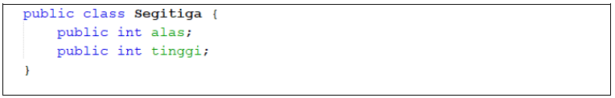<p>
    Tambahkan konstruktor pada class Segitiga tersebut yang berisi parameter int a, int t yang masing-masing digunakan untuk mengisikan atribut alas dan tinggi.<p>
    >**Jawab**<p>
    >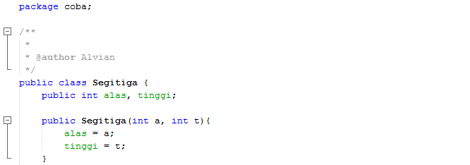<p>

3. Tambahkan method hitungLuas() dan hitungKeliling() pada class Segitiga tersebut. 
    >**Jawab**<p>
    >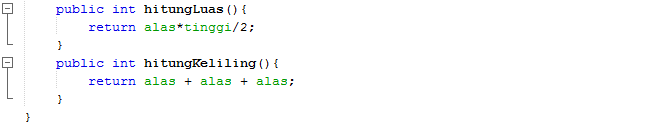<p>

4. Pada fungsi main, buat array Segitiga sgArray yang berisi 4 elemen, isikan masing-masing atributnya sebagai berikut:<p>
    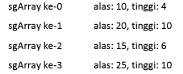<p>

    >**Jawab**<p>
    >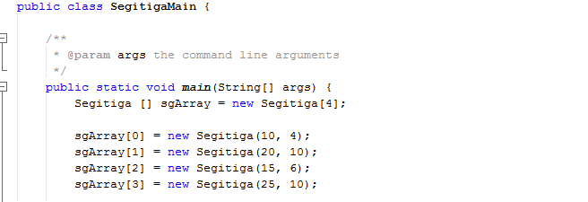<p>

5. Kemudian menggunakan looping, cetak luas dan keliling dengan cara memanggil method hitungLuas() dan hitungKeliling(). 
    >**Jawab**<p>
    >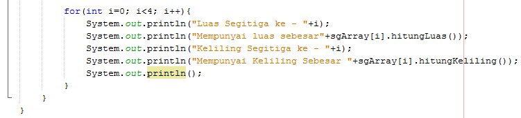<p>
    >output<p>
    >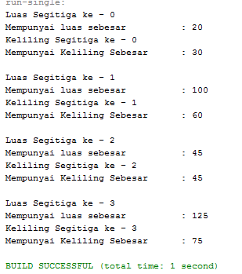<p>

<br>

## 3.5 Latihan Praktikum 
1. Buatlah program yang dapat menghitung luas permukaan dan volume beberapa bangun ruang (minimal 3, jenis bangun luas bebas). Buatlah 3 (tiga) class sesuai dengan jumlah jenis bangun ruang. Dan buat satu main class untuk membuat array of objek yang menginputkan atribut-atribut yang ada menggunakan konstruktor semua bangun ruang tersebut.  Keterangan : Buat looping untuk menginputkan masing-masing atributnya, kemudian tampilkan luas permukaan dan volume dari tiap jenis bangun ruang tersebut.<p>
    >**Jawab**<p>
    membuat class "Prisma"
    ```java
    package Latihan1;
    /**
    *
    * @author Alvian
    */
    public class Prisma {
        public int panjang, lebar, tinggi;
    
            int luasPermukaanPrisma(){
                return 2*(panjang*lebar)+2*(panjang+lebar)*tinggi;
            }
            int volume(){
                return panjang*lebar*tinggi;
            }
        }
    }
    ```
    >membuat class "Kerucut"<p>
    ```java
    package Latihan1;

    /**
    *
    * @author Alvian
    */
    public class Kerucut {
        public int jariJari, tinggi, garisPelukis;
    
        double luasPermukaanKerucut(){
            return 3.14*jariJari*(jariJari+garisPelukis);
        }
        double volume(){
            return 1/(float)3*3.14*jariJari*jariJari*tinggi;
        }
    }
    ```
    >membuat class "Limas Segi Empat"<p>
    ```java
    package Latihan1;

    /**
    *
    * @author Alvian
    */
    public class LimasSegiEmpat {
        public int panjangLimas, tinggiLimas, lebarLimas,   alasLimas;
    
        public int luasPermukaanLimas(){
            return (panjangLimas*lebarLimas) + 4*(alasLimas*tinggiLimas/2);
        }
        public int volumeLimas(){
            return (panjangLimas*lebarLimas)/3*tinggiLimas;
        }
    }
    ```
    >membuat main class "BangunRuang"<p>
    ```java
    package Latihan1;
    import java.util.Scanner;
    /**
    *
    * @author Alvian
    */
    public class BangunRuangMain {

    /**
     * @param args the command line arguments
     */
    public static void main(String[] args) {
        System.out.println("-----Sistem Menghitung Bangun Ruang------\n");
        Scanner sc = new Scanner (System.in);
        System.out.print("Masukkan Jumlah Prisma yang akan dihitung : ");
        int prisma = sc.nextInt();
        Prisma [] prm = new Prisma [prisma];
        System.out.println();
        
            for(int i=0; i<prisma; i++){
                prm[i] = new Prisma();
                System.out.println("Masukkan inputan Prisma ke- "+(i+1));
                System.out.print("Masukkan Panjang Prisma\t\t\t: ");
                prm[i].panjang = sc.nextInt();
                System.out.print("Masukkan Lebar Prisma\t\t\t: ");
                prm[i].lebar = sc.nextInt();
                System.out.print("Masukkan Tinggi Prisma\t\t\t: ");
                prm[i].tinggi = sc.nextInt();
                System.out.println();
            }
            for(int i=0; i<prisma; i++){
                System.out.println("Hasil Menghitung Prisma ke - "+(i+1));
                System.out.println("Luas Permukaan Prisma Tersebut adalah\t : "+prm[i].luasPermukaanPrisma());
                System.out.println("Volume Prisma Tersebut adalah\t\t : "+prm[i].volume());
                System.out.println();
            }
            System.out.print("Masukkan Jumlah Kerucut yang akan dihitung : ");
            int kerucut = sc.nextInt();
            Kerucut [] krc = new Kerucut [kerucut];
            System.out.println();
        
            for(int i=0; i<kerucut; i++){
                krc[i] = new Kerucut();
                System.out.println("Masukkan inputan Kerucut ke- "+(i+1));
                System.out.print("Masukkan Jari-jari kerucut\t\t: ");
                krc[i].jariJari = sc.nextInt();
                System.out.print("Masukkan Tinggi Kerucut\t\t\t: ");
                krc[i].tinggi = sc.nextInt();
                System.out.print("Masukkan Garis Pelukis Kerucut\t\t: ");
                krc[i].garisPelukis = sc.nextInt();
                System.out.println();
            }
            for(int i=0; i<kerucut; i++){
                System.out.println("Hasil Menghitung Kerucut ke - "+(i+1));
                System.out.println("Luas Permukaan Kerucut Tersebut adalah\t : "+krc[i].luasPermukaanKerucut());
                System.out.println("Volume Kerucut Tersebut adalah\t\t : "+krc[i].volume());
                System.out.println();
            }
            System.out.print("Masukkan Jumlah Limas Persegi yang akan dihitung : ");
            int limasPersegi = sc.nextInt();
            LimasSegiEmpat [] lms = new LimasSegiEmpat [limasPersegi];
            System.out.println();
        
            for(int i=0; i<kerucut; i++){
                lms[i] = new LimasSegiEmpat();
                System.out.println("Masukkan inputan Limas Segi Empat ke- "+(i+1));
                System.out.print("Masukkan Panjang limas segi empat\t: ");
                lms[i].panjangLimas = sc.nextInt();
                System.out.print("Masukkan Tinggi limas segi empat\t: ");
                lms[i].tinggiLimas = sc.nextInt();
                System.out.print("Masukkan Lebar limas segi empat\t\t: ");
                lms[i].lebarLimas = sc.nextInt();
                System.out.print("Masukkan Alas limas segi empat\t\t: ");
                lms[i].alasLimas = sc.nextInt();
                System.out.println();
            }
            for(int i=0; i<kerucut; i++){
                System.out.println("Hasil Menghitung Limas Segi empat ke - "+(i+1));
                System.out.println("Luas Permukaan Kerucut Tersebut adalah\t : "+lms[i].luasPermukaanLimas());
                System.out.println("Volume Kerucut Tersebut adalah\t\t : "+lms[i].volumeLimas());
                System.out.println();
            }
        }
    }
    ```
    >Hasil Output Latihan 1<p>
    >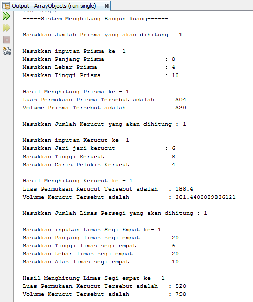<p>


<br>

2. Sebuah perusahaan jual beli tanah membutuhkan sebuah program yang dapat memberitahu luas tanah. Program tersebut dapat menerima input jumlah tanah yang akan dihitung dan atribut panjang dan lebar masing-masing dari tanah yang diinputkan. Program dapat menampilkan luas tanah masing-masing tanah yang diinputkan tadi dan juga tanah terluas dari ketiga tanah yang ada.

    >**Jawab**<p>
    membuat class "Latihan2"
    ```java
    package Latihan2;
    /**
    *
    * @author Alvian
    */
    public class Latihan2 {
        public int tanah, panjang, lebar;
        
        public int hitungLuasTanah(){
            return panjang*lebar;
        }
    }
    ```
    >membuat main class "Latihan2Main"
    ```java
    package Latihan2;
    import java.util.Scanner;
    /**
    *
    * @author Alvian
    */
    public class Latihan2Main {
        /**
        * @param args the command line arguments
        */
        public static void main(String[] args) {
            Scanner sc = new Scanner(System.in);
            System.out.println("-------Sistem Jual Beli Tanah------\n");
            System.out.print("Masukkan Jumlah Tanah\t: ");
            int tanah = sc.nextInt();
            Latihan2[] alv2 = new Latihan2 [tanah];
        
            System.out.println();
        
            for(int i=0; i<tanah; i++){
                alv2[i] = new Latihan2();
                System.out.println("Tanah ke - "+(i+1));
                System.out.print("Panjang\t\t: ");
                alv2[i].panjang = sc.nextInt();
                System.out.print("Lebar\t\t: ");
                alv2[i].lebar = sc.nextInt();
                System.out.println();
            }
            int terluas = 0;
            int taterLuas = 0;
            for(int i=0; i<tanah; i++){
                System.out.println("Luas Tanah "+(i+1)+"\t: "+alv2[i].hitungLuasTanah());
                if(alv2[i].hitungLuasTanah()>terluas){
                    terluas=alv2[i].hitungLuasTanah();
                    taterLuas=i;
                }
            }System.out.println("Tanah Terluas\t: "+"Tanah"+(taterLuas+1));
        }
    }
    ```
    >Hasil Output Latihan2<p>
    >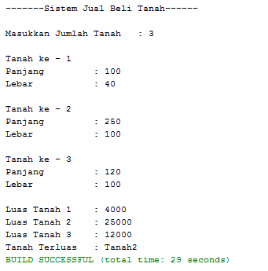<p>

<br>

3. Sebuah kampus membutuhkan program untuk menampilkan informasi mahasiswa berupa nama, nim, jenis kelamin dan juga IPK mahasiswa. Program dapat menerima input semua informasi tersebut, kemudian menampilkanya kembali ke user. Implementasikan program tersebut jika dimisalkan terdapat 3 data mahasiswa yang tersedia. <p>

    >**Jawab**<p>
    membuat class "Latihan3"
    ```java
    package Latihan3;
    /**
    *
    * @author Alvian
    */
    public class Latihan3 {
        public String nama, jenisKelamin;
        public int nim;
        public double ipk;
    }
    ```
    >membuat main class "Latihan3Main"
    ```java
    package Latihan3;
    import java.util.Scanner;
    /**
    *
    * @author Alvian
    */
    public class Latihan3Main {
        /**
        * @param args the command line arguments
        */
        public static void main(String[] args) {
            Scanner sc = new Scanner(System.in);
            Scanner sd = new Scanner(System.in);
            Scanner se = new Scanner(System.in);
            Latihan3 [] alv3 = new Latihan3[3];
            
            System.out.println("------SIAKAD POLINEMA------");
            for(int i=0; i<3; i++){
                alv3[i]= new Latihan3();
                System.out.println("Masukkan data Mahasiswa ke - "+(i+1));
                System.out.print("Masukkan Nama\t\t: ");
                alv3[i].nama = sc.nextLine();
                System.out.print("Masukkan Nim\t\t: ");
                alv3[i].nim = sd.nextInt();
                System.out.print("Masukkan Jenis Kelamin\t: ");alv3[i].jenisKelamin = sc.nextLine();
                System.out.print("Masukkan IPK\t\t: ");
                alv3[i].ipk = se.nextDouble();
                System.out.println();
            }
            System.out.println();
            for(int i=0; i<3; i++){
                System.out.println("Data Mahasiswa ke - "+(i+1));
                System.out.println("Nama\t\t: "+alv3[1].nama);
                System.out.println("Nim\t\t: "+alv3[i].nim);
                System.out.println("Jenis Kelamin\t: "+alv3[i].jenisKelamin);
                System.out.println("Nilai IPK\t: "+alv3[i].ipk);
                System.out.println();
            }
        }
    }
    ```
    >Hasil Output Latihan3<p>
    >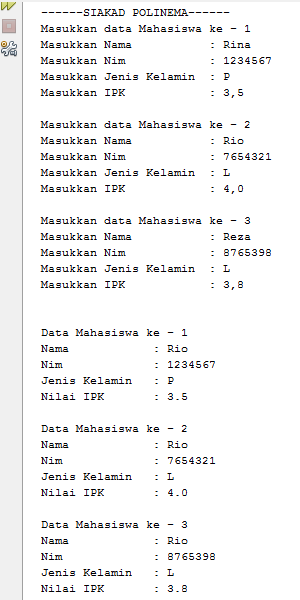<p>


-------------TERIMA KASIH------------------
