# **Laporan Praktikum**
# **Jobseat 8 QUEUE**

## **Data Mahasiswa**
><p>Nama : Alvian Nur Firdaus<p>
>Kelas : 1F<p>
>Prodi : D-IV Teknik Inormatika<p>
>Jurusan : Teknologi Inormasi<p>
>Politeknik Negri Malang

<br>

## **8.1 Tujuan Praktikum**
Setelah melakukan materi praktikum ini, mahasiswa mampu:
1. Mengenal struktur data Queue
2. Membuat dan mendeklarasikan struktur data Queue
3. Menerapkan algoritma Queue dengan menggunakan array

<br>

## **8.2 Praktikum 1**
Waktu percobaan : 45 menit<p>
Pada percobaan ini, kita akan mengimplementasikan penggunaan class Queue.<p>

<br>

### **8.2.1 Langkah-langkah Percobaan**
1. Perhatikan Diagram Class queue berikut ini:<p>
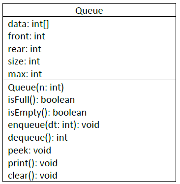<p>
Berdasarkan diagram class tersebut, akan dibuat program class Queue dalam Java.<p>

2. Buat package dengan nama Praktikum1, kemudian buat class baru dengan nama Queue.<p>
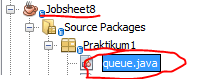<p>

3. Tambahkan atribut-atribut Queue sesuai diagram class, kemudian tambahkan pula konstruktornya seperti gambar berikut ini.<p>
    ```java
    package Praktikum1;
    /**
    *
    * @author Alvian
    */
    public class queue {
        int max, size, front, rear, data[];
    
        public queue(int n){
            max = n;
            data = new int [max];
            size = 0;
            front = rear = -1;
        }
    ```

4. Buat method IsEmpty bertipe boolean yang digunakan untuk mengecek apakah queue kosong.<p>

    ```java
    public boolean IsEmpty(){
        if(size == 0){
            return true;
        }else{
            return false;
        }
    }
    ```

5. Buat method IsFull bertipe boolean yang digunakan untuk mengecek apakah queue sudah penuh.<p>
    
    ```java
    public boolean IsFull(){
        if(size == max){
            return true;
        }else {
            return false;
        }
    }
    ```

6. Buat method peek bertipe void untuk menampilkan elemen queue pada posisi paling depan.<p>
    ```java
    public void peek(){
        if(!IsEmpty()){
            System.out.println("Elemen terdepan : "+data[front]);
        }else{
            System.out.println("Queue masih kosong");
        }
    }
    ```
7. Buat method print bertipe void untuk menampilkan seluruh elemen pada queue mulai dari posisi front sampai dengan posisi rear.<p>
    ```java
    public void print(){
        if(IsEmpty()){
            System.out.println("Queue masih kosong");
        }else {
            int i = front;
            while(i != rear){
                System.out.println(data[i] + " ");
                i = (i + 1) % max;
            }
            System.out.println(data[i] + " ");
            System.out.println("Jumlah elemen = "+ size);
        }
    }
    ```
8. Buat method clear bertipe void untuk menghapus semua elemen pada queue<p>
    ```java
    public void clear(){
        if(!IsEmpty()){
            front = rear = -1;
            size = 0;
            System.out.println("queue berhasil dikosongkan");
        }else{
            System.out.println("Queue masih kosong");
        }
    }
    ```
9. Buat method Enqueue bertipe void untuk menambahkan isi queue dengan parameter dt yang bertipe integer<p>
    ```java
    public void enqueue(int dt){
        if(IsFull()){
            System.out.println("Queue sudah penuh");
        }else{
            if(IsEmpty()){
                front = rear = 0;
            }else{
                if (rear == max -1){
                    rear = 0;
                }else{
                    rear++;
                }
            }
            data[rear] = dt;
            size++;
        }
    }
    ```
10. Buat method Dequeue bertipe int untuk mengeluarkan data pada queue di posisi belakang<p>
    ```java
    public int dequeue(){
        int dt = 0;
        if(IsEmpty()){
            System.out.println("Queue masih kosong");
        }else{
            dt = data[front];
            size--;
            if(IsEmpty()){
                front = rear = -1;
            }else{
                if(front == max -1){
                    front = 0;
                }else{
                    front++;
                }
            }
        }
        return dt;
    }
    ```
11. Selanjutnya, buat class baru dengan nama QueueMain tetap pada package Praktikum1. Buat method menu bertipe void untuk memilih menu program pada saat dijalankan.<p>
    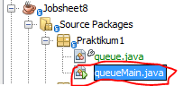<p>
    ```java
    import java.util.Scanner;
    /**
    *
    * @author Alvian
    */
    public class queueMain {
        /**
        * @param args the command line arguments
        */
        public static void menu(){
            System.out.println("\nMasukkan Operasi yang diinginkan ");
            System.out.println(" 1. Enqueue\n 2. Dequeue\n 3. Print\n 4. Peek\n 5. Clear\n 0. Exit");
            System.out.println("-----------------------------------");
        
        }
    ```
12. Buat fungsi main, kemudian deklarasikan Scanner dengan nama sc.<p>
    ```java
    public static void main(String[] args) {
        Scanner sc = new Scanner(System.in);
    ```
13. Buat variabel n untuk menampung masukan berupa jumlah maksimal elemen yang dapat disimpan pada queue.<p>
    ```java
    public static void main(String[] args) {
        Scanner sc = new Scanner(System.in);
        
        System.out.print("Masukkan kapasitas queue : ");
        int n = sc.nextInt();
    ```

14. Lakukan instansiasi objek Queue dengan nama Q dengan mengirimkan parameter n sebagai kapasitas elemen queue
    ```java
    public static void main(String[] args) {
        Scanner sc = new Scanner(System.in);
        
        System.out.print("Masukkan kapasitas queue : ");
        int n = sc.nextInt();
        
        queue Q = new queue(n);
    ```
15. Deklarasikan variabel dengan nama pilih bertipe integer untuk menampung pilih menu dari pengguna.<p>
    ```java
    public static void main(String[] args) {
        Scanner sc = new Scanner(System.in);
        
        System.out.print("Masukkan kapasitas queue : ");
        int n = sc.nextInt();
        
        queue Q = new queue(n);
        
        int pilih;
    ```

16. Lakukan perulangan menggunakan do-while untuk menjalankan program secara terus menerus sesuai masukan yang diberikan. Di dalam perulangan tersebut, terdapat pemilihan kondisi menggunakan switch-case untuk menjalankan operasi queue sesuai dengan masukan pengguna.<p>
    
    ```java
        do{
            menu();
            pilih = sc.nextInt();
            switch (pilih){
                case 1:
                    System.out.print("Masukkan data baru : ");
                    int dataMasuk = sc.nextInt();
                    Q.enqueue(dataMasuk);
                    break;
                case 2:
                    int dataKeluar = Q.dequeue();
                    if (dataKeluar != 0){
                        System.out.println("Data yang dikeluarkan : "+ dataKeluar);
                        break;
                    }
                case 3:
                    Q.print();
                    break;
                case 4:
                    Q.peek();
                    break;
                case 5:
                    Q.clear();
                    break;
            }
        }while (pilih == 1 || pilih == 2 || pilih == 3 || pilih == 4 || pilih == 5);
    }
    ```
17. Compile dan jalankan class QueueMain, kemudian amati hasilnya.

<br>

### **8.2.2 Verifikasi Hasil Percobaan**
Setelah saya melakukan RUN kode program diatas didapatkan hasil run sama seperti di Jobseat, menandakan sudah berhasil<p>

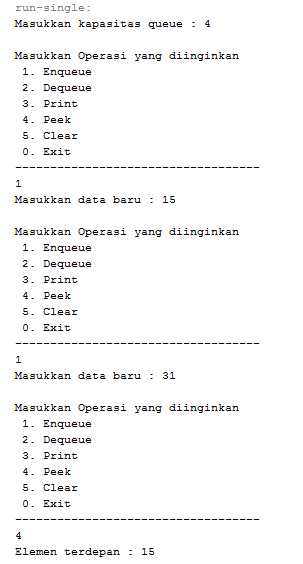<p>

<br>

### **8.2.3 Pertanyaan**
1. Pada konstruktor, mengapa nilai awal atribut front dan rear bernilai -1, sementara atribut size bernilai 0?<p>
    >**Jawab**<p>
    >- atribut front dan rear bernilai -1,dimaksutkan untuk menunjukkan bahwa sizenya masih dalam konsisi kosong/0,<p>
    >- tribut size bernilai 0, Karena setiap array di mulai dari indexs ke 0,<p>

2. Pada method Enqueue, jelaskan maksud dan kegunaan dari potongan kode berikut!<p>
    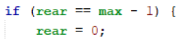<p>
    > **Jawab**<p>
    >potongan kode tersebut berguna untuk jika rear/data berada pada posisi max-1/indexs terakhir dari array, maka disaat ada penambahan data baru, maka akan di tempatkan pada index ke -0.

3. Pada method Dequeue, jelaskan maksud dan kegunaan dari potongan kode berikut!<p>
    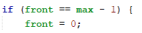<p>
    >**Jawab**<p>
    >potongan kode tersebut berguna untuk jika front berada pada posisi max-1 atau indexs terakhir dari array, maka disaat ada penambahan data baru, maka akan di tempatkan pada index ke -0.

4. Pada method print, mengapa pada proses perulangan variabel i tidak dimulai dari 0 (int i=0), melainkan int i=front?<p>
    > **Jawab**<p>
    >Karena posisi front atau data terdepan tidak selalu pada indeks ke-0, sedangkan perulangan dimulai dengan posisi frontnya<p>

5. Perhatikan kembali method print, jelaskan maksud dari potongan kode berikut!<p>
    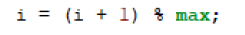<p>
    > **Jawab**<p>
    >maksud dari kode tersebut adalah, nilai i(front) jika tidak berposisi sebagai rear, maka akan dilakukan penambahan pada variable tersebut lalu akan dimodulus dengan nilai max atau kapasitas dari Queue tersebut. Gunanya untuk mencegah melakukan print melebihi max, sehingga di lakukan modulo max<p>

6. Tunjukkan potongan kode program yang merupakan queue overflow!<p>
    > **Jawab**<p>
    >berikut adalah potongan kode program queue overflow<p>
    ```java
    public void enqueue(int dt){
        if(IsFull()){
            System.out.println("Queue sudah penuh");
    ```
    >berikut adalah potongan kode program queue underflow<p>
    ```java
    public int dequeue(){
        int dt = 0;
        if(IsEmpty()){
            System.out.println("Queue masih kosong");
    ```

7. Pada saat terjadi queue overflow dan queue underflow, program tersebut tetap dapat berjalan dan hanya menampilkan teks informasi. Lakukan modifikasi program sehingga pada saat terjadi queue overflow dan queue underflow, program dihentikan!<p>
    > **Jawab**<p>
    >saya melakukan modifikasi pada class "queue" seperti berikut ini dengan menambhakan potongan kode berikut pada Queue overflow dan Queue underflow<p>
    ```java
    package Praktikum1;
    /**
    *
    * @author Alvian
    */
    public class queue {
        int max, size, front, rear, data[];
    
        public queue(int n){
            max = n;
            data = new int [max];
            size = 0;
            front = rear = -1;
        }
        public boolean IsEmpty(){
            if(size == 0){
                return true;
            }else{
                return false;
            }
        }
        public boolean IsFull(){
            if(size == max){
                return true;
            }else {
                return false;
            }
        }
        public void peek(){
            if(!IsEmpty()){
                System.out.println("Elemen terdepan : "+data[front]);
            }else{
                System.out.println("Queue masih kosong");
            }
        }
        public void print(){
            if(IsEmpty()){
                System.out.println("Queue masih kosong");
            }else {
                int i = front;
                while(i != rear){
                    System.out.println(data[i] + " ");
                    i = (i + 1) % max;
                }
                System.out.println(data[i] + " ");
                System.out.println("Jumlah elemen = "+ size);
            }
        }
        public void clear(){
            if(!IsEmpty()){
                front = rear = -1;
                size = 0;
                System.out.println("queue berhasil dikosongkan");
            }else{
                System.out.println("Queue masih kosong");
            }
        }
        public void enqueue(int dt){
            if(IsFull()){
                System.out.println("Queue sudah penuh");
                System.exit(0);
            }else{
                if(IsEmpty()){
                    front = rear = 0;
                }else{
                    if (rear == max -1){
                        rear = 0;
                    }else{
                        rear++;
                    }
                }
                data[rear] = dt;
                size++;
            }
        }
        public int dequeue(){
            int dt = 0;
            if(IsEmpty()){
                System.out.println("Queue masih kosong");
                System.exit(0);
            }else{
                dt = data[front];
                size--;
                if(IsEmpty()){
                    front = rear = -1;
                }else{
                    if(front == max -1){
                        front = 0;
                    }else{
                        front++;
                    }
                }
            }
            return dt;
        }
    }
    ```
    >output jika overflow (maka program akan berhenti)<p>
    >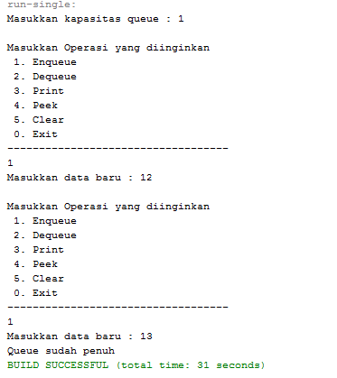<p>
    >output jika underflow (maka program akan berhenti)<p>
    >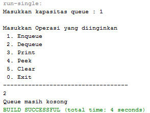<p>

<br>

## **8.3 Praktikum 2**
Waktu percobaan : 45 menit<p>
Pada percobaan ini, kita akan membuat program yang mengilustrasikan teller di bank dalam melayani nasabah.<p>

<br>

### **8.3.1 Langkah-langkah Percobaan**
1. Perhatikan Diagram Class berikut ini:<p>
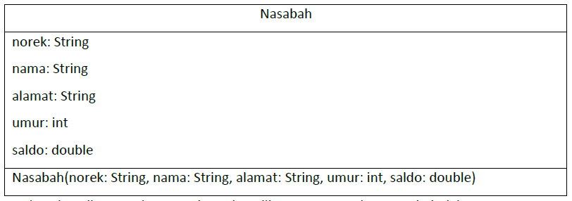<p>
Berdasarkan diagram class tersebut, akan dibuat program class Nasabah dalam Java.<p>

2. Buat package dengan nama Praktikum2, kemudian buat class baru dengan nama Nasabah.<p>
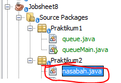<p>

3. Tambahkan atribut-atribut Nasabah seperti pada Class Diagram, kemudian tambahkan pula konstruktornya seperti gambar berikut ini.<p>
    ```java
    package Praktikum2;
    /**
    *
    * @author Alvian
    */
    public class nasabah {
        String norek, nama, alamat;
        int umur;
        double saldo;
    
        nasabah(String norek, String nama, String alamat, int umur, double saldo){
            this.norek = norek;
            this.nama = nama;
            this.alamat = alamat;
            this.umur = umur;
            this.saldo = saldo;
        }
    ```

4. Salin kode program class Queue pada Praktikum 1 untuk digunakan kembali pada Praktikum 2 ini. Karena pada Praktikum 1, data yang disimpan pada queue hanya berupa array bertipe integer, sedangkan pada Praktikum 2 data yang digunakan adalah object, maka perlu dilakukan modifikasi pada class Queue tersebut.<p>
    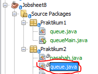<p>

5. Lakukan modifikasi pada class Queue dengan mengubah tipe int[] data menjadi Nasabah[] data karena pada kasus ini data yang akan disimpan pada queue berupa object Nasabah. Modifikasi perlu dilakukan pada atribut, method Enqueue, dan method Dequeue.<p>
    ```java
    package Praktikum2;
    /**
    *
    * @author Alvian
    */
    public class queue {
        nt max, size, front, rear;
        nasabah[] data;
    
        public queue(int n){
            max = n;
            data = new nasabah [max];
            size = 0;
            front = rear = -1;
        }
        public void enqueue(nasabah dt){
            if(IsFull()){
                System.out.println("Queue sudah penuh");
            }else{
                if(IsEmpty()){
                    front = rear = 0;
                }else{
                    if (rear == max -1){
                        rear = 0;
                    }else{
                        rear++;
                    }
                }
                data[rear] = dt;
                size++;
            }
        }
        public nasabah dequeue(){
            nasabah dt = new nasabah();
            if(IsEmpty()){
                System.out.println("Queue masih kosong");
            }else{
                dt = data[front];
                size--;
                if(IsEmpty()){
                    front = rear = -1;
                }else{
                    if(front == max -1){
                        front = 0;
                    }else{
                        front++;
                    }
                }
            }
            return dt;
        }    
    ```
    Baris program Nasabah dt = new Nasabah(); akan ditandai sebagai error, untuk mengatasinya, tambahkan konstruktor default di dalam class Nasabah.<p>
    ```java
    nasabah() {

    }
    ```

6. Karena satu elemen queue terdiri dari beberapa informasi (norek, nama, alamat, umur, dan saldo), maka ketika mencetak data juga perlu ditampilkan semua informasi tersebut, sehingga meodifikasi perlu dilakukan pada method peek dan method print.<p>
    ```java
    public void peek(){
        if(!IsEmpty()){
            System.out.println("Elemen terdepan : "+data[front].norek+ " "+data[front].nama+" "+data[front].alamat+" "+data[front].umur+" "+data[front].saldo);
        }else{
            System.out.println("Queue masih kosong");
        }
    }
    public void print(){
        if(IsEmpty()){
            System.out.println("Queue masih kosong");
        }else {
            int i = front;
            while(i != rear){
                System.out.println(data[i].norek + " "+data[i].nama + " "+data[i].alamat + " "+data[i].umur + " "+data[i].saldo);
                i = (i + 1) % max;
            }
            System.out.println(data[i].norek + " "+data[i].nama + " "+data[i].alamat + " "+data[i].umur + " "+data[i].saldo);
            System.out.println("Jumlah elemen = "+ size);
        }
    }
    ```
7. Selanjutnya, buat class baru dengan nama QueueMain tetap pada package Praktikum2. Buat method menu untuk mengakomodasi pilihan menu dari masukan pengguna<p>
    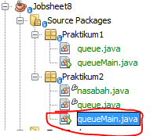<p>
    ```java
    package Praktikum2;
    import java.util.Scanner;
    /**
    *
    * @author Alvian
    */
    public class queueMain {
        /**
        * @param args the command line arguments
        */
        public static void menu(){
            System.out.println("\nPilih Menu ");
            System.out.println(" 1. Antrian baru\n 2. Antrian Keluar\n 3. Cek Antrian Terdepan\n 4. Cek Semua Antrian 0. Exit");
        }
    ```
8. Buat fungsi main, deklarasikan Scanner dengan nama sc
    ```java
    public static void main(String[] args) {
        Scanner sc = new Scanner(System.in);
    ```

9. Buat variabel max untuk menampung kapasitas elemen pada queue. Kemudian lakukan instansiasi objek queue dengan nama antri dan nilai parameternya adalah variabel jumlah.<p>

    ```java
    public static void main(String[] args) {
        Scanner sc = new Scanner(System.in);
        
        System.out.print("Masukkan kapasitas queue : ");
        int jumlah = sc.nextInt();
        queue antri = new queue(jumlah);
    ```
10. Deklarasikan variabel dengan nama pilih bertipe integer untuk menampung pilih menu dari pengguna.
    ```java
    public static void main(String[] args) {
        Scanner sc = new Scanner(System.in);
        
        System.out.print("Masukkan kapasitas queue : ");
        int jumlah = sc.nextInt();
        queue antri = new queue(jumlah);
        
        int pilih;
    ```

11. Tambahkan kode berikut untuk melakukan perulangan menu sesuai dengan masukan yang diberikan oleh pengguna.<p>

    ```java
        do{
            menu();
            pilih = sc.nextInt();
            sc.nextLine();
            
            switch(pilih){
                case 1:
                    System.out.print("No Rekening\t: ");
                    String norek = sc.nextLine();
                    System.out.print("Nama\t\t: ");
                    String nama = sc.nextLine();
                    System.out.print("Alamat\t\t: ");
                    String alamat = sc.nextLine();
                    System.out.print("Umur\t\t: ");
                    int umur = sc.nextInt();
                    System.out.print("Saldo\t\t: ");
                    int saldo = sc.nextInt();
                    nasabah nb = new nasabah(norek, nama, alamat, umur, saldo);
                    sc.nextLine();
                    antri.enqueue(nb);
                    break;
                case 2:
                    nasabah data = antri.dequeue();
                    if(!"".equals(data.norek) && !"".equals(data.nama) &&!"".equals(data.alamat) && data.umur !=0 && data.saldo !=0){
                        System.out.println("Antrian yang keluar : " + data.norek+ " "+ data.nama+" "+ data.alamat+" "+data.umur+" "+data.saldo);
                }
                    break;
                case 3:
                    antri.peek();
                    break;
                case 4:
                    antri.print();
                    break;
            }
        }while (pilih == 1 || pilih == 2 || pilih == 3 || pilih == 4);
    }
    ```
12. Compile dan jalankan class QueueMain, kemudian amati hasilnya.

<br>

### **8.3.2 Verifikasi Hasil Percobaan**
Setelah saya melakukan RUN kode program diatas didapatkan hasil run sama seperti di Jobseat, menandakan sudah berhasil<p>
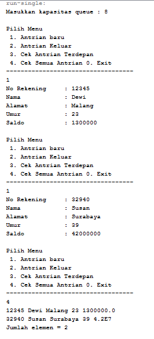<p>

<br>

### **8.3.3 Pertanyaan**
1. Pada class QueueMain, jelaskan fungsi IF pada potongan kode program berikut!<p>
    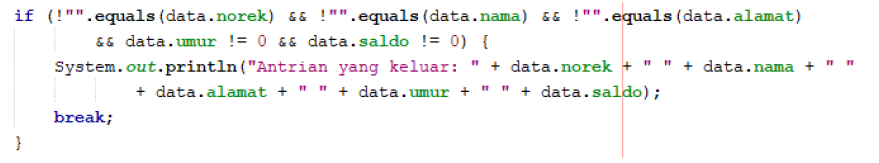<p>
    > **Jawab**<p>
    >equals adalah membandingkan dua string jika kedua string sama maka akan mereturn true dan sebaliknya<p>
    > !"".equals(data.norek) ... digunakan untuk mengecek apakah norek pada data tidak sama dengan string kosong ("") dst<p>
    >jika semua kondisi bernilai true maka akan menampilkan pada konsol isi dari data tersebut lalu berhenti (break)<p>
    >break berfungsi untuk mengakhiri kode program akgar tidak terus melakukan proses 

2. Lakukan modifikasi program dengan menambahkan method baru bernama peekRear pada class Queue yang digunakan untuk mengecek antrian yang berada di posisi belakang! Tambahkan pula daftar menu 5. Cek Antrian paling belakang pada class QueueMain sehingga method peekRear dapat dipanggil!<p>
    > **Jawab**<p>
    >berikut adalah kode program yang saya modifikasi di class "queue" dengan menambahkan method peekRear seperti berikut ini<p>
    ```java
    package Praktikum2;
    /**
    *
    * @author Alvian
    */
    public class queue {
        int max, size, front, rear;
        nasabah[] data;
    
        public queue(int n){
            max = n;
            data = new nasabah [max];
            size = 0;
            front = rear = -1;
        }
        public boolean IsEmpty(){
            if(size == 0){
                return true;
            }else{
                return false;
            }
        }
        public boolean IsFull(){
            if(size == max){
                return true;
            }else {
                return false;
            }
        }
        public void peek(){
            if(!IsEmpty()){
                System.out.println("Elemen terdepan : "+data[front].norek+ " "+data[front].nama+" "+data[front].alamat+" "+data[front].umur+" "+data[front].saldo);
            }else{
                System.out.println("Queue masih kosong");
            }
        }
        public void peekRear(){
            if(!IsEmpty()){
                System.out.println("Elemen terdepan : "+data[rear].norek+ " "+data[rear].nama+" "+data[rear].alamat+" "+data[rear].umur+" "+data[rear].saldo);
            }else{
                System.out.println("Queue masih kosong");
            }
        }
        public void print(){
            if(IsEmpty()){
                System.out.println("Queue masih kosong");
            }else {
                int i = front;
                while(i != rear){
                    System.out.println(data[i].norek + " "+data[i].nama + " "+data[i].alamat + " "+data[i].umur + " "+data[i].saldo);
                    i = (i + 1) % max;
                }
                System.out.println(data[i].norek + " "+data[i].nama + " "+data[i].alamat + " "+data[i].umur + " "+data[i].saldo);
                System.out.println("Jumlah elemen = "+ size);
            }
        }
        public void clear(){
            if(!IsEmpty()){
                front = rear = -1;
                size = 0;
                System.out.println("queue berhasil dikosongkan");
            }else{
                System.out.println("Queue masih kosong");
            }
        }
        public void enqueue(nasabah dt){
            if(IsFull()){
                System.out.println("Queue sudah penuh");
            }else{
                if(IsEmpty()){
                    front = rear = 0;
                }else{
                    if (rear == max -1){
                        rear = 0;
                    }else{
                        rear++;
                    }
                }   
                data[rear] = dt;
                size++;
            }
        }   
        public nasabah dequeue(){
            nasabah dt = new nasabah();
            if(IsEmpty()){
                System.out.println("Queue masih kosong");
            }else{
                dt = data[front];
                size--;
                if(IsEmpty()){
                    front = rear = -1;
                }else{
                    if(front == max -1){
                        front = 0;
                    }else{
                        front++;
                    }
                }
            }
            return dt;
        }
    }
    ```
    >berikut adalah kode program yang saya modifikasi di main class "queueMain" dengan menambahkan method peekRear seperti berikut ini<p>
    ```java
    package Praktikum2;
    import java.util.Scanner;
    /**
    *
    * @author Alvian
    */
    public class queueMain {
    /**
    * @param args the command line arguments
    */
    public static void menu(){
        System.out.println("\nPilih Menu ");
        System.out.println(" 1. Antrian baru\n 2. Antrian Keluar\n 3. Cek Antrian Terdepan\n 4. Cek Semua Antrian\n 5. Cek Antrian Paling Blekang\n 0. Exit");
        System.out.println("-----------------------------------");
        
    }
    public static void main(String[] args) {
        Scanner sc = new Scanner(System.in);
        
        System.out.print("Masukkan kapasitas queue : ");
        int jumlah = sc.nextInt();
        queue antri = new queue(jumlah);
        
        int pilih;
        do{
            menu();
            pilih = sc.nextInt();
            sc.nextLine();
            
            switch(pilih){
                case 1:
                    System.out.print("No Rekening\t: ");
                    String norek = sc.nextLine();
                    System.out.print("Nama\t\t: ");
                    String nama = sc.nextLine();
                    System.out.print("Alamat\t\t: ");
                    String alamat = sc.nextLine();
                    System.out.print("Umur\t\t: ");
                    int umur = sc.nextInt();
                    System.out.print("Saldo\t\t: ");
                    int saldo = sc.nextInt();
                    nasabah nb = new nasabah(norek, nama, alamat, umur, saldo);
                    sc.nextLine();
                    antri.enqueue(nb);
                    break;
                case 2:
                    nasabah data = antri.dequeue();
                    if(!"".equals(data.norek) && !"".equals(data.nama) &&!"".equals(data.alamat) && data.umur !=0 && data.saldo !=0){
                        System.out.println("Antrian yang keluar : " + data.norek+ " "+ data.nama+" "+ data.alamat+" "+data.umur+" "+data.saldo);
                }
                    break;
                case 3:
                    antri.peek();
                    break;
                case 4:
                    antri.print();
                    break;
                case 5:
                    antri.peekRear();
                    break;
            }
        }while (pilih == 1 || pilih == 2 || pilih == 3 || pilih == 4);
    }
    ```
    >Berikut adalah hasil outputnya sesuai dengan yang di inginkan pada soal seperrtii gambar berikut ini<p>
    >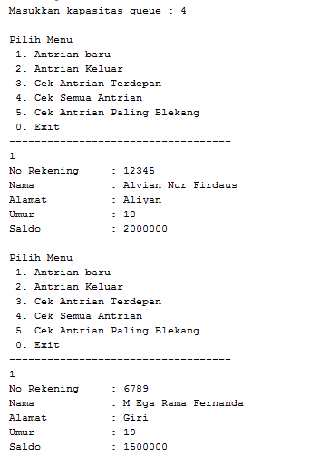<p>
    ><p>


<br>

## **8.4 Tugas**
1. Tambahkan dua method berikut ke dalam class Queue pada Praktikum 1:<p>
    
    - Method peekPosition(data: int) : void<p>
    Untuk menampilkan posisi dari sebuah data di dalam queue, misalnya dengan mengirimkan data tertentu, akan diketahui posisi (indeks) data tersebut berada di urutan ke berapa
    - Method peekAt(position: int) : void<p>
    Untuk menampilkan data yang berada pada posisi (indeks) tertentu 
    
    Sesuaikan daftar menu yang terdapat pada class QueueMain sehingga kedua method tersebut dapat dipanggil!

    **Jawab**
    **class "queue"**
    ```java
    package Tugas1;
    /**
    *
    * @author Alvian
    */
    public class queue {
        int max, size, front, rear, data[];
    
        public queue(int n){
            max = n;
            data = new int [max];
            size = 0;
            front = rear = -1;
        }
        public boolean IsEmpty(){
            if(size == 0){
                return true;
            }else{
                return false;
            }
        }
        public boolean IsFull(){
            if(size == max){
                return true;
            }else {
                return false;
            }
        }
        public void peek(){
            if(!IsEmpty()){
                System.out.println("Elemen terdepan : "+data[front]);
            }else{
                System.out.println("Queue masih kosong");
            }
        }
        public void print(){
            if(IsEmpty()){
                System.out.println("Queue masih kosong");
            }else {
                int i = front;
                while(i != rear){
                    System.out.println(data[i] + " ");
                    i = (i + 1) % max;
                }
                System.out.println(data[i] + " ");
                System.out.println("Jumlah elemen = "+ size);
            }
        }
        public void clear(){
            if(!IsEmpty()){
                front = rear = -1;
                size = 0;
                System.out.println("queue berhasil dikosongkan");
            }else{
                System.out.println("Queue masih kosong");
            }
        }
        public void enqueue(int dt){
            if(IsFull()){
                System.out.println("Queue sudah penuh");
                System.exit(0);
            }else{
                if(IsEmpty()){
                    front = rear = 0;
                }else{
                    if (rear == max -1){
                        rear = 0;
                    }else{
                        rear++;
                    }
                }
                data[rear] = dt;
                size++;
            }
        }
        public int dequeue(){
            int dt = 0;
            if(IsEmpty()){
                System.out.println("Queue masih kosong");
                System.exit(0);
            }else{
                dt = data[front];
                size--;
                if(IsEmpty()){
                    front = rear = -1;
                }else{
                    if(front == max -1){
                        front = 0;
                    }else{
                        front++;
                    }
                }
            }
            return dt;
        }
        public void peekPosition(int data){
            int i = front;
            boolean j = true;
            while (j){
                if (data == this.data[i]){
                    System.out.println("data "+data+" ada pada index ke- "+i);
                    j = false;
                }
                i++;
            }
        }
        public void peekAt (int posisi){
            int i = front;
            boolean j = true;
            while(j){
                if(posisi == i){
                    System.out.println("data pada index ke - "+i+" adalah "+this.data[i]);
                    j = false;
                }
                i++;
            }
        }
    }
    ```
    **mainclass "queueMain"**
    ```java
    package Tugas1;
    import java.util.Scanner;
    /**
    *
    * @author Alvian
    */
    public class queueMain {
    /**
     * @param args the command line arguments
     */
    public static void menu(){
        System.out.println("\nMasukkan Operasi yang diinginkan ");
        System.out.println(" 1. Enqueue\n 2. Dequeue\n 3. Print\n 4. Peek\n 5. Clear\n 6. Cari indeks \n 7. cari data\n 0. Exit");
        System.out.println("-----------------------------------");
        
    }
    public static void main(String[] args) {
        Scanner sc = new Scanner(System.in);
        
        System.out.print("Masukkan kapasitas queue\t\t\t: ");
        int n = sc.nextInt();
        
        queue Q = new queue(n);
        
        int pilih;
        do{
            menu();
            pilih = sc.nextInt();
            switch (pilih){
                case 1:
                    System.out.print("Masukkan data baru\t\t\t: ");
                    int dataMasuk = sc.nextInt();
                    Q.enqueue(dataMasuk);
                    break;
                case 2:
                    int dataKeluar = Q.dequeue();
                    if (dataKeluar != 0){
                        System.out.println("Data yang dikeluarkan\t\t: "+ dataKeluar);
                        break;
                    }
                case 3:
                    Q.print();
                    break;
                case 4:
                    Q.peek();
                    break;
                case 5:
                    Q.clear();
                    break;
                case 6:
                    System.out.print("Masukkan data yang akan dicari\t:");
                    int cari = sc.nextInt();
                    Q.peekPosition(cari);
                    break;
                case 7:
                    System.out.print("Masukkan indeks yang akan dicari\t:");
                    int posisi = sc.nextInt();
                    Q.peekAt(posisi);
                    break;     
            }
        }while (pilih == 1 || pilih == 2 || pilih == 3 || pilih == 4 || pilih == 5 || pilih == 6 || pilih == 7);
    }
    ```
    **Berikut hasil output nya**
    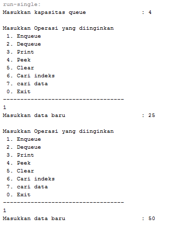<p>
    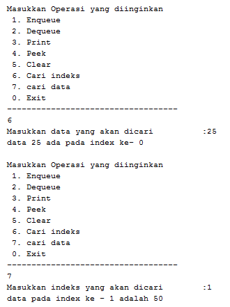<p>


<br>

2. Buatlah program antrian untuk mengilustasikan mahasiswa yang sedang meminta tanda tangan KRS pada dosen DPA di kampus. Ketika seorang mahasiswa akan mengantri, maka dia harus menuliskan terlebih dulu NIM, nama, absen, dan IPK seperti yang digambarkan pada Class diagram berikut:<p>
    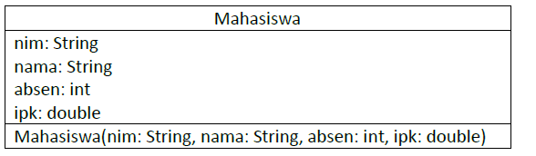<p>

    Class diagram Queue digambarkan sebagai berikut:<p>
    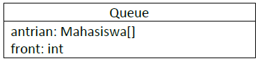<p>
    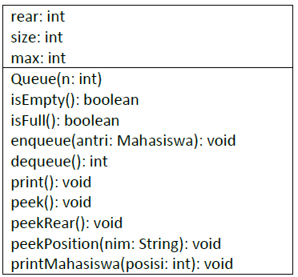<p>

    Keterangan:
    - Method create(), isEmpty(), isFull(), enqueue(), dequeue() dan print(), kegunaannya sama seperti yang telah dibuat pada Praktikum
    - Method peek(): digunakan untuk menampilkan data Mahasiswa yang berada di posisi antrian paling depan
    - Method peekRear(): digunakan untuk menampilkan data Mahasiswa yang berada di posisi antrian paling belakang
    - Method peekPosition(): digunakan untuk menampilkan posisi antrian ke berapa, seorang Mahasiswa berada. Pengecekan dilakukan berdasarkan NIM
    - Method printMahasiswa(): digunakan untuk menampilkan data mahasiswa pada suatu posisi tertentu dalam antrian

    **Jawab**
    **Berikut class Mahasiswa saya beri nama "tugas2_Mahasiswa"**
    ```java
    package Tugas2;
    /**
    *
    * @author Alvian
    */
    public class tugas2_Mahasiswa{
        String nim;
        String nama;
        int absen;
        double ipk;

        tugas2_Mahasiswa (String nim, String nama, int absen, double ipk){
            this.nim = nim;
            this.nama = nama;
            this.absen = absen;
            this.ipk = ipk;
        }

        tugas2_Mahasiswa() {
       
        }
    }
    ```
    **Berikut class Queue saya beri nama "tugas2_Queue"**
    ```java
    package Tugas2;
    /**
    *
    * @author Alvian
    */
    public class tugas2_Queue {
        int max, size, front, rear;
        tugas2_Mahasiswa[] antrian;
    
        public tugas2_Queue(int n){
            max = n;
            antrian = new tugas2_Mahasiswa [max];
            size = 0;
            front = rear = -1;
        }
        public boolean IsEmpty(){
            if(size == 0){
                return true;
            }else{
                return false;
            }
        }
        public boolean IsFull(){
            if(size == max){
                return true;
            }else {
                return false;
            }
        }
        public void peek(){
            if(!IsEmpty()){
                System.out.println("Elemen terdepan : "+antrian[front].nama+ " "+antrian[front].nim+" "+antrian[front].absen+" "+antrian[front].ipk);
            }else{
                System.out.println("Queue masih kosong");
            }
        }
        public void peekRear(){
            if(!IsEmpty()){
                System.out.println("Elemen yang belakang : "+antrian[rear].nama+ " "+antrian[rear].nim+" "+antrian[rear].absen+" "+antrian[rear].ipk);
            }else{
                System.out.println("Queue masih kosong");
            }
        }
        public void print(){
            if(IsEmpty()){
                System.out.println("Queue masih kosong");
            }else {
                int i = front;
                while(i != rear){
                    System.out.println(antrian[i].nama + " "+antrian[i].nim + " "+antrian[i].absen + " "+antrian[i].ipk);
                    i = (i + 1) % max;
                }
                System.out.println(antrian[i].nama + " "+antrian[i].nim + " "+antrian[i].absen + " "+antrian[i].ipk);
                System.out.println("Jumlah elemen = "+ size);
            }
        }
        public void clear(){
            if(!IsEmpty()){
                front = rear = -1;
                size = 0;
                System.out.println("queue berhasil dikosongkan");
            }else{
                System.out.println("Queue masih kosong");
            }
        }
        public void enqueue(tugas2_Mahasiswa dt){
            if(IsFull()){
                System.out.println("Queue sudah penuh");
            }else{
                if(IsEmpty()){
                    front = rear = 0;
                }else{
                    if (rear == max -1){
                        rear = 0;
                    }else{
                        rear++;
                    }
                }
                antrian[rear] = dt;
                size++;
            }
        }
        public tugas2_Mahasiswa dequeue(){
            tugas2_Mahasiswa dt = new tugas2_Mahasiswa();
            if(IsEmpty()){
                System.out.println("Queue masih kosong");
            }else{
                dt = antrian[front];
                size--;
                if(IsEmpty()){
                    front = rear = -1;
                }else{
                    if(front == max -1){
                        front = 0;
                    }else{
                        front++;
                    }
                }   
            }
            return dt;
        }
        public void peekPosition(String nim){
            int i = front;
            boolean j = true;
            while (j) {
                if (nim.equals(this.antrian[i].nim)) {
                    System.out.println("data " + antrian[i].nim + " ada di index ke-" + i);
                    j = false;
                }
                i++;
            }
        }
        public void printMahasiswa (int posisi){
            int i = front;
            boolean j = true;
            while(j){
                if(posisi == i){
                    System.out.println("data pada index ke - "+i+" adalah "+this.antrian[i].nim+" "+this.antrian[i].nama+" "+this.antrian[i].absen+" "+this.antrian[i].ipk);
                    j = false;
                }
                i++;
            }
        }
    }
    ```java
    package Tugas2;
    import java.util.Scanner;
    /**
    *
    * @author Alvian
    */
    public class tugas2QueueMain {
        /**
        * @param args the command line arguments
        */
        public static void menu(){
            System.out.println("\nPilih Menu ");
            System.out.println(" 1. Antrian baru\n 2. Antrian Keluar\n 3. Cek Antrian Terdepan\n 4. Cek Semua Antrian\n 5. Cek Antrian Paling Belekang\n 6. Cari index Mahasiswa dengan Nim\n 7. Cek data mahasiswa berdasarkan antrian\n 8. Hapus Antrian\n 0. Exit");
            System.out.println("-----------------------------------");
        
        }
        public static void main(String[] args) {
            Scanner sc = new Scanner(System.in);
            Scanner sd = new Scanner(System.in);
            Scanner sb = new Scanner(System.in);
        
            System.out.print("Masukkan kapasitas queue : ");
            int jumlah = sc.nextInt();
            tugas2_Queue antri = new tugas2_Queue(jumlah);
        
            int pilih;
            do{
                menu();
                pilih = sc.nextInt();
                sc.nextLine();
            
                switch(pilih){
                    case 1:
                    System.out.print("Nim Mahasiswa\t: ");
                    String nim = sc.nextLine();
                    System.out.print("Nama Mahasiswa\t: ");
                    String nama = sc.nextLine();
                    System.out.print("Absen Mahasiswa\t: ");
                    int absen = sd.nextInt();
                    System.out.print("IPK Mahasiswa\t: ");
                    double ipk = sb.nextDouble();
                    tugas2_Mahasiswa nb = new tugas2_Mahasiswa(nim, nama, absen, ipk);
                    sc.nextLine();
                    antri.enqueue(nb);
                    break;
                case 2:
                    tugas2_Mahasiswa data = antri.dequeue();
                    if(!"".equals(data.nim) && !"".equals(data.nama) &&!"".equals(data.absen) && data.ipk !=0){
                        System.out.println("Antrian yang keluar : " + data.nim+ " "+ data.nama+" "+ data.absen+" "+data.ipk);
                }
                    break;
                case 3:
                    antri.peek();
                    break;
                case 4:
                    antri.print();
                    break;
                case 5:
                    antri.peekRear();
                    break;
                case 6:
                    System.out.print("Masukkan nim Mahasiswa\t\t:");
                    String nimm = sc.nextLine();
                    antri.peekPosition(nimm);
                    break;
                case 7:
                    System.out.print("Masukkan indeks Antrian yang akan dicek\t:");
                    int posisi = sc.nextInt();
                    antri.printMahasiswa(posisi);
                    break;
                case 8:
                    antri.clear();
                    break;
            }
        }while (pilih == 1 || pilih == 2 || pilih == 3 || pilih == 4 || pilih == 5 || pilih == 6 || pilih == 7 || pilih == 8);
    }
    }
    ```
    **Berikut hasil Output dari kode program diatas**

    - menambahkan antrian baru<p>
    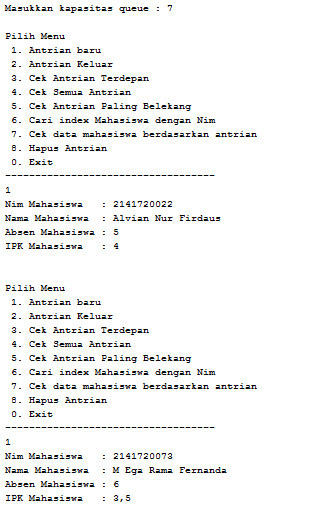
    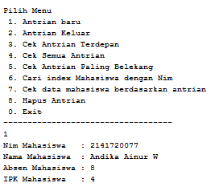<p>

    - menampilkan data mahasiswa terdepan<p>
    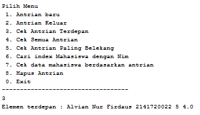<p>

    - menampilkan data mahasiswa urutan belakang<p>
    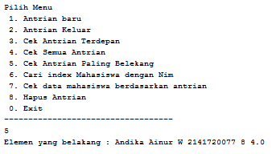<p>

    - menampilkan posisi antrian ke berapa, seorang Mahasiswa berada. Pengecekan dilakukan berdasarkan NIM<p>
    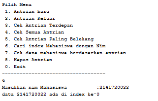<p>

    - menampilkan data mahasiswa pada suatu posisi tertentu dalam antrian<p>
    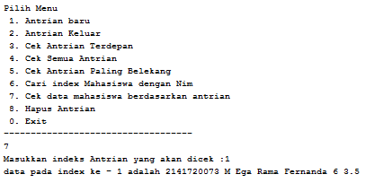<p>


----------------------------
Terima Kasih<p>
Alvian Nur Firdaus | TI-1F | 2141720022 | Politeknik Negeri Malang<p>
copyright @2022 
_______________