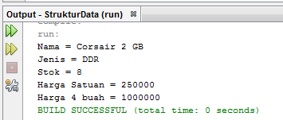
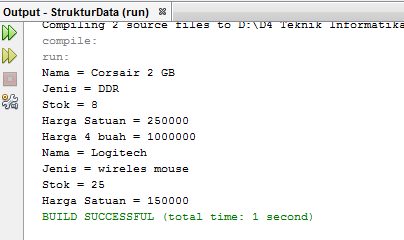

# **Laporan Praktikum**
# **Jobseat 2 Objeck**

## **Data Mahasiswa**
><center></center>

><p>Nama : Alvian Nur Firdaus<p>
>Kelas : 1F<p>
>Prodi : D-IV Teknik Inormatika<p>
>Jurusan : Teknologi Inormasi<p>
><center> Politeknik Negri Malang</center> 

<br>

## 2.1 Tujuan Praktikum
Setelah melakukan materi praktikum ini, mahasiswa mampu:

1. Mengenal objek dan class sebagai konsep mendasar pada pemrograman berorientasi objek
2. Mendeklarasikan class, atribut dan method
3. Membuat objek (instansiasi)
4. Mengakses atribut dan method dari suatu objek
5. Menerapkan konstruktor

<br>

## 2.2 Deklarasi Class, Atribut dan Method
Waktu : 45 Menit

Perhatikan Diagram Class berikut ini:

<center></center>

<br>

Berdasarkan diagram class di atas, akan dibuat program class dalam Java.

## 2.2.1 Langkah-langkah Percobaan
1. Buat Project baru, dengan nama StrukturData. Buat paket dengan nama minggu2, buatlah class baru dengan nama Barang.

    >membuat Project dengan nama StrukturData
    >>
    >membuat paket dengan nama minggu2
    >>
    >membuat class dengan nama "barang"
    >>
<br>

2. Lengkapi class Barang dengan atribut dan method yang telah digambarkan di dalam diagram class di atas, sebagai berikut:

```java
package minggu2;

/**
 *
 * @author Alvian
 */
public class barang {
    String namaBarang, jenisBarang;
    int stok, hargaSatuan;
    
    void tampilBarang(){
        System.out.println("Nama = "+ namaBarang);
        System.out.println("Jenis = "+ jenisBarang);
        System.out.println("Stok = "+ stok);
        System.out.println("Harga Satuan = "+hargaSatuan);
    }
    
    void tambahStok(int n){
        stok = stok + n;
    }
    
    void kurangiStok(int n){
        stok = stok - n;
    
    int hitungHargaTotal(int jumlah ){
        return jumlah*hargaSatuan;
    }
}
```

3. Coba jalankan (Run) class Barang tersebut. Apakah bisa?
    >Terdapat peringatan seperti berikut   
    >>

<br>

## 2.2.2 Verifikasi Hasil Percobaan
Cocokkan hasil compile kode program anda dengan gambar berikut ini.
> iya cocok dengan yang di jobseat dan berikut adalah hasil verivikasinnya  
>>

<br>

## 2.2.3 Pertanyaan

1. Sebutkan 2 karakteristik class/objek!
    > **Jawab** <p>
    > Karakteristik Class / object yaitu
    >- Memiliki sesuatu data/ karakter properti variabel / state / atribut
    >- Bisa melakukan sesuatu tingkah laku / behaviour / fungsi / method
    
    <br>
2. Kata kunci apakah yang digunakan untuk mendeklarasikan class?
    >**Jawab** <p>
    >Dengan menuliskan seperti berikut ini 
    >>
    
    <br>
3. Perhatikan class Barang yang ada di Praktikum di atas, ada berapa atribut yang dimiliki oleh class tersebut? Sebutkan! Dan pada baris berapa saja deklarasi atribut dilakukan?
    >**Jawab** <p>
    >Pada Class Barang diatas terdapat 4 atribut yaitu :
    > - String namaBarang
    > - String jenisBarang
    > - int stok, dan
    > - int hargaSatuan
    ><p>atribut tersebut dideklarasikan pada baris ke 13 dan 14

    <br>
4. Ada berapa method yang dimiliki oleh class tersebut? Sebutkan! Dan pada baris berapa saja deklarasi method dilakukan?

    >**Jawab** <p>
    >Ada 4 method , yaitu 3 void dan 1 return :
    > - void tampilBarang()
    > - void tambahStok(), 
    > - void kurangStok(), 
    > - int hitungTotalHarga(). 
    ><p>Method - method tersebut dideklarasikan pada baris ke 16, 23, 27, dan 31.

    <br>
5. Perhatikan method kurangiStok() yang ada di class Barang, modifikasi isi method tersebut sehingga proses pengurangan hanya dilakukan jika stok masih ada (masih lebih besar dari 0)
    >**Jawab** <p>
    >
    
    <br>
6. Menurut Anda, mengapa method tambahStok() dibuat dengan memiliki 1 parameter berupa bilangan int?
    >**Jawab** <p>
    >Karena nama dari parameter tidak boleh sama dengan variabel yang sudah dideklarasikan pada bagian atribut. dari nama parameter (int n) merujuk pada (int stok) yang sudah dideklarasikan pada bagian atribut diatas. yang digunakan untuk memberikan nilai pada instansiasi.

    <br>
7. Menurut Anda, mengapa method hitungHargaTotal() memiliki tipe data int?
    >**Jawab** <p>
    >Karena memiliki nilai yang akan dikembalikan **return** dan juga memiliki parameter yang bertipe data int. yang nantinya akan merujuk pada variabel hargaSatuan yang sudah dideklarasikan pada bagian atribut, lalu melakukan proses perhitungan

    <br> 
8. Menurut Anda, mengapa method tambahStok() memiliki tipe data void?
    >**Jawab** <p>
    >karena tidak memiliki nilai yang akan dikembalikan. selain itu juga, tidak untuk melakukan proses mencari perhitungan

<br>

## 2.3 Instansiasi Objek dan Mengakses Atribut & Method
Waktu : 45 Menit

Sampai tahap ini, kita telah membuat class Barang dengan sukses. Selanjutnya, apabila diinginkan untuk mulai menggunakan class Barang tersebut, mengakses atribut-atribut dan method-method yang ada di dalamnya, maka selanjutnya perlu dibuat objek/instance dari class Barang terlebih dahulu.

## 2.3.1 Langkah-langkah Percobaan

1. Di dalam paket minggu2, buatlah class baru dengan nama BarangMain. Dan di dalam class BarangMain tersebut, buatlah method main().
    >membuat class main dengan nama "BarangMain"
    >>

    <br>
2. Di dalam method main(), lakukan instansiasi, dan kemudian lanjutkan dengan mengakses atribut dan method dari objek yang telah terbentuk.
``` java
package minggu2;

/**
 *
 * @author Alvian
 */
public class BarangMain {

    /**
     *
     * @param args
     */
    public static void main(String[] args) {
        barang bl = new barang(); 
        
        bl.namaBarang = "Corsair 2 GB";
        bl.jenisBarang = "DDR";
        bl.hargaSatuan = 250000;
        bl.stok = 10;
        bl.tambahStok(1);
        bl.kurangiStok(3);
        bl.tampilBarang();
        int hargaTotal = bl.hitungHargaTotal(4);
        System.out.println("Harga 4 buah = "+hargaTotal);
    }
}
```
<br>

3. Jalankan (Run) class BarangMain tersebut dan amati hasilnya.
    >

## 2.3.2 Verifikasi Hasil Percobaan
Cocokkan hasil compile kode program anda dengan gambar berikut ini.
>Iya cocok 
>>

<br>

## 2.3.3 Pertanyaan
1. Pada class BarangMain, pada baris berapakah proses instansiasi dilakukan? Dan apa nama objek yang dihasilkan?
    >**Jawab** <p>
    >didalam netbeans saya menunjukan pada baris ke 19 dan nama objeck yang dihasilkan adalah "bl"
    >>

    <br>
2. Bagaimana cara mengakses atribut dan method dari suatu objek?
    >**Jawab** <p>
    >Dengan menuliskan seperti gambar dibawah ini 
    >>
    >><p>

## 2.4 Membuat Konstruktor
Waktu : 45 Menit

Di dalam percobaan ini, kita akan mempraktekkan bagaimana membuat berbagai macam konstruktor berdasarkan parameternya.

## 2.4.1 Langkah-langkah Percobaan

1. Perhatikan kembali class Barang. Tambahkan di dalam class Barang tersebut 2 buah konstruktor. 1 konstruktor default dan 1 konstruktor berparameter.

```java
package minggu2;

/**
 *
 * @author Alvian
 */
public class barang {
    String namaBarang, jenisBarang;
    int stok, hargaSatuan;
    
    barang (){
    }
    barang (String nm, String jn, int st, int hs){
        namaBarang = nm;
        jenisBarang = jn;
        stok = st;
        hargaSatuan = hs;
    }
    
    void tampilBarang(){
        System.out.println("Nama = "+ namaBarang);
        System.out.println("Jenis = "+ jenisBarang);
        System.out.println("Stok = "+ stok);
        System.out.println("Harga Satuan = "+hargaSatuan);
    }
    
    void tambahStok(int n){
        stok = stok + n;
    }
    
    void kurangiStok(int n){
        if(stok > 0){
            stok = stok - n;
        }else{
            System.out.println("stok kurang dari 0 ");
        }
    }
    
    int hitungHargaTotal(int jumlah ){
        return jumlah*hargaSatuan;
    }
}
```
<br>

2. Buka kembali class BarangMain. Dan buat sebuah objek lagi, kali ini dengan menggunakan konstruktor berparameter.

```java
package minggu2;

/**
 *
 * @author Alvian
 */
public class BarangMain {

    /**
     *
     * @param args
     */
    public static void main(String[] args) {
        barang bl = new barang(); 
        
        bl.namaBarang = "Corsair 2 GB";
        bl.jenisBarang = "DDR";
        bl.hargaSatuan = 250000;
        bl.stok = 10;
        bl.tambahStok(1);
        bl.kurangiStok(3);
        bl.tampilBarang();
        int hargaTotal = bl.hitungHargaTotal(4);
        System.out.println("Harga 4 buah = "+hargaTotal);
        barang b2 = new barang ("Logitech", "wireles mouse", 25, 150000);
        b2.tampilBarang();
    }
}
```
<br>

3. Jalankan kembali class BarangMain dan amati hasilnya.


<br>

## 2.4.2 Verifikasi Hasil Percobaan
Cocokkan hasil compile kode program anda dengan gambar berikut ini.
>iya cocok seperti di jobseat
>>

## 2.4.3 Pertanyaan
1. Perhatikan class Barang yang ada di Praktikum 2.4.1, pada baris berapakah deklarasi konstruktor berparameter dilakukan?
    >**Jawab** <p>
    >pada Baris ke 18 seperti pada gambar dibawah ini
    >>

    <br>
2. Perhatikan class BarangMain di Praktikum 2.4.1, apa sebenarnya yang dilakukan pada baris program dibawah ini?
    
    
    >**Jawab** <p>
    >Melakukan instansiasi pembuatan objek dengan nama b2. serta menggunakan konstruktor berparameter yang langsung diisi nilai. tapi jika menggunakan konstruktor tersebut harus mengingat letak masing masing dari isi atribut

    <br>
3. Coba buat objek dengan nama b3 dengan menggunakan konstruktor berparameter dari class Barang.
    >**Jawab** <p>
```java
package minggu2;

/**
 *
 * @author Alvian
 */
public class BarangMain {

    /**
     *
     * @param args
     */
    public static void main(String[] args) {
        barang bl = new barang(); 
        
        bl.namaBarang = "Corsair 2 GB";
        bl.jenisBarang = "DDR";
        bl.hargaSatuan = 250000;
        bl.stok = 10;
        bl.tambahStok(1);
        bl.kurangiStok(3);
        bl.tampilBarang();
        int hargaTotal = bl.hitungHargaTotal(4);
        System.out.println("Harga 4 buah = "+hargaTotal);
        barang b2 = new barang ("Logitech", "wireles mouse", 25, 150000);
        b2.tampilBarang();
        barang b3 = new barang ("Sony HXR NX100", "Provesional Kamera", 10, 17000000);
        b3.tampilBarang();
    }
}
```
<br>
    <p>hasil output


<br>

## 2.5 Latihan Praktikum
Waktu : 60 Menit

1. Buat program berdasarkan diagram class berikut ini!
<center></center>

- Method hitungHargaTotal() digunakan untuk menghitung harga total yang merupakan perkalian antara hargaSatuan dengan jumlah barang yang dibeli
- Method hitungDiskon() digunakan untuk menghitung diskon dengan aturan sbb:

    - Jika harga total > 100000, akan mendapat diskon 10%
    - Jika harga total mulai dari 50000 sampai 100000 akan mendapat diskon sebesar 5%
    - Jika dibawah 50000 tidak mendapat diskon
    - Method hitungHargaBayar() digunakan untuk menghitung harga total setelah dikurangi diskon

>**Jawab**<p>
>pertama tama disini saya membuat nama project dengan nama "Jobseat2". selanjutnya membuat package dengan nama "LatihanPraktikum". kemudian membuat class dengan nama "BarangLatihan1"
>> 
>selanjutnya saya memasukkan kode program clas. kode program class "BarangLatihan1" adalah seperti berikut
``` java
package LatihanPraktikum;

/**
 *
 * @author Alvian
 */
public class BarangLatihan1 {
    String namaBarang;
    int hargaSatuan, jumlah, harga, hargaBayar;
    float diskon;
    
    BarangLatihan1() {
        
    }
    BarangLatihan1(String nb, int jm, int hs){
        namaBarang = nb;
        jumlah = jm;
        hargaSatuan = hs;
    }
    int hitungHargaTotal(int jumlah){
        harga = jumlah*hargaSatuan;
        return 0;
    }
    void hitungDiskon(){
        if(harga > 100000){
            diskon = (float)(harga*0.1);
        }else if(harga >= 50000 && harga <= 100000){
            diskon = (float)(harga*0.05);
        }
    }
    void hitungHargaBayar (){
        hargaBayar =(int) (harga - diskon);
    }
    void tampilBarang(){
        System.out.println("Nama Barang\t= "+namaBarang);
        System.out.println("Harga Satuan\t= "+hargaSatuan);
        System.out.println("Jumlah Barang\t= "+jumlah);
        System.out.println("Harga Total\t= "+harga);
        System.out.println("Diskon\t\t= "+diskon);
        System.out.println("Harga Bayar\t= "+hargaBayar);
    }
}
```
>setalah itu saya membuat clas main dengan nama "BarangLatihan1Main"<p>
>selanjutnya saya memasukkan kode program clas main. kode program class main "BarangLatihan1Main" adalah seperti berikut
```java
package LatihanPraktikum;

/**
 *
 * @author Alvian
 */
public class BarangLatihan1Main {

    /**
     * @param args the command line arguments
     */
    public static void main(String[] args) {
        BarangLatihan1 bt1 = new BarangLatihan1();
        bt1.namaBarang = "Lensa Sony PXW";
        bt1.hargaSatuan = 120000;
        bt1.jumlah = 12;
        int hargaTotal=bt1.hitungHargaTotal(bt1.jumlah);
        bt1.hitungDiskon();
        bt1.hitungHargaBayar();
        bt1.tampilBarang();
    }
}
```
<br>

>dengan hasil outputan seperti berikut ini
>>

<br>

---------------------------------------------

2. Buat program berdasarkan diagram class berikut ini!
<center></center>

- Atribut x digunakan untuk menyimpan posisi koordinat x (mendatar) dari pacman, sedangkan atribut y untuk posisi koordinat y (vertikal)
- Atribut width digunakan untuk menyimpan lebar dari area permainan, sedangkan height untuk menyimpan panjang area
- Method moveLeft() digunakan untuk mengubah posisi pacman ke kiri (koordinat x akan berkurang 1), sedangkan moveRight() untuk bergerak ke kanan (koordinat x akan bertambah 1). Perlu diperhatikan bahwa koordinat x tidak boleh lebih kecil dari 0 atau lebih besar dari nilai width
- Method moveUp() digunakan untuk mengubah posisi pacman ke atas (koordinat y akan berkurang 1), sedangkan moveDown() untuk bergerak ke bawah (koordinat y akan bertambah 1). Perlu diperhatikan bahwa koordinat y tidak boleh lebih kecil dari 0 atau lebih besar dari nilai height

>**Jawab**<p>
>pertama tama disini saya menggunakan nama project yang sama yaitu dengan nama "Jobseat2" yang telah kita buat sebelumnya. selanjutnya saya menambahkan package dengan nama "LatihanPraktikum2". kemudian membuat class dengan nama "PachmanLatihan2"
>>
>selanjutnya saya memasukkan kode program clas. kode program class "PachmanLatihan2" adalah seperti berikut
```java
package LatihanPraktikum2;

/**
 *
 * @author Alvian
 */
public class PachmanLatihan2 {
    int x, y, width, height;
    
    PachmanLatihan2(){
        
    }
    PachmanLatihan2(int xh, int yv, int w, int h){
        x = xh;
        y = yv;
        width = w;
        height = h;
    }
    void moveLeft(){
        if(x > 1)x--;
        printPosition();
    }
    void moveRight(){
        if(x < width-1)x++;
        printPosition();
    }
    void moveUp(){
        if(y > 1)y--;
        printPosition();
    }
    void moveDown(){
        if(y < height -1)y++;
        printPosition();
    }
    void printPosition(){
        for(int i = 0; i <= height; i++){
            for(int j=0; j <= width; j++){
                if(i == 0 || i == height || j == 0 || j == width){
                    System.out.print("A  ");
                }else if (i == y && j == x) {
                    System.out.print("O  ");
                }else{
                    System.out.print("   ");
                }
            }
            System.out.println();
        }
    }
}
```
<br>

>setalah itu saya membuat clas main dengan nama "PachmanLatihan2main"<p>
>selanjutnya saya memasukkan kode program clas main. kode program class main "PachmanLatihan2main" adalah seperti berikut

```java
package LatihanPraktikum2;

/**
 *
 * @author Alvian
 */
import java.util.Scanner;
public class PachmanLatihan2main {

    /**
     * @param args the command line arguments
     */
    public static void main(String[] args) {
        PachmanLatihan2 pch2 = new PachmanLatihan2(1, 1, 10, 10);
        Scanner sc = new Scanner(System.in);
        
        System.out.println("--------------------------------------");
        System.out.println("Aturan Bermain");
        System.out.println("Tombol a untuk mengarahkan ke kiri");
        System.out.println("Tombol d untuk mengarahkan ke kanan");
        System.out.println("Tombol w untuk mengarahkan ke atas");
        System.out.println("Tombol s untuk mengarahkan ke bawah");
        System.out.println("ketik  exit untuk keluar");
        System.out.println("--------------------------------------");
        
        pch2.printPosition();
        loop : while (true){
            switch(sc.nextLine()){
                case "a" :
                pch2.moveLeft();
                break;
                
                case "d" :
                pch2.moveRight();
                break;
                
                case "w" :
                pch2.moveUp();
                break;
                
                case "s" :
                pch2.moveDown();
                break;
                
                case "exit" :
                    System.out.println("------------GAME OVER------------");
                break loop;
                
                default :
                pch2.printPosition();
            }
        }
    }
}
```
<br>

>dengan hasil outputan seperti berikut ini<p>
>>
>selanjutnya kita melakukan pengujian dengan menginputkan tombol "d" maka pachman akan bergeser ke kanan
>>
>tombol "s" maka pachman akan bergeser ke bawah
>>
>tombol "a" maka pachman akan bergeser ke kiri
>>
>tombol "w" maka pachman akan bergeser ke atas
>>
>ketik "exit" maka game akan berhenti 
>>

<br>
<center>--------------------------Terima Kasih ----------------------</center>