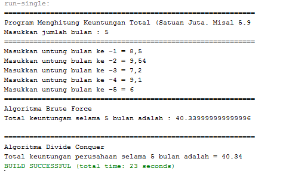

# **Laporan Praktikum**
# **Jobseat 5 Brute Force dan Divide Conquer**

## **Data Mahasiswa**
><p>Nama : Alvian Nur Firdaus<p>
>Kelas : 1F<p>
>Prodi : D-IV Teknik Inormatika<p>
>Jurusan : Teknologi Inormasi<p>
>Politeknik Negri Malang
<br>

## **4.1 Tujuan Praktikum**
Setelah melakukan materi praktikum ini, mahasiswa mampu:

1. Mahasiswa mampu membuat algoritma bruteforce dan divide-conquer
2. Mahasiswa mampu menerapkan penggunaan algorima bruteforce dan divide-conquer

<br>

## **4.2 Menghitung Nilai Faktorial dengan Algoritma Brute Force dan Divide and Conquer**
Perhatikan Diagram Class berikut ini :<p>
<p>

Berdasarkan diagram class di atas, akan dibuat program class dalam Java. Untuk menghitung nilai faktorial suatu angka menggunakan 2 jenis algoritma, Brute Force dan Divide and Conquer. Jika digambarkan terdapat perbedaan proses perhitungan 2 jenis algoritma tersebut sebagai berikut :<p>
Tahapan pencarian nilai faktorial dengan algoritma Brute Force :<p>
<p>
Tahapan pencarian nilai faktorial dengan algoritma Divide and Conquer :<p>
<p>

<br>

### **4.2.1 Langkah-langkah Percobaan**
1. Buat Project baru, dengan nama “BruteForceDivideConquer”. Buat package dengan nama minggu5.<p>
<p>
2. Buatlah class baru dengan nama Faktorial<p>
<p>
3. Lengkapi class Faktorial dengan atribut dan method yang telah digambarkan di dalam diagram class di atas, sebagai berikut:<p>
    a) Tambahkan atribut nilai<p>
    b) Tambahkan method faktorialBF() nilai<p>
    c) Tambahkan method faktorialDC() nilai<p>
    (berikut adalah class Faktorial)

    ```java
    package minggu5;
    /**
    *
    * @author Alvian
    */
    public class faktorial {
        public int nilai;
        
        public int faktorialIBF(int n){
            int fakto = 1;
            for(int  i=1; i<= n; i++){
                fakto = fakto*i;
            }
            return fakto;
        }
        public int faktorialDC(int n){
            if (n==1){
                return 1;
            }else{
                int fakto = n*faktorialDC(n-1);
                return fakto;
            }
        }
    }
    ```
<p>

4. Coba jalankan (Run) class Faktorial dengan membuat class baru MainFaktorial.<p>
    <p>
    a) Di dalam fungsi main sediakan komunikasi dengan user untuk menginputkan jumlah angka yang akan dicari nilai faktorialnya<p>
    b) Buat Array of Objek pada fungsi main, kemudian inputkan beberapa nilai yang akan dihitung faktorialnya<p>
    c) Tampilkan hasil pemanggilan method faktorialDC() dan faktorialBF()<p>
    d) Pastikan program sudah berjalan dengan baik!<p>
    (berikut adalah main class "mainFaktorial")<p>

    ```java
    package minggu5;
    import java.util.Scanner;
    /**
    *
    * @author Alvian
    */
    public class mainFaktorial {
        /**
        * @param args the command line arguments
        */
        public static void main(String[] args) {
            Scanner sc = new Scanner(System.in);
            System.out.println("============================================");
            System.out.print("Masukkan Jumlah Elemen yang akan dihitung : ");
            int elemen = sc.nextInt();
            
            faktorial [] fk = new faktorial[elemen];
            for (int i=0; i<elemen; i++){
                fk[i] = new faktorial();
                System.out.print("Masukkan nilai data ke-"+(i+1)+" : ");
                fk[i].nilai = sc.nextInt();
            }
            System.out.println("======================================");
            System.out.println("Hasil Faktorial dengan Brute Force");
            for(int i=0; i<elemen; i++){
                System.out.println("Faktorial dari nilai "+fk[i].nilai+" adalah : "+fk[i].faktorialIBF(fk[i].nilai));
            }
            System.out.println("======================================");
            System.out.println("Hasil Faktorial dengan Divide and Conquer");
            for(int i=0; i<elemen; i++){
                System.out.println("Faktorial dari nilai "+fk[i].nilai+" adalah : "+fk[i].faktorialDC(fk[i].nilai));
            }
            System.out.println("======================================");
        }
    }
    ```
<br>

### **4.2.2 Verifikasi Hasil Percobaan**
Cocokkan hasil compile kode program anda dengan gambar berikut ini.<p>
**Jawab :**
Ya cocok dengan seperti di jobseat berikut adalah hasil run program faktorial yang saya buat<P>
<p>

<br>

### **4.2.3 Pertanyaan**
1. Jelaskan mengenai base line Algoritma Divide Conquer untuk melakukan pencarian nilai faktorial!
    >**Jawab**<p>
    >Dalama base line Algorima Divide Conquer pada class factorial menggunakan pemilihan if(n==1) return 1; artinya jika nilai yang dimasukkan nantinya adalah 1 maka hasil yang akan ditampilkan oleh program main nantinya adalah 1 dan erfungsi sebagai batas dari devide conuer dimana perulangan akan berakhir saat n sudah sama dengan 1<p>
    
2. Pada implementasi Algoritma Divide and Conquer Faktorial apakah lengkap terdiri dari 3 tahapan divide, conquer, combine? Jelaskan masing-masing bagiannya pada kode program!
    >**Jawab**<p>
    >1. Devide : membagi masalah menjadi beberapa masalah yang memiliki kemiripan dengan masalah semula namun berukuran lebih kecil (idealnya berukuran hampir sama).<p>
    >(berikut bagian kode programnya)<p>
    ><p>
    >2. conquer : memecahkan (menyelesaikan) masing-masing masalah (secara rekursif)<p>
    >(berikut bagian kode programnya)<p>
    ><p>
    >3. Combine : menggabungkan solusi masing-masing masalah sehingga membentuk solusi masalah semula<p>
    >(berikut bagian kode programnya)<p>
    ><p>


3. Apakah memungkinkan perulangan pada method faktorialBF() dirubah selain menggunakan for?Buktikan!
    >**Jawab**<p>
    >Ya Bisa, selama termasuk looping maka jenis looping apapun bisa digunakan pada method faktorialBF(), disini saya mencoba menggunakan perulangan while dan hasil outputnya aman dan tidak ada yang eror<p>
    >- Modifikasi Program<p>
    ><p>
    >- Hasil Output<p>
    ><p>

4. Tambahkan pegecekan waktu eksekusi kedua jenis method tersebut!
    >**Jawab**<p>
    >1. Penambahan pengecekan waktu Awal<p>
    ><p>
    >2. Penambahan pengecekan Waktu Akhir<p>
    ><p>
    >3. Penambahan pengecekan Interval Waktu(Akhir-Awal)<p>
    ><p>

5. Buktikan dengan inputan elemen yang di atas 20 angka, apakah ada perbedaan waktu eksekusi?
    >**Jawab**<p>
    >-  **elemen dibawah 20 angka**<p>
    ><p>
    >-  **elemen diatas 20 angka**<p>
    ><p>
    ><p>
    ><p>

<br>

## **4.3 Menghitung Hasil Pangkat dengan Algoritma Brute Force dan Divide and Conquer**
Pada praktikum ini kita akan membuat program class dalam Java. Untuk menghitung nilai pangkat suatu angka menggunakan 2 jenis algoritma, Brute Force dan Divide and Conquer.<p>

### **4.3.1 Langkah-langkah Percobaan**
1. Di dalam paket minggu5, buatlah class baru dengan nama Pangkat. Dan di dalam class Pangkat tersebut, buat atribut angka yang akan dipangkatkan sekaligus dengan angka pemangkatnya<p>
<p>

2. Pada class Pangkat tersebut, tambahkan method PangkatBF()<p>
3. Pada class Pangkat juga tambahkan method PangkatDC()<p>
4. Perhatikan apakah sudah tidak ada kesalahan yang muncul dalam pembuatan class Pangkat<P>
(berikut adalah class pangkat)<P>

    ```java
    package minggu5;

    /**
    *
    * @author Alvian
    */
    public class pangkat {
        public int nilai, pangkat;
        
        public int pangkatBF(int a, int n){
            int hasil = 1;
            for(int i=0; i<n; i++){
                hasil = hasil*a;
            }
            return hasil;
        }
        public int pangkatDC(int a, int n){
            if (n==0){
                return 1;
            }else{
                if(n%2==1)//bilangan ganjil
                return(pangkatDC(a,n/2)*pangkatDC(a,n/2)*a);
                else//bilangan genap
                return(pangkatDC(a,n/2)*pangkatDC(a,n/2));
            }
        }
    }
    ```
<br>

5. Selanjutnya buat class baru yang di dalamnya terdapat method main. Class tersebut dapat dinamakan MainPangkat. Tambahkan kode pada class main untuk menginputkan jumlah nilai yang akan dihitung pangkatnya.<p>
<p>

6. Nilai pada tahap 5 selanjutnya digunakan untuk instansiasi array of objek. Di dalam Kode berikut ditambahkan proses pengisian beberapa nilai yang akan dipangkatkan sekaligus dengan pemangkatnya.<p>
7. Kemudian, panggil hasil nya dengan mengeluarkan return value dari method PangkatBF() dan PangkatDC().<p>
(berikut adalah main class "mainPangkat")<P>

    ```java
    package minggu5;
    import java.util.Scanner;
    /**
    *
    * @author Alvian
    */
    public class mainPangkat {
        /**
        * @param args the command line arguments
        */
        public static void main(String[] args) {
            Scanner sc = new Scanner(System.in);
            System.out.println("============================================");
            System.out.print("Masukkan Jumlah Elemen yang akan dihitung : ");
            int elemen = sc.nextInt();
            
            pangkat[]png = new pangkat[elemen];
            
            for(int i=0; i<elemen; i++){
                png[i]= new pangkat();
                System.out.print("Masukkan nilai yang akan dipangkatkan ke-"+(i+1)+" : ");
                png[i].nilai = sc.nextInt();
                System.out.print("Masukkan nilai pemankat ke-"+(i+1)+" : ");
                png[i].pangkat = sc.nextInt();
            }
            System.out.println("============================================");
            System.out.println("Hasil pangkat dengan Brute force ");
            for(int i=0; i<elemen; i++){
                System.out.println("Nilai "+png[i].nilai+" pangkat "+png[i].pangkat+" adalah "+png[i].pangkatBF(png[i].nilai,png[i].pangkat));
            }
            System.out.println("============================================");
            System.out.println("Hasil pangkat dengan Devide Conquer ");
            for(int i=0; i<elemen; i++){
                System.out.println("Nilai "+png[i].nilai+" pangkat "+png[i].pangkat+" adalah "+png[i].pangkatDC(png[i].nilai,png[i].pangkat));
            }
            System.out.println("============================================");
        }
    }
    ```

<br>

### **4.3.2 Verifikasi Hasil Percobaan**
Pastikan output yang ditampilkan sudah benar seperti di bawah ini.<p>
**Jawab :**
Ya cocok dengan seperti di jobseat berikut adalah hasil run program pangkat yang saya buat<P>
<p>

<br>

### **4.3.3 Pertanyaan**
1. Jelaskan mengenai perbedaan 2 method yang dibuat yaitu PangkatBF() dan PangkatDC()!
    >**Jawab**<p>
    >- pada method pangkatBF() operasi mencari hitung hasil pangkat dilakukan dengan cara bruteforce yang dilakukan dengan interative/perulangan/looping dan algoritma bruteforce nya adalah mendeklarasikan dahulu hasil = 1 lalu melakukan perulangan dengan batas n(pangkatnya) dan dalam perulangan tersebut dilakukan looping dari hasil tadi di kali dengan a (bilangan yang akan dipangkat) dan perulangan akan terus berlanjut hingga < n sehingga a akan menghasilkan nilai hasil dari pemangkatnya.
    > - pada method pangkatDC() operasi mencari hitung hail pangkat dilakukan dengan cara divide conqquer yang dilakukan dengan rekursif dan algoritma divide conquer yang dilakukan terbagi dalam 3 tahapan yaitu : Divide, Conquer, Combine


2. Pada method PangkatDC() terdapat potongan program sebagai berikut:<p>
    <p>
    Jelaskan arti potongan kode tersebut
    >**Jawab**<p>
    >- jika n(pangkat bilangan) dimodulus 2 hasilnya adalah 1 maka returnya(kembalian nilai) adalah hasil dari (pangkatDC(a,n/2)*pangkatDC(a,n/2)*a) karena bilangan pangkatnya adalah ganjil<p>
    >- jika n(pangkat bilangan) dimodulus 2 hasilnya adalah tidak sama dengan 1 maka returnya (kembalian nilai) adalah hasil dari (pangkatDC(a,n/2)*pangkatDC(a,n/2)) karena bilangan pangkatnya adalah genap
3. Apakah tahap combine sudah termasuk dalam kode tersebut?Tunjukkan!
    >**Jawab**<p>
    >Ya Sudah termasuk, Tahap Combine dalam kode tersebut ditunjukkan pada sintaks return atau pengembalian nilai dimana hasil conquer atau penyelesaian masalah sebelumnya direturnkan semua dan dalam tahap combine dilakukan pemanggilan hasil dari bilangan berpangkat tersebut<p>

4. Modifikasi kode program tersebut, anggap proses pengisian atribut dilakukan dengan konstruktor.
    >**Jawab**<p>
    >**hasil Modifikasi**<p>
    >- class "pangkat<p>
    ><p>
    >- main class "mainPangkat<p>
    ><p>
    >- output<p>
    ><p>

5. Tambahkan menu agar salah satu method yang terpilih saja yang akan dijalankan!
    >**Jawab**<p>
    >**hasil Modifikasi**<p>
    >- penambahan fitur menu pada main class "mainPangkat" dibawah ini<p>

    ```java
        package minggu5;
        import java.util.Scanner;
        /**
        *
        * @author Alvian
        */
        public class mainPangkat {      
            /**
            * @param args the command line arguments
            */
            public static void main(String[] args) {
                Scanner sc = new Scanner(System.in);
                
                pangkat[]png = new pangkat[5];
                png[0] = new pangkat(5, 2);
                png[1] = new pangkat(10, 2);
                png[2] = new pangkat(15, 4);
                png[3] = new pangkat(20, 2);
                png[4] = new pangkat(25, 2);
        
                System.out.println("===========================================");
                System.out.println("                Menu Pangkat               ");
                System.out.println("========================================== ");
                System.out.println("1. Menggunakan Brute Force ");
                System.out.println("2. Menggunakan Devide Conquer ");
                System.out.println("3. exit ");
                System.out.print("Silahkan Pilih Metode Perhitungan : ");
                int pilih = sc.nextInt();
        
                switch(pilih){
                    case 1 :
                    System.out.println("============================================");
                    System.out.println("Hasil pangkat dengan Brute force ");     
                    for(int i=0; i<png.length; i++){
                        System.out.println("Nilai "+png[i].nilai+" pangkat "+png[i].pangkat+" adalah "+png[i].pangkatBF(png[i].nilai,png[i].pangkat));
                    }
                    break;
                    case 2 :
                    System.out.println("============================================");
                    System.out.println("Hasil pangkat dengan Devide Conquer ");
                    for(int i=0; i<png.length; i++){
                        System.out.println("Nilai "+png[i].nilai+" pangkat "+png[i].pangkat+" adalah "+png[i].pangkatDC(png[i].nilai,png[i].pangkat));
                    }
                    break;
                    case 3 :
                    System.out.println("------------Terima Kasih---------");
                    break;
                    default :
                    System.out.println("------ input yang anda masukkan salah -------");
                }
            }
        }
    ``` 
    >**hasil Output**<p>    
    >- jika memilih no 1 <p>
    ><p>
    >- jika memilih no 2 <p>
    ><p>
    >- jika memilih no 3 <p>
    ><p>
    >- jika memilih selain ketiga nomor diatas <p>
    ><p>

<br>

## **4.4 Menghitung Sum Array dengan Algoritma Brute Force dan Divide and Conquer**
Di dalam percobaan ini, kita akan mempraktekkan bagaimana proses divide, conquer, dan combine diterapkan pada studi kasus penjumlahan keuntungan suatu perusahaan dalam beberapa bulan.<p>

### **4.4.1 Langkah-langkah Percobaan**
1. Pada paket minggu5. Buat class baru yaitu class Sum. DI salam class tersebut terdapat beberapa atribut jumlah elemen array, array, dan juga total. Tambahkan pula konstruktor pada class Sum.<p>
<p>

2. Tambahkan method TotalBF() yang akan menghitung total nilai array dengan cara iterative.<p>
3. Tambahkan pula method TotalDC() untuk implementasi perhitungan nilai total array menggunakan algoritma Divide and Conquer<p>
(berikut adalah class sum)<P>

    ```java
    package minggu5;
    /**
    *
    * @author Alvian
    */
    public class sum {
        public int elemen;
        public double keuntungan[];
        public double total;
        
        sum(int elemen){
            this.elemen = elemen;
            this.keuntungan = new double[elemen];
            this.total = 0;
        }
        double totalBF(double arr[]){
            for(int i=0; i<elemen; i++){
                total = total + arr[i];
            }
            return total;
        }
        double totalDC(double arr[], int l, int r){
            if(l==r)
            return arr[l];
            else if(l<r){
                int mid = (l+r)/2;
                double lsum = totalDC(arr,l,mid-l);
                double rsum = totalDC(arr,r, mid+l);
                return lsum+rsum+arr[mid];
            }
            return 0;
        }
    }
    ```

<br>

4. Buat class baru yaitu MainSum. Di dalam kelas ini terdapat method main. Pada method ini user dapat menuliskan berapa bulan keuntungan yang akan dihitung. Dalam kelas ini sekaligus dibuat instansiasi objek untuk memanggil atribut ataupun fungsi pada class Sum<p>
<p>

5. Karena yang akan dihitung adalah total nilai keuntungan, maka ditambahkan pula pada method main mana array yang akan dihitung. Array tersebut merupakan atribut yang terdapat di class Sum, maka dari itu dibutuhkan pembuatan objek Sum terlebih dahulu.
6. Tampilkan hasil perhitungan melalui objek yang telah dibuat untuk kedua cara yang ada (Brute Force dan Divide and Conquer)<p>
(berikut adalah main class "mainSum")<P>

    ```java
    package minggu5;
    import java.util.Scanner;
    /**
    *
    * @author Alvian
    */
    public class mainSum {
        /**
        * @param args the command line arguments
        */
        public static void main(String[] args) {
            Scanner sc = new Scanner(System.in);
            System.out.println("============================================================");
            System.out.println("Program Menghitung Keuntungan Total (Satuan Juta. Misal 5.9");
            System.out.print("Masukkan jumlah bulan : ");
            int elm = sc.nextInt();
            
            sum sm = new sum(elm);
            System.out.println("============================================================");
            for(int i=0; i<sm.elemen; i++){
                System.out.print("Masukkan untung bulan ke -"+(i+1)+" = ");
                sm.keuntungan[i] = sc.nextDouble();
            }
            System.out.println("============================================================");
            System.out.println("Algoritma Brute Force");
            System.out.println("Total keuntungan perusahaan selama "+ sm.elemen+ " bulan adalah = "+sm.totalBF(sm.keuntungan));
            System.out.println("============================================================");
            System.out.println("Algoritma Divide Conquer");
            System.out.println("Total keuntungan perusahaan selama "+ sm.elemen+ " bulan adalah = "+sm.totalDC(sm.keuntungan, 0,sm.elemen-1));
        }  
    }
    ```
<br>

### **4.4.2 Verifikasi Hasil Percobaan**
Cocokkan hasil compile kode program anda dengan gambar berikut ini.
Ya cocok dengan seperti di jobseat berikut adalah hasil run program pangkat yang saya buat<P>
<p>

<br>

### **4.4.3 Pertanyaan**
1. Berikan ilustrasi perbedaan perhitungan keuntungan dengan method TotalBF() ataupun TotalDC()
    >**Jawab**<p>
    >- TotalBF()<p>
    >pada totalBF() menggunakan fungsi interative/looping/perulangan untuk melakukan penjumlahan semua elemen  array[i] yang nantinya dimasukkan pada oprasi penjumlahan variable total dan di returnkan variable totalnya. Nilai dari variable total adalah hasil penjumlahan seluruh elemen array[i].<p>
    >- TotalDC()<p>
    >pada totalDC() perhitungan keuntungan menggunakan fungsi rekursif untuk melakukan proses devid yang diimplementasikan dengan pemiihan (if-else, if-else) . lalu melakukan tahapan conquer untuk menyelesaikan setiap masalah tersebut, lalu pada tahap akhir atau combine maka semua hasil penyelesaian tadi dijadikan satu menjadi solusi<p>

2. Perhatikan output dari kedua jenis algoritma tersebut bisa jadi memiliki hasil berbeda di belakang koma. Bagaimana membatasi output di belakang koma agar menjadi standar untuk kedua jenis algoritma tersebut.
    >**Jawab**<p>
    >- Modifikasi Brute Force<p>
    ><p>
    >- Modifikasi Divide Conquer<p>
    ><p>
    >- Hasil Outputan<p>
    ><p>

3. Mengapa terdapat formulasi return value berikut?Jelaskan!<p>
    <p>
    >**Jawab**<p>
    >untuk mereturnkan semua hasil dari penjumlahan keuntungan dari (lsum) lalu sengan (rsum) dan dengan (arr[mid]), sehingga dari penjmlahan ketigannya bisa diketemukan berapa banyak keuntungan yang didapat dari perusahaan tersebut dalam rentang waktu n bulan.<p>

4. Kenapa dibutuhkan variable mid pada method TotalDC()?
    >**Jawab**<p>
    >karena perhitungan keuntungan pada method totalDC() tersebut membagi bagiannya menjadi left(l), dan right(r). maka dari itu membutuhkan variable mid untuk perhitungan semua bagian tengahnya.

5. Program perhitungan keuntungan suatu perusahaan ini hanya untuk satu perusahaan saja. Bagaimana cara menghitung sekaligus keuntungan beberapa bulan untuk beberapa perusahaan.(Setiap perusahaan bisa saja memiliki jumlah bulan berbeda-beda)? Buktikan dengan program!
    >**Jawab**<p>
    >- Modifikasi class sum<p>
    ```java
    package minggu5;
    /**
    *
    * @author Alvian
    */
    public class sum {
        public int elemen;
        public double keuntungan[];
        public double total;
        
        public double totalBF(double arr[]){
            for(int i=0; i<arr.length; i++){
                total = total + arr[i];
            }
            return total;
        }
        public double totalDC(double arr[], int l, int r) {
            if (l == r) {
                return arr[l];
            } else if (l < r) {
                int mid = (l + r) / 2;
                double lsum = totalDC(arr, l, mid - 1);
                double rsum = totalDC(arr, mid + 1, r);
                return lsum + rsum + arr[mid];
            }
            return 0;
        }
    }
    ```

    >- Modifikasi main class "mainSum"<p>
    ```java
    package minggu5;
    import java.util.Scanner;
    /**
    *
    * @author Alvian
    */
    public class mainSum {
        /**
        * @param args the command line arguments
        */
        public static void main(String[] args) {
            Scanner sc = new Scanner(System.in);
        
            System.out.println("============================================================");
            System.out.println("Program Menghitung Keuntungan Total (Satuan Juta. Misal 5,9)");
            System.out.print("Masukkan jumlah perusahaan : ");
            int per = sc.nextInt();
        
            sum peru[]= new sum[per];
            for(int i=0; i<per; i++){
                peru[i] = new sum();
                System.out.println("============================================================");
                System.out.println("Perusahaan ke -"+(i+1));
                System.out.print("Masukkan Jumlah Bulan : ");
                peru[i].elemen = sc.nextInt();
            
                peru[i].keuntungan = new double[peru[i].elemen];
            
                System.out.println("============================================================");
                for(int j=0; j<peru[i].elemen; j++){
                    System.out.print("Masukkan untung bulan ke -"+(j+1)+" = ");
                    peru[i].keuntungan[j] = sc.nextDouble();
                }
            }
            System.out.println("============================================================");
            sum dat =new sum();
            for(int i=0; i<peru.length; i++){
                System.out.println("Perusahaan ke-"+(i+1));
                System.out.println("Jumlah Bulan : "+peru[i].elemen);
                System.out.println();
                System.out.println("Algoritma Brute Force");
                System.out.printf("Total keuntungam perusahaan selama "+peru[i].elemen+" bulan adalah : %.2f ", dat.totalBF(peru[i].keuntungan));
                System.out.println();
                System.out.println("Algoritma Divide Conquer");
                System.out.printf("Total keuntungam perusahaan selama "+peru[i].elemen+" bulan adalah : %.2f ", dat.totalDC(peru[i].keuntungan, 0, peru[i].elemen-1));
                System.out.println("\n============================================================");
            }
        }
    }
    ```
    >- hasil outputan<p>
    ><p>


<br>

## **4.5 Latihan Praktikum**
1. Suatu Perguruan Tinggi di kota Malang sedang mengadakan pemilihan suara untuk memilih ketua BEM tahun 2022. Jika jumlah suara yang terkumpul diumpamakan selalu genap. Maka dengan inputan kandidat terpilih, carilah mayoritas jumlah suara untuk masing-masing kandidat. (Jumlah elemen array dan hasil pemilhan suara merupakan inputan user).<p>

    **Elemen Mayoritas : Elemen mayoritas di dalam A adalah elemen yang terdapat pada lebih dari n/2 posisi. Contohnya, jika n=6 atau n=7 maka nilai mayoritas paling sedikit adalah 4. Berasal dari (7/2)+1 atau (6/2)+1).**<p>

    Nilai mayoritas berbeda konsep dengan menghitung total suara terbanyak kandidat terpilih !<p>
    Contoh : Hasil pemilihan suara sebagai berikut (m adalah mayoritas, nm adalah no mayoritas)<p>

    
    <p>

    Karena n = 8, nilai mayoritas paling sedikit sejumlah 5 (8/2+1)<p>
    Keterangan : Warna Biru adalah proses divide, warna kuning dimulainya proses conquer, warna hijau dimulainya proses combine<p>
    **Jawab**<p>

    - Class Latihan1

    ``` java
    package praktikumMinggu5;

    /**
    *
    * @author Alvian
    */
    public class Latihan1 {
        public int vote, jumlahVote, jmlhKandidat = 4;
        public String kandidat;
        public static int nilai, av, seleksi = 0;
        public static int[] array = new int[10000];

        public static int hasilPemungutanSwara(int js, int k1, int k2, int k3, int k4) {
            if (nilai == 4) {
                return 1;
            }
            if (nilai == 1 && k1 < 0) {
                array[seleksi] = nilai;
                seleksi++;
                nilai++;
                return hasilPemungutanSwara(js, k1 - 1, k2, k3, k4);
            } else if (nilai == 2 && k2 < 0) {
                array[seleksi] = nilai;
                seleksi++;
                nilai++;
                return hasilPemungutanSwara(js, k1, k2 - 1, k3, k4);
            } else if (nilai == 3 && k3 < 0) {
                array[seleksi] = nilai;
                seleksi++;
                nilai++;
                return hasilPemungutanSwara(js, k1, k2, k3 - 1, k4);
            } else if (nilai == 4 && k4 < 0) {
                array[seleksi] = nilai;
                seleksi++;
                nilai++;
                return hasilPemungutanSwara(js, k1, k2, k3, k4 - 1);
            } else if (k1 == 0 && k2 == 0 && k3 == 0 && k4 == 0) {
                if (array[av] == array[av + 1] && av + 1 < js) {
                    return array[av];

                } else if (av + 2 > js) {
                    av += 2;
                    return hasilPemungutanSwara(js, k1, k2, k3, k4);
                } else {
                    return 0;
            }
            } else {
                nilai++;
                return hasilPemungutanSwara(js, k1, k2, k3, k4);
            }
        }
    }
    ```

    - Main Class "Latihan1Main"

    ```java
    public class Latihan1Main {

    /**
     * @param args the command line arguments
     */
    public static void main(String[] args) {
        Scanner sc = new Scanner(System.in);

        System.out.println("----------------- Portal Pemira BEM Tahun 2020 ---------------");
        Latihan1 lat = new Latihan1();
        Latihan1[] qwer = new Latihan1[lat.jmlhKandidat];
        for (int i = 0; i < lat.jmlhKandidat; i++) {
            qwer[i] = new Latihan1();
            System.out.print("Nama Calon Presiden BEM ke- " + (i + 1) + " : ");
            qwer[i].kandidat = sc.nextLine();
        }

        System.out.println("-----------------------------------------------------------------");
        for (int i = 0; i < lat.jmlhKandidat; i++) {
            System.out.print(" Masukkan Jumlah Suara Calon Presiden Bem ke" + (i + 1) + " : ");
            qwer[i].vote = sc.nextInt();
            lat.jumlahVote += qwer[i].vote;
        }

        System.out.println("-----------------------------------------------------------------");
        int hasil = lat.hasilPemungutanSwara(lat.jumlahVote,qwer[0].vote, qwer[1].vote, qwer[2].vote, qwer[3].vote);
            System.out.println("Presiden Bem Terpilih Dimenangkan oleh : " + qwer[hasil - 1].kandidat);
        }
    }
    ```

    - hasil output
    <p>


