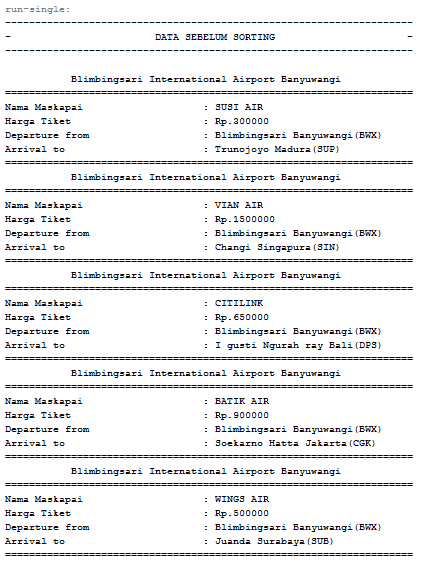

# **Laporan Praktikum**
# **Jobseat 6 SORTING (BUBBLE, SELECTION, DAN INSERTION SORT)**

## **Data Mahasiswa**
><p>Nama : Alvian Nur Firdaus<p>
>Kelas : 1F<p>
>Prodi : D-IV Teknik Inormatika<p>
>Jurusan : Teknologi Inormasi<p>
>Politeknik Negri Malang
<br>

## **5.1 Tujuan Praktikum**
Setelah melakukan praktikum ini diharapkan mahasiswa mampu:<p>

1. Mahasiswa mampu membuat algoritma searching bubble sort, selection sort dan insertion sort<p>
2. Mahasiswa mampu menerapkan algoritma searching bubble sort, selection sort dan insertion sort pada program<p>

<br>

## **5.2 Mengurutkan Data Mahasiswa Berdasarkan IPK Menggunakan Bubble Sort**
Perhatikan diagram class Mahasiswa di bawah ini! Diagram class ini yang selanjutnya akan dibuat sebagai acuan dalam membuat kode program class Mahasiswa.<p>
<p>

Berdasarkan class diagram di atas, kita akan membuat sebuah class Mahasiswa yang berfunsi untuk membuat objek mahasiswa yang akan dimasukan ke dalam sebuah array. Terdapat sebuah konstruktor berparameter dan juga fungsi tampil() untuk menampilkan semua attribute yang ada.<p>
<p>

Selanjutnya class diagram di atas merupakan representasi dari sebuah class yang berfungsi untuk melakukan operasi-operasi dari objek array mahasiswa, misalkan untuk menambahkan objek mahasiswa, menampilkan semua data mahasiswa, dan juga untuk mengurutkan menggunakan Teknik bubble sort berdasarkan nilai IPK mahasiswa.<p>

<br>

### **5.2.1 Langkah-langkah Percobaan**
1. Buat project baru dengan nama “bubble-selection-insertion”, kemudian buat package dengan nama “jobsheet6”.<p>
<p>
2. Buatlah sebuah class dengan nama Mahasiswa<p>
<p>
3. Sesuaikan class Mahasiswa dengan melihat class diagram di atas dengan menambahkan attribute, konstruktor, dan fungsi atau method. Untuk lebih jelasnya class tersebut dapat dilihat pada potongan kode di bawah ini<p>

    ```java
    package jobsheet6;
    /**
    *
    * @author Alvian
    */
    public class mahasiswa {
        String nama;
        int thnMasuk, umur;
        double ipk;
    
        mahasiswa(String n, int t, int u, double i){
            nama = n;
            thnMasuk = t;
            umur = u;
            ipk = i;
        }
        void tampil(){
            System.out.println("Nama        = "+nama);
            System.out.println("Tahun Masuk = "+thnMasuk);
            System.out.println("Umur        = "+umur);
            System.out.println("IPK         = "+ipk);
        }
    }
    ```

4. Buat class DaftarMahasiswaBerprestasi seperti di bawah ini!<p>
<p>

    ```java
    package jobsheet6;
    /**
    *
    * @author Alvian
    */
    public class daftarMahasiswaBerprestasi {
        mahasiswa listMhs[] = new mahasiswa[5];
        int idx;
    ```

5. Tambahkan method tambah() di dalam class tersebut! Method tambah() digunakan untuk menambahkan objek dari class Mahasiswa ke dalam atribut listMhs.<p>

    ```java
    //method tambah()
    void tambah(mahasiswa m){
        if(idx<listMhs.length){
            listMhs[idx] = m; //selama id belum mencapai lengt, maka objeck mahasiswa dapat ters dimasukkan kedalam array list mhs
            idx++;
        }else{
            System.out.println("Data Sudah Penuh!!");
        }
    }
    ```
6. Tambahkan method tampil() di dalam class tersebut! Method tampil() digunakan untuk menampilkan semua data mahasiswa-mahasiswa yang ada di dalam class tersebut! Perhatikan penggunaan sintaks for yang agak berbeda dengan for yang telah dipelajari sebelumnya, meskipun secara konsep sebenarnya mirip.<p>

    ```java
    //method tampil()
    void tampil(){
        for(mahasiswa m : listMhs){//selama jumlah mahasiswa sesuai dengan elemen yang diset maka akan terus ditampilkan
            m.tampil();
            System.out.println("---------------------");
        }
    }
    ```
7. Tambahkan method bubbleSort() di dalam class tersebut!<p>

    ```java
    //method bubbleSort()
    void bubbleSort(){
        for(int i=0; i<listMhs.length-1; i++){
            for(int j=1; j<listMhs.length-i; j++){
                if(listMhs[j].ipk > listMhs[j-1].ipk){
                    //proses dibawah ini adalah proses swap atau pertukaran
                    mahasiswa tmp = listMhs[j];
                    listMhs[j] = listMhs[j-1];
                    listMhs[j-1] = tmp;
                }
            }
        }
    }
    ```
8. Buat class Main dan didalamnya buat method main() seperti di bawah ini!<p>
<p>

    ```java
    package jobsheet6;
    /**
    *
    * @author Alvian
    */
    public class main {
        /**
        * @param args the command line arguments
        */
        public static void main(String[] args) {

        }
    }
    ```

9. Di dalam method main(), buatlah sebuah objek DaftarMahasiswaBerprestasi dan buatlah 5 objek mahasiswa kemudian tambahkan semua objek mahasiswa tersebut dengan memanggil fungsi tambah pada objek DaftarMahasiswaBerprestasi. Silakan dipanggil fungsi tampil() untuk melihat semua data yang telah dimasukan, urutkan data tersebut dengan memanggil fungsi bubbleSort() dan yang terakhir panggil fungsi tampil kembali.<p>

    ```java
    package jobsheet6;
    /**
    *
    * @author Alvian
    */
    public class main {
        /**
        * @param args the command line arguments
        */
        public static void main(String[] args) {
            daftarMahasiswaBerprestasi list = new daftarMahasiswaBerprestasi();
            mahasiswa m1 = new mahasiswa("Nusa", 2017, 25, 3);
            mahasiswa m2 = new mahasiswa("Rara", 2012, 19, 4);
            mahasiswa m3 = new mahasiswa("Dompu", 2018, 19, 3.5);
            mahasiswa m4 = new mahasiswa("Abdul", 2017, 23, 2);
            mahasiswa m5 = new mahasiswa("Ummi", 2019, 21, 3.75);
        
            list.tambah(m1);
            list.tambah(m2);
            list.tambah(m3);
            list.tambah(m4);
            list.tambah(m5);
        
            System.out.println("Data Mahasiswa sebelum Sorting = ");
            list.tampil();
        
            System.out.println();
            System.out.println("Data mahasiswa setela sorting desc berdasarkan ipk (menggunakan Bobble Short)");
            list.bubbleSort();
            list.tampil();
        }
    }
    ```

<br>

### **5.2.2 Verifikasi Hasil Percobaan**
Cocokan hasilnya dengan yang terdapat pada tampilan di bawah ini

**Jawab : iya cocok dengan seperti yang di js dan mampu menampilkan sorting desc berdasarkan ipk (menggunakan Bobble Short), berikut adalah buktinya**<p>
<p>
<p>

<br>

## **5.2.3 Pertanyaan**
1. Terdapat di method apakah proses bubble sort?
    >**Jawab**<p>
    >Terdapat pada method bubbleShort(), method tersebut berada di line 32-43, dimana methood bubleShort terdapat pada class "daftarMahasiswaBerprestasi", untuk lebih jelasnya kami tampilkan method bubbleShort() dibawah ini <p>

    ```java
    //method bubbleSort()
    void bubbleSort(){
        for(int i=0; i<listMhs.length-1; i++){
            for(int j=1; j<listMhs.length-i; j++){
                if(listMhs[j].ipk > listMhs[j-1].ipk){
                    //proses dibawah ini adalah proses swap atau pertukaran
                    mahasiswa tmp = listMhs[j];
                    listMhs[j] = listMhs[j-1];
                    listMhs[j-1] = tmp;
                }
            }
        }
    }
    ```

2. Terdapat di method apakah proses selection sort?
    >**Jawab**<p>
    >pada **percobaan 1** masih belum ditambahkan method selection short, akan tetapi pada **percobaan 2** method selection short sudah ditambahkan. method selection short terdapat pada method selectionShort(), yang berada pada line 45 - 58, dimana method selection short ini masih didalam class yang sama dengan bubble short yaitu pada class "daftarMahasiswaBerprestasi", berikut adalah kode programnya<p>

    ```java
    void selectionSort(){
        for(int i=0; i<listMhs.length-1; i++){
            int idxMin = i;
            for(int j=i+1; j<listMhs.length; j++){
                if(listMhs[j].ipk < listMhs[idxMin].ipk){
                    idxMin = j;
                }
            }
            //swap
            mahasiswa tmp = listMhs[idxMin];
            listMhs[idxMin] = listMhs[i];
            listMhs[i] = tmp;
        }
    }
    ```

3. Apakah yang dimaksud proses swap? Tuliskan potongan program untuk melakukan proses swap tersebut!
    >**Jawab**<p>
    >swap adalah proses penukaran angka yang akan di sorting yang nantinya angka tersebut setelah di tukar **(swap)** akan diurutkan sesuai intruksi, apakah akan diurutkan dari terkecil ke terbesar (ascending), atau sebaliknya (descending), potongan program proses swap terdapat pada percobaan 1, 2, 3 berikut adalah potongan kodenya.<p>
    <p>
    <p>
    <p>

4. Di dalam method bubbleSort(), terdapat baris program seperti di bawah ini:<p>
    <p>
    Untuk apakah proses tersebut?
    >**Jawab**<p>
    >proses tersebut adalah proses "pemilihan / if" dimana terdapat sebuah kondisi jika (listMhs[j].ipk > listMhs[j-1].ipk) terpenuhi, maka akan dilakukan proses swap atau pertukaran nilai dengan syarat yang telah diberikan. Yang mana syarat tersebut adalah (>) lebih dari, maka nilai yang akan diurutkan akan keluar descending (dari angka terbesar ke angka yang terkecil)<p>

5. Perhatikan perulangan di dalam bubbleSort() di bawah ini:<p>
    <p>

    a. Apakah perbedaan antara kegunaan perulangan i dan perulangan j?<p>
    >**Jawab**<p>
    >- perulangan i disebut sebagai perulangan luar yang bertujuan agar proses pertukaran (swap) pada perulangan j tetap berlanjut hingga semua bilangan sudah diurutkan

    >- perulangan j disebut sebagai perulangan dalam yang bertugas melakukan pertukaran (swap) nilai secara terus menerus hingga bilangan sudah terurut sesuai dengan syarat kondisi (ascending atau descending)

    b. Mengapa syarat dari perulangan i adalah ```i<listMhs.length-1?``` <p>
    >**Jawab**<p>
    >agar batas dari perulangan i (perulangan dalam) memiliki rentang panjang sejumlah panjang array listMhs dikurangi 1 ketika melakukan perulangan dari perulangan swapping yang dilakukan oleh perulangan j<p>

    c. Mengapa syarat dari perulangan j adalah ```j<listMhs.length-i ?``` <p>
    >**Jawab**<p>
    >agar batas dari perulangan j (perulangan dalam) memiliki rentang panjang sejumlah panjang array listMhs dikurangi i ketika melakukan swapping / penukaran nilai dari array listMhs agar bisa urut<p>

    d. Jika banyak data di dalam listMhs adalah 50, maka berapakali perulangan i akan berlangsung? Dan ada berapa Tahap bubble sort yang ditempuh?<p>
    >**Jawab**<p>
    >- perulangan yang akan berlangsung pada i apabila length listMhs 50 adalah sebanyak length dari array listMhs -1 (listMhs.length -1) sampai proses swipping atau tahap bubbleshot pada perulangan j habis / sudah memnuhi kondisi terurut(jika belum perulangan i akan terus dilakukan). dan jika dalam bentuk angka sesungguhnya perulangan i akan berlangsung sebanyak 49 kali<p>
    >- dan tahap bubbleshot akan ditempuh jika length listMhs 50 adalah sebanyak length dari array listMhs - i(listMhs.length -i) sampai proses swapping atau penukaran nilai dari elemen - elemen array listMhs sudah memnuhi kondisi terurut(jika belum maka swapping akan terus dilakukan). dan jika dalam bentuk angka sesungguhnya perulangan j(tahap bubblesort) akan ditempuh sebanyak 1273 kali 

## **5.3 Mengurutkan Data Mahasiswa Berdasarkan IPK Menggunakan Selection Sort**
Jika pada praktikum yang sebelumnya kita telah mengurutkan data mahasiwa berdasarkan IPK menggunakan Bubble Sort secara descending, pada kali ini kita akan mencoba untuk menambahkan fungsi pengurutan menggunakan Selection Sort.

<br>

### **5.3.1. Langkah-langkah Percobaan.**
1. Lihat kembali class DaftarMahasiswaBerprestasi, dan tambahkan method selectionSort() di dalamnya! Method ini juga akan melakukan proses sorting secara ascending, tetapi menggunakan pendekatan selection sort.

    ```java
    //method selectionSort()
    void selectionSort(){
        for(int i=0; i<listMhs.length-1; i++){
            int idxMin = i;
            for(int j=i+1; j<listMhs.length; j++){
                if(listMhs[j].ipk < listMhs[idxMin].ipk){
                    idxMin = j;
                }
            }
            //swap
            mahasiswa tmp = listMhs[idxMin];
            listMhs[idxMin] = listMhs[i];
            listMhs[i] = tmp;
        }
    }
    ```

2. Setelah itu, buka kembali class Main, dan di dalam method main() tambahkan baris program untuk memanggil method selectionSort() tersebut!

    ```java
        System.out.println();
        System.out.println("Data mahasiswa stelah sorting asc berdasarkan ipk (menggunakan Selection Short)");
        list.selectionSort();
        list.tampil();
    ```

3. Coba jalankan kembali class Main, dan amati hasilnya! Apakah kini data mahasiswa telah tampil urut menaik berdasar ipk?

### **5.3.2. Verifikasi Hasil Percobaan**
Pastikan output yang ditampilkan sudah benar seperti di bawah ini<p>

**Jawab : iya cocok dengan seperti yang di js dan mampu menampilkan sorting asc berdasarkan ipk (menggunakan selection Short), berikut adalah buktinya**<p>
<p>
<p>

<br>

### **5.3.3. Pertanyaan**
Di dalam method selection sort, terdapat baris program seperti di bawah ini:<p>
<p>
Untuk apakah proses tersebut, jelaskan!<p>

>**Jawab**<p>
>- proses tersebut bertujuan untuk mencari nilai elemen min pada semua nilai elemen pada array yang seharusnya (minimal pada pertama). kemudian elemen array tersebut ditetapkan<p>
>- menemukan sebuah elemen array yang memiliki nilai kecil dari index kedua dari elemen awal jika terkecil, setelah itu melakukan penukaran elemen tersebut dengan elemen array pada posisi index kedua, kemudian untuk menetapkan elemen array tersebut ditambah dengan elemen array yang sebelumnya<p>
>- dari program diatas nilai terkecil atau min dideklarasikan dengan idxmin, lalu masuk perulangan kedua untuk memberikan syart pemilihan if (listMhs[j].ipk < listMhs[idxMin].ipk) pada nilai tersebut dan jika memenuhi kondisi maka nilai terkecil sudah ditemukan<p>

<br>

## **5.4 Mengurutkan Data Mahasiswa Berdasarkan IPK Menggunakan Insertion Sort**
Yang terakhir akan diimplementasikan Teknik sorting menggunakan Insertion Sort, dengan mengurutkan IPK mahasiswa secara ascending.

<br>

### **5.4.1 Langkah-langkah Percobaan**
1. Lihat kembali class DaftarMahasiswaBerprestasi, dan tambahkan method insertionSort() di dalamnya. Method ini juga akan melakukan proses sorting secara ascending, tetapi menggunakan pendekatan Insertion Sort.<p>

    ```java
    //method insertionSort()
    void insertionSort(){
        for(int i=1; i<listMhs.length; i++){
            mahasiswa temp = listMhs[i];
            int j = i;
            while(j > 0 && listMhs[j - 1].ipk > temp.ipk){
                listMhs[j] = listMhs[j-1];
                j--;
            }
            listMhs[j] = temp;
        }
    }
    ```
2. Setelah itu, buka kembali class Main, dan di dalam method main() tambahkan baris program untuk memanggil method insertionSort() tersebut!<p>

    ```java
        System.out.println();
        System.out.println("Data mahasiswa setelah sorting asc berdasarkan ipk (menggunakan Insertion Short)");
        list.insertionSort();
        list.tampil();
    ```

3. Coba jalankan kembali class Main, dan amati hasilnya! Apakah kini data mahasiswa telah tampil urut menaik berdasar ipk?<p>

<br>

### **5.4.2 Verifikasi Hasil Percobaan**
Pastikan output yang ditampilkan sudah benar seperti di bawah ini
**Jawab : iya cocok dengan seperti yang di js dan mampu menampilkan sorting asc berdasarkan ipk (menggunakan insertion Short), berikut adalah buktinya**<p>
<p>
<p>

<br>

### **5.4.3 Pertanyaan**
Ubahlah fungsi pada InsertionSort sehingga fungsi ini dapat melaksanakan proses sorting dengan cara ascending atau decending, anda dapat melakukannya dengan menambahkan parameter pada pemanggilan fungsi insertionSort.<p>
<p>

>**Jawab**<p>
>disini saya melakukan modifikasi di class daftarMahasiswaBerprestasi dan di main class, untuk perubahan pada class daftarMahasiswaBerprestasi menambahkan parameter sebagai berikut

```java
package jobsheet6;
/**
 *
 * @author Alvian
 */
public class daftarMahasiswaBerprestasi {
    mahasiswa listMhs[] = new mahasiswa[5];
    int idx;
    
    //method tambah()
    void tambah(mahasiswa m){
        if(idx<listMhs.length){
            listMhs[idx] = m; 
            idx++;
        }else{
            System.out.println("Data Sudah Penuh!!");
        }
    }
    //method tampil()
    void tampil(){
        for(mahasiswa m : listMhs){
            m.tampil();
            System.out.println("---------------------");
        }
    }
    //method insertionSort()
    void insertionSort(boolean asc){
        for(int i=1; i<listMhs.length; i++){
            mahasiswa temp = listMhs[i];
            int j = i;
            if(asc){
                while(j > 0 && listMhs[j - 1].ipk > temp.ipk){
                    listMhs[j] = listMhs[j-1];
                    j--;
                }
            }else{
                while(j > 0 && listMhs[j - 1].ipk < temp.ipk){
                    listMhs[j] = listMhs[j-1];
                    j--;
                }
            }
            listMhs[j] = temp;
        }
    }
}
```
>untuk perubahan pada main class adalah sebagai berikut<p>
```java
package jobsheet6;
/**
 *
 * @author Alvian
 */
public class main {

    /**
     * @param args the command line arguments
     */
    public static void main(String[] args) {
        daftarMahasiswaBerprestasi list = new daftarMahasiswaBerprestasi();
        mahasiswa m1 = new mahasiswa("Nusa", 2017, 25, 3);
        mahasiswa m2 = new mahasiswa("Rara", 2012, 19, 4);
        mahasiswa m3 = new mahasiswa("Dompu", 2018, 19, 3.5);
        mahasiswa m4 = new mahasiswa("Abdul", 2017, 23, 2);
        mahasiswa m5 = new mahasiswa("Ummi", 2019, 21, 3.75);
        
        list.tambah(m1);
        list.tambah(m2);
        list.tambah(m3);
        list.tambah(m4);
        list.tambah(m5);
        
        System.out.println("Data Mahasiswa sebelum Sorting = ");
        list.tampil();

        System.out.println();
        System.out.println("Data mahasiswa setelah sorting asc berdasarkan ipk (menggunakan Insertion Short)");
        list.insertionSort(true);
        list.tampil();
        
        System.out.println();
        System.out.println("Data mahasiswa setelah sorting dsc berdasarkan ipk (menggunakan Insertion Short)");
        list.insertionSort(false);
        list.tampil();
    }
}
```
>sehingga diperoleh hasil output seperti berikut<p>
<p>
<p>
<p>

<br>

## **5.5 Latihan Praktikum**
Sebuah yang bergerak dalam bidang penjualan tiket pesawat sedang mengembangkan backend untuk sistem pemesanan tiket, salah satu fiturnya adalah menampilkan daftar tiket yang tersedia berdasarkan pilihan filter yang diinginkan user. Daftar tiket ini harus dapat di sorting berdasarkan harga dimulai dari harga termurah ke harga tertinggi. Implementasikanlah class diagram berikut ini kedalam bahasa pemrograman java kemudian buatlah proses sorting data untuk harga tiket menggunakan algoritma bubble sort dan selection sort.<p>
<p>

## **Jawab**<p>

## **Class "tiket"**

```java
package latihanPraktikum;
/**
 *
 * @author Alvian
 */
public class tiket {
    String maskapai, asal, tujuan;
    int harga;
    
    tiket(String m, int h, String a, String t){
        maskapai = m;
        harga = h;
        asal = a;
        tujuan = t;
    }
    void tampilAll(){
        System.out.println("           Blimbingsari International Airport Banyuwangi            ");
        System.out.println("====================================================================");
        System.out.println("Nama Maskapai\t\t\t : "+maskapai);
        System.out.println("Harga Tiket\t\t\t : Rp."+harga);
        System.out.println("Departure from\t\t\t : "+asal);
        System.out.println("Arrival to\t\t\t : "+tujuan);
        System.out.println("====================================================================");
    }
}
```
## **Class "tiketService"**

```java
package latihanPraktikum;
/**
 *
 * @author Alvian
 */
public class tiketService {
    tiket tikets [] = new tiket[5];
    int index;
    
    //method tambah
    void tambah(tiket t){
        if(index <tikets.length){
            tikets[index] = t;
            index++;
        }else{
            System.out.println("Data Sudah Penuh");
        }
    }
    //method tampil
    void tampilAll(){
        for(tiket t : tikets){
            t.tampilAll();
        }
    }
    //method bubble short()
    void bubbleSort(){
        for(int i=0; i<tikets.length-1; i++){
            for(int j=1; j<tikets.length-i; j++){
                if(tikets[j].harga < tikets[j-1].harga){
                    //proses swap bubble short
                    tiket tmp = tikets[j];
                    tikets[j] = tikets[j-1];
                    tikets[j-1] = tmp;
                }
            }
        }
    }
    //method selection short
    void selectionShort(){
        for(int i=0; i<tikets.length-1; i++){
            int indexMin = i;
            for(int j=i+1; j<tikets.length; j++){
                if(tikets[j].harga > tikets[indexMin].harga){
                    indexMin = j;
                }
            }
            //proses swap selection short
            tiket tmp = tikets[indexMin];
            tikets[indexMin] = tikets[i];
            tikets[i] = tmp;
        }
    }
}
```

## **main class "tiketMain"**

```java
package latihanPraktikum;
/**
 *
 * @author Alvian
 */
public class mainTiket {
    /**
     * @param args the command line arguments
     */
    public static void main(String[] args) {
        tiketService daftar = new tiketService();
        tiket t1 = new tiket ("SUSI AIR", 300000, "Blimbingsari Banyuwangi(BWX)", "Trunojoyo Madura(SUP)");
        tiket t2 = new tiket ("VIAN AIR", 1500000, "Blimbingsari Banyuwangi(BWX)", "Changi Singapura(SIN)");
        tiket t3 = new tiket ("CITILINK", 650000, "Blimbingsari Banyuwangi(BWX)", "I gusti Ngurah ray Bali(DPS)");
        tiket t4 = new tiket ("BATIK AIR", 900000, "Blimbingsari Banyuwangi(BWX)", "Soekarno Hatta Jakarta(CGK)");
        tiket t5 = new tiket ("WINGS AIR", 500000, "Blimbingsari Banyuwangi(BWX)", "Juanda Surabaya(SUB)");
        
        daftar.tambah(t1);
        daftar.tambah(t2);
        daftar.tambah(t3);
        daftar.tambah(t4);
        daftar.tambah(t5);
        
        System.out.println("--------------------------------------------------------------------");
        System.out.println("-                        DATA SEBELUM SORTING                      -");
        System.out.println("--------------------------------------------------------------------");
        System.out.println();
        daftar.tampilAll();
        
        System.out.println();
        System.out.println("--------------------------------------------------------------------");
        System.out.println("-    DAFTAR HARGA SETELAH SORTING (ASC) MENGGUNAKAN BUBBLE SORT    -");
        System.out.println("--------------------------------------------------------------------");
        daftar.bubbleSort();
        daftar.tampilAll();
        
        System.out.println();
        System.out.println("--------------------------------------------------------------------");
        System.out.println("-  DAFTAR HARGA SETELAH SORTING (DSC) MENGGUNAKAN SELECTION SORT   -");
        System.out.println("--------------------------------------------------------------------");
        daftar.selectionShort();
        daftar.tampilAll();
    }
}
```

## **Hasil Output**
<p>
<p>
<p>

------------------

TERIMA KASIH<p>
ALVIAN NUR FIRDAUS<p>
TI 1F / 05<p>
2141720022<p>
all right reserved @ 2022