# **Laporan Praktikum**
# **Jobseat 7 SEARCHING**

## **Data Mahasiswa**
><p>Nama : Alvian Nur Firdaus<p>
>Kelas : 1F<p>
>Prodi : D-IV Teknik Inormatika<p>
>Jurusan : Teknologi Inormasi<p>
>Politeknik Negri Malang

<br>

## **6.1. Tujuan Praktikum**
Setelah melakukan materi praktikum ini, mahasiswa mampu:<p>
1. Menjelaskan mengenai algoritma Searching.
2. Membuat dan mendeklarasikan struktur algoritma Searching.
3. Menerapkan dan mengimplementasikan algoritma Searching.

<br>

## **6.2. Searching / Pencarian Menggunakan Agoritma Sequential Search**
Perhatikan diagram class Mahasiswa di bawah ini! Diagram class ini yang selanjutnya akan dibuat sebagai acuan dalam membuat kode program class Mahasiswa.<p>
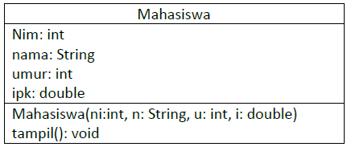<p>

Berdasarkan class diagram di atas, akan dibuat class Mahasiswa yang berfunsi untuk membuat objek mahasiswa yang akan dimasukan ke dalam sebuah array. Terdapat sebuah konstruktor berparameter dan juga fungsi tampil() untuk menampilkan semua attribute yang ada.<p>
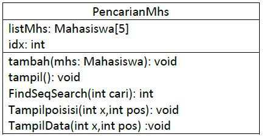<p>

Selanjutnya class diagram di atas merupakan representasi dari sebuah class yang berfungsi untuk melakukan operasi-operasi dari objek array mahasiswa, misalkan untuk menambahkan objek mahasiswa, menampilkan semua data mahasiswa, untuk melakukan pencarian berdasarkan NIM menggunakan algoritma Sequential Search, menampilkan posisi dari data yang dicari, serta menampilkan data mahasiswa yang dicari.<p>

<br>

### **6.2.1. Langkah-langkah Percobaan Sequential Search**
1. Buatlah Project baru pada Netbeans dengan nama TestSearching<p>
    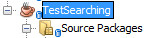<p>
2. Kemuadian buat packages baru dengan nama minggu7.<p>
    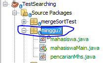<p> 
3. Buat class Mahasiswa, kemudian deklarasikan atribut berikut ini:<p>
    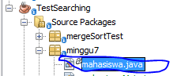<p> 

    ```java
    package minggu7;
    /**
    *
    * @author Alvian
    */
    public class mahasiswa {
        int nim;
        String nama;
        int umur;
        double ipk;
    ```
4. Buatlah konstruktor dengan nama Mahasiswa dengan parameter (int ni, String n, int u, double i) kemudian Isi konstruktor tersebut dengan kode berikut!
    ```java
    mahasiswa(int ni, String n, int u, double i){
        nim = ni;
        nama = n;
        umur = u;
        ipk = i;
    }
    ```
5. Buatlah method tampil bertipe void.
    ```java
    void tampil(){
        System.out.println("Nim\t: "+nim);
        System.out.println("Nama\t: "+nama);
        System.out.println("Umur\t: "+umur);
        System.out.println("IPK\t: "+ipk);
    }
    ```
6. Buat class baru dengan nama PencarianMhs seperti di bawah ini!<p>
    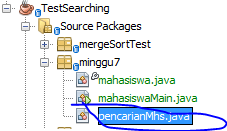<p>
    ```java
    package minggu7;
    /**
    *
    * @author Alvian
    */
    public class pencarianMhs {
        mahasiswa listMhs[] = new mahasiswa[5];
        int idx;
    ``` 
7. Tambahkan method tambah() di dalam class tersebut! Method tambah() digunakan untuk menambahkan objek dari class Mahasiswa ke dalam atribut listMhs.
    ```java
    void tambah(mahasiswa m){
        if(idx < listMhs.length){
            listMhs[idx] = m;
            idx ++;
        }else{
            System.out.println("Data Sudah Penuh !!");
        }
    }
    ```
8. Tambahkan method tampil() di dalam class PencarianMhs! Method tampil() digunakan untuk menampilkan semua data mahasiswa-mahasiswa yang ada di dalam class tersebut! Perhatikan penggunaan sintaks for yang agak berbeda dengan for yang telah dipelajari sebelumnya, meskipun secara konsep sebenarnya mirip.
    ```java
    void tampil(){
        for(mahasiswa m : listMhs){
            m.tampil();
            System.out.println("-----------------------");
        }
    }
    ```
9. Tambahkan method FindSeqSearch bertipe integer dengan parameter cari bertipe integer. Kemudian Deklarasikan isi method FindSeqSearch dengan algoritma pencarian data menggunakan teknik sequential searching.
    ```java
    public int findSeqSearch(int cari){
        int posisi = -1;
        for(int j=0; j < listMhs.length; j++){
            if(listMhs[j].nim == cari){
                posisi = j;
                break;
            }
        }
        return posisi;
    }
    ```
10. Buatlah method Tampilpoisisi bertipe void dan Deklarasikan isi dari method Tampilpoisisi.
    ```java
    public void tampilPosisi(int x, int pos){
        if(pos != -1){
            System.out.println("data\t: "+ x +" ditemukan pada indeks "+pos);
        }else {
            System.out.println("data\t"+ x +" tidak ditemukan");
        }
    }
    ```
11. Buatlah method TampilData bertipe void dan Deklarasikan isi dari method TampilData.
    ```java
    public void tampilData(int x, int pos){
        if(pos!= -1){
            System.out.println("Nim\t: "+x);
            System.out.println("Nama\t: "+listMhs[pos].nama);
            System.out.println("umur\t: "+listMhs[pos].umur);
            System.out.println("IPK\t: "+listMhs[pos].ipk);
        }else{
            System.out.println("Data "+ x +" Tidak ditemukan" );
        }
    }
    ```
12. Buatlah class baru dengan nama MahasiswaMain tambahkan method main seperti pada gambar berikut!<p>
    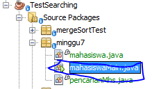<p>
    ```java
    package minggu7;
    import java.util.Scanner;
    /**
    *
    * @author Alvian
    */
    public class mahasiswaMain {
        /**
        * @param args the command line arguments
        */
    public static void main(String[] args) {
    ```
13. Di dalam method main(), buatlah sebuah objek PencarianMhs dan buatlah 5 objek mahasiswa kemudian tambahkan semua objek mahasiswa tersebut dengan memanggil fungsi tambah pada objek PencarianMhs.
    ```java
    package minggu7;
    import java.util.Scanner;
    /**
    *
    * @author Alvian
    */
    public class mahasiswaMain {
        /**
        * @param args the command line arguments
        */
        public static void main(String[] args) {
            Scanner s = new Scanner(System.in);
            Scanner sl = new Scanner(System.in);
        
            pencarianMhs data = new pencarianMhs();
            int jumMhs = 5;
        
            System.out.println("-----------------------------------------------------");
            System.out.println("Masukkan data mahasiswa secara urut dari Nim terkecil");
            for(int i=0; i < jumMhs; i++){
                System.out.println("-----------------------------------------------------");
                System.out.print("Nim\t: ");
                int nim = s.nextInt();
                System.out.print("Nama\t: ");
                String nama = sl.nextLine();
                System.out.print("Umur\t: ");
                int umur = s.nextInt();
                System.out.print("IPK\t: ");
                double ipk = s.nextDouble();
            
                mahasiswa m = new mahasiswa(nim, nama, umur, ipk);
                data.tambah(m);
            }
    ```
14. Panggil method tampil() untuk melihat semua data yang telah dimasukan.
    ```java
    System.out.println("________________________________________________________");
    System.out.println("Data Keseluruhan Mahasiswa : ");
    data.tampil();
    ```
15. Untuk melakukan pencarian berdasarkan NIM mahasiswa. Buatlah variable cari yang dapat menampung masukan dari keyboard lalu panggil method FindSeqSearch dengan isi parameternya adalah variable cari.
    ```java
    System.out.println("______________________________________________");
    System.out.println("Pencarian Data : ");
    System.out.println("Masukkan Nim Mahasiswa yang dicari : ");
    System.out.print("NIM\t: ");
    int cari = s.nextInt();
    System.out.println("Menggunakan sequential Search");
    int posisi = data.findSeqSearch(cari);
    ```
16. Lakukan pemanggilan method Tampilposisi dari class PencarianMhs.
    ```java
    data.tampilPosisi(cari, posisi);
    ```
17. Lakukan pemanggilan method TampilData dari class PencarianMhs.
    ```java
    data.tampilData(cari, posisi);
    ```
18. Jalankan dan amati hasilnya.

<br>

### **6.2.2. Verifikasi Hasil Percobaan**
Cocokkan hasil kode program anda dengan gambar berikut ini.<p>
**Jawab :** ya sama seperti yang di jobseat, berikut adalah hasil kode program yang berhasil saya jalankan dibawah ini<p>
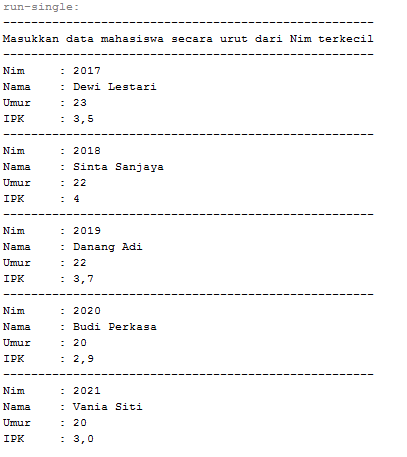<p>
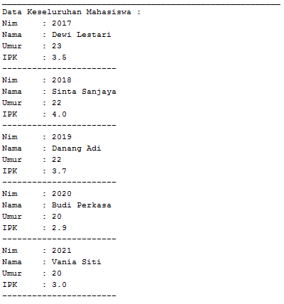<p>
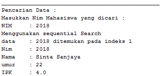<p>

<br>

### **6.2.3. Pertanyaan**
1. Jelaskan perbedaan metod TampilData dan Tampilposisi pada class PencarianMhs
    > **Jawab**
    >- method Tampil Data || TampilData(int x,int pos) :void <p>
    >   adalah sebuah method yang digunakan untuk menampilkan data yang ingin dicari oleh pengguna, dimana pengguna memasukan Nim dan kemudian akan di proses dan menampilkan data berupa NIM, NAMA, UMUR, IPK. apabila nim yang dimasukkan tidak ada pada program, maka method tampil data ini akan menampilkan output seperti berikut "Data "+ x +" Tidak ditemukan"<p>
    >- method TampilPosisi || Tampilpoisisi(int x,int pos): void<p>
    >   adalah sebuah method yang digunakan untuk menampilan posisi data yang ingin dicari oleh pengguna, dimana disaat pengguna memasukkan nim kdan meudian akan di proses dan menampilkan posisi data yang dicari berada pada index ke berapa, apabila nim yang dimasukkan tidak ada pada program, maka method tampil data ini akan menampilkan output seperti berikut "data\t"+ x +" tidak ditemukan"<p>

2. Jelaskan fungsi break pada kode program dibawah ini!<p>
    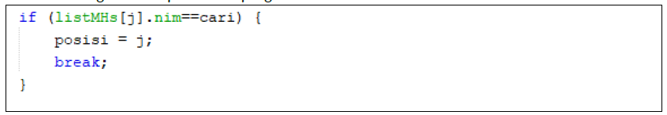<p>
    > **Jawab**<p>
    >Fungsi Break pada program diatas berfungsi apabila/jika listMhs[j].nim sama dengan variable  cari atau data listMhs[j] berhasil ditemukan. maka fungsi break adaah menghentikan perulangan pencarian data. karena data yang dicari sudah ditemukan<p>

3. Jika Data Nim yang dimasukkan tidak terurut dari kecil ke besar. Apakah program masih dapat berjalan? Apakah hasil yang dikeluarkan benar? Mengapa demikian!
    > **Jawab**<p>
    >Ya Dapat Berjalan, Ya Hasil yang dikeluarkan Benar, Karena pada algoritma Sequential Search dilakukan Proses pencarian dilakukan dengan membandingkan elemen array satu per satu secara beruntun mulai dari elemen pertama sampai elemen yang dicari sudah ditemukan atau sampai semua elemen sudah diperiksa sehingga Kumpulan data tidak harus dalam keadaan terurut program tetap bisa dijalankan berikut adalah bukti programnya<p>
    >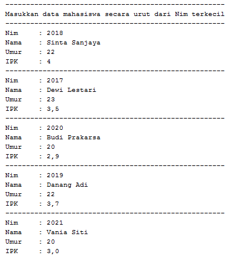<p>
    >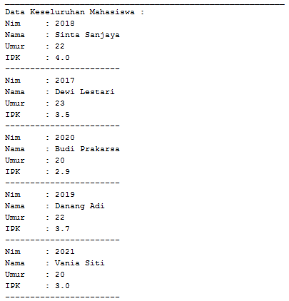<p>
    >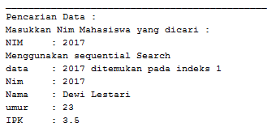<p>

<br>

## **6.3. Searching / Pencarian Menggunakan Binary Search**
### **6.3.1. Langkah-langkah Percobaan Binary Search**
1. Pada percobaan 6.2.1 (sequential search) tambahkan method FindBinarySearch bertipe integer pada class PencarianMhs. Kemudian Deklarasikan isi method FindBinarySearch dengan algoritma pencarian data menggunakan teknik binary searching.
    ```java
    public int findBinarySearch(int cari, int left, int right){
        int mid;
        if(right >= left){
            mid = (left + right)/2;
            if(cari == listMhs[mid].nim){
                return(mid);
            }else if(listMhs[mid].nim > cari){
                return findBinarySearch(cari, left, mid -1);
            }else{
                return findBinarySearch(cari, mid +1, right);
            }
        }
        return -1;
    }
    ```
2. Panggil method FindBinarySearch terdapat pada class PencarianMhs di kelas Mahasiswamain. Kemudia panggil method tampilposisi dan tampilData
    ```java
    System.out.println();
    System.out.println("==============================================");
    System.out.println("Menggunakan Binary Search");
    posisi = data.findBinarySearch(cari, 0, jumMhs -1);
        
    data.tampilPosisi(cari, posisi);
    data.tampilData(cari, posisi);
    ```
3. Jalankan dan amati hasilnya.

<br>

### **6.3.2. Verifikasi Hasil Percobaan**
Cocokkan hasil kode program anda dengan gambar berikut ini.<p>
**Jawab :** ya sama seperti yang di jobseat, berikut adalah hasil kode program yang berhasil saya jalankan dibawah ini<p>
<p>
<p>
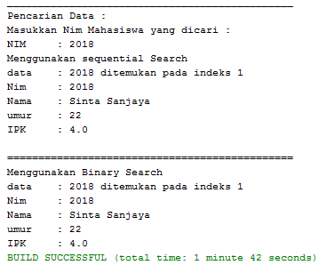<p>

<br>

### **6.3.3. Pertanyaan**
1. Tunjukkan pada kode program yang mana proses divide dijalankan!
    > **Jawab**<p>
    >Divede adalah dimana terjadi Proses pembagian dilakukan, pada source code saya terdapat pada class "pencarianMHS" pada baris ke 59, untuk detailnya terdapat pada gambar dibawah ini<p>
    >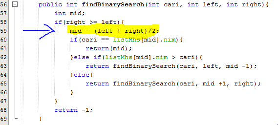<p>

2. Tunjukkan pada kode program yang mana proses conquer dijalankan!
    > **Jawab**<p>
    >Conquer adalah dimana terjadi proses pengurutan dilakukan, pada source code saya terdapat pada class "pencarianMHS" pada baris ke 62 - 66, untuk detailnya terdapat pada gambar dibawah ini<p>
    >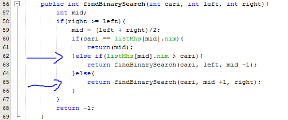<p>

3. Jika data Nim yang dimasukkan tidak urut. Apakah program masih dapat berjalan? Mengapa demikian!
    > **Jawab**<p>
    >Program masih dapat di Run, akkan tetapi data yang dicari tidak dapat ditemukan karena pada algoritma BinarySearch Teknik pencarian = data dibagi menjadi dua bagian untuk setiap kali proses pencarian. Data awal harus dalam kondisi terurut. Sehingga harus dilakukan proses sorting terlebih dahulu untuk data awal. Berikut adalah bukti bahwa data tidak ditemukan<p>
    ><p>
    ><p>
    >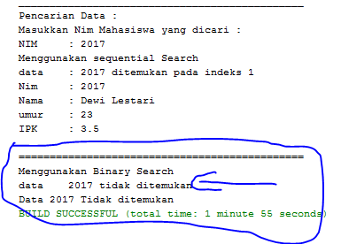<p>
4. Jika Nim yang dimasukkan dari NIM terbesar ke terkecil (missal : 20215, 20214, 20212, 20211, 20210) dan elemen yang dicari adalah 20210. Bagaimana hasil dari binary search? Apakah sesuai? Jika tidak sesuai maka ubahlah kode program binary seach agar hasilnya sesuai
    > **Jawab**<p>
    >Hasil Searching menggunakan Algoritma Binary Search tersebut tidak sesuai, berikut adalah pembuktian output programnya<p>
    >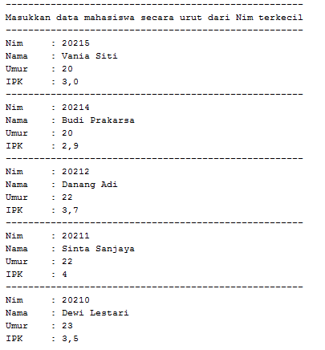<p>
    >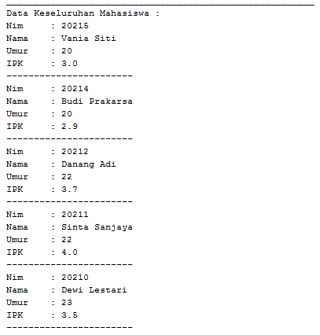<p>
    >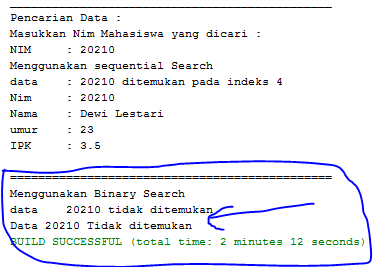<p>
    >jadi agar data yang di inginkan dapat ditemukan, saya mengubah kode program pada class "pencarianMHS" pada method "findBinarySearch", karena data yang di inputkan dari yang terbesar ke terkecil (descending) maka source code nya seperti berikut ini <p>
    >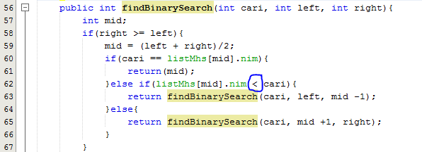<p>
    >dengan hasil outputan seperti berikut ini (maka sudah dapat ditemukan)<p>
    ><p>
    ><p>
    >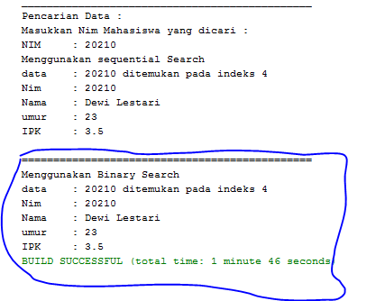<p>

5. Modifikasilah program diatas yang mana jumlah mahasiswa yang di inputkan sesuai dengan masukan dari keyboard.
    > **Jawab**
    >disini saya memodifikasi pada class "pencarianMhs" dan pada main class "mahasiswaMain"<p>
    >berikut adalah kode program yang saya modifikasi pada class "pencarianMhs"<p>
    ```java
    package minggu7;
    /**
    *
    * @author Alvian
    */
    public class pencarianMhs {
        mahasiswa listMhs[];
        int idx;
    
        void tambah(mahasiswa m){
            if(idx < listMhs.length){
                listMhs[idx] = m;
                idx ++;
            }else{
                System.out.println("Data Sudah Penuh !!");
            }
        }
        void tampil(){
            for(mahasiswa m : listMhs){
                m.tampil();
                System.out.println("-----------------------");
            }
        }
        public int findSeqSearch(int cari){
            int posisi = -1;
            for(int j=0; j < listMhs.length; j++){
                if(listMhs[j].nim == cari){
                    posisi = j;
                    break;
                }
            }
            return posisi;
        }
        public void tampilPosisi(int x, int pos){
            if(pos != -1){
                System.out.println("data\t: "+ x +" ditemukan pada indeks "+pos);
            }else {
                System.out.println("data\t"+ x +" tidak ditemukan");
            }
        }
        public void tampilData(int x, int pos){
            if(pos!= -1){
                System.out.println("Nim\t: "+x);
                System.out.println("Nama\t: "+listMhs[pos].nama);
                System.out.println("umur\t: "+listMhs[pos].umur);
                System.out.println("IPK\t: "+listMhs[pos].ipk);
            }else{
                System.out.println("Data "+ x +" Tidak ditemukan" );
            }
        }
        public int findBinarySearch(int cari, int left, int right){
            int mid;
            if(right >= left){
                mid = (left + right)/2;
                if(cari == listMhs[mid].nim){
                    return(mid);
                }else if(listMhs[mid].nim > cari){
                    return findBinarySearch(cari, left, mid -1);
                }else{
                    return findBinarySearch(cari, mid +1, right);
                }
            }
            return -1;
        }
    }
    ```
    >berikut adalah kode program yang saya modifikasi pada main class "mahasiswaMain"<p>
    ```java
    package minggu7;
    import java.util.Scanner;
    /**
    *
    * @author Alvian
    */
    public class mahasiswaMain {
        /**
        * @param args the command line arguments
        */
        public static void main(String[] args) {
            Scanner s = new Scanner(System.in);
            Scanner sl = new Scanner(System.in);
        
            pencarianMhs data = new pencarianMhs();
            System.out.print("Masukkan jumlah data Mahasiswa : ");
            int jumMhs = s.nextInt();
            mahasiswa[] inputan=new mahasiswa[jumMhs];
            data.listMhs=inputan;
        
            System.out.println("-----------------------------------------------------");
            System.out.println("Masukkan data mahasiswa secara urut dari Nim terkecil");
            for(int i=0; i < jumMhs; i++){
                System.out.println("-----------------------------------------------------");
                System.out.print("Nim\t: ");
                int nim = s.nextInt();
                System.out.print("Nama\t: ");
                String nama = sl.nextLine();
                System.out.print("Umur\t: ");
                int umur = s.nextInt();
                System.out.print("IPK\t: ");
                double ipk = s.nextDouble();
            
                mahasiswa m = new mahasiswa(nim, nama, umur, ipk);
                data.tambah(m);
            }    
            System.out.println("________________________________________________________");
            System.out.println("Data Keseluruhan Mahasiswa : ");
            data.tampil();
            
            System.out.println("______________________________________________");
            System.out.println("Pencarian Data : ");
            System.out.println("Masukkan Nim Mahasiswa yang dicari : ");
            System.out.print("NIM\t: ");
            int cari = s.nextInt();
            System.out.println("Menggunakan sequential Search");
            int posisi = data.findSeqSearch(cari);
            
            data.tampilPosisi(cari, posisi);
            data.tampilData(cari, posisi);
        
            System.out.println();
            System.out.println("==============================================");
            System.out.println("Menggunakan Binary Search");
            posisi = data.findBinarySearch(cari, 0, jumMhs -1);
        
            data.tampilPosisi(cari, posisi);
            data.tampilData(cari, posisi);
        }
    }
    ```
    >berikut adalah hasil outputan pada modifikasi diatas<p>
    >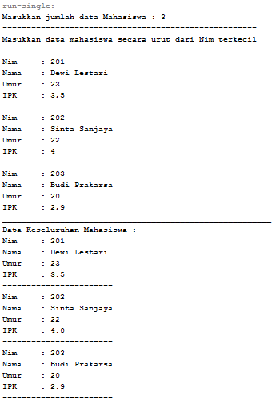<p>
    >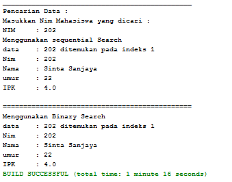<p>

<br>

## **6.4. Percobaan Pengayaan Divide and Conquer**
### **6.4.1. Langkah-langkah Percobaan Merge Sort**
1. Buatlah Package baru pada NetBeans dengan nama MergeSortTest<p>
    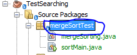<p>
2. Tambahkan class MergeSorting pada package tersebut<p>
    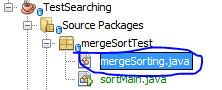<p>
3. Pada class MergeSorting buatlah method mergeSort yang menerima parameter data array yang akan diurutkan
    ```java
    package mergeSortTest;
    /**
    *
    * @author Alvian
    */
    public class mergeSorting {
    
        public void mergeSort(int[] data){
            this.sort(data, 0, data.length -1);
        }
    ```
4. Buatlah method merge untuk melakukan proses penggabungan data dari bagian kiri dan kanan.
    ```java
    private void merge(int data[], int left, int midle, int right){
    ```
5. Implementasikan proses merge sebagai berikut.
    ```java
    private void merge(int data[], int left, int midle, int right){
        int[] temp = new int[data.length];
        for(int i= left; i<= right; i++){
            temp[i] = data[i];
        }
        int a = left;
        int b = midle +1;
        int c = left;
        
        //membandingkan setiap bagian
        while(a <= midle && b<= right){
            if(temp[a] <= temp[b]){
                data[c] = temp[a];
                a++;
            }else{
                data[c] = temp[b];
                b++;
            }
            c++;
        }
        int s= midle - a;
        for(int i=0; i<=s; i++){
            data[c+i] = temp[a+i];
        }
    }
    ```
6. Buatlah method sort
    ```java
    private void sort(int data[], int left, int right){
    ```
7. Implementasikan kode berikut pada method sort
    ```java
    //membagi menjadi 2 bagian dan dibagi kembali hingga tidak dapat dibagi kembali
    private void sort(int data[], int left, int right){
        if(left < right){
            int midle = (left + right)/2;
            sort(data, left, midle);
            sort(data, midle + 1, right);
            merge(data, left, midle, right);
        }
    }
    ```
8. Pada method mergeSort, panggil method sort dengan parameter data yang ingin diurutkan serta range data awal sampai dengan akhir.
9. Tambahkan method printArray
    ```java
    public void printArray(int arr[]){
        int n = arr.length;
        for(int i=0; i<n; i++){
            System.out.print(arr[i]+" ");
        }
        System.out.println();
    }
    ```
10. Sebagai langkah terakhir, deklarasikan data yang akan diurutkan kemudian panggil proses sorting pada class SortMain<p>
    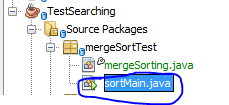<p>
    ```java
    package mergeSortTest;
    /**
    *
    * @author Alvian
    */
    public class sortMain {
        /**
        * @param args the command line arguments
        */
        public static void main(String[] args) {
            int data[] = {10, 40, 30, 50, 70, 20, 100, 90};
            System.out.println("Sorting dengan merge sort");
            mergeSorting mSort = new mergeSorting();
            System.out.println("data awal");
            mSort.printArray(data);
            mSort.mergeSort(data);
            System.out.println("Setelah diurutkan");
            mSort.printArray(data);
        }
    }
    ```

<br>

### **6.4.2. Verifikasi Hasil Percobaan**
Cocokkan hasil compile kode program anda dengan gambar berikut ini.<p>
**Jawab :** ya sama seperti yang di jobseat, berikut adalah hasil kode program yang berhasil saya jalankan dibawah ini<p>
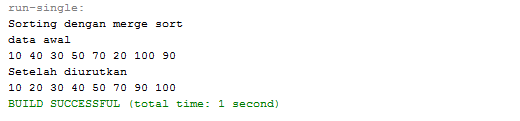<p>

<br>

## **6.5. Latihan Praktikum**
1. Modifikasi percobaan searching diatas dengan ketentuan berikut ini
    - Sebelum dilakukan searching dengan binary search data harus dilakukan pengurutan dengan menggunakan algoritma sorting (pilih salah satu algoritma sorting dari pertemuan sebelumnya)<p>
    **Jawab**<p>
    **class "tugas1_mahasiswa"**<p>
    ```java
    package tugas1;
    /**
    *
    * @author Alvian
    */
    public class tugas1_mahasiswa {
        int nim;
        String nama;
        int umur;
        double ipk;
        
        tugas1_mahasiswa(int ni, String n, int u, double i){
            nim = ni;
            nama = n;
            umur = u;
            ipk = i;
        }
        void tampil(){
            System.out.println("Nim\t: "+nim);
            System.out.println("Nama\t: "+nama);
            System.out.println("Umur\t: "+umur);
            System.out.println("IPK\t: "+ipk);
        }
    }
    ```

    **class "tugas1_pencarianMhs"**<p>
    ```java
    package tugas1;
    /**
    *
    * @author Alvian
    */
    public class tugas1_pencarianMhs {
        tugas1_mahasiswa listMhs[];
        int idx;
    
        void tambah(tugas1_mahasiswa m){
            if(idx < listMhs.length){
                listMhs[idx] = m;
                idx ++;
            }else{
                System.out.println("Data Sudah Penuh !!");
            }
        }
        void tampil(){
            for(tugas1_mahasiswa m : listMhs){
                m.tampil();
                System.out.println("-----------------------");
            }
        }
        void selectionSort(){
            for(int i=0;i<listMhs.length-1;i++){
                int idxMin=i;
                for(int j=i+1;j<listMhs.length;j++){
                    if(listMhs[j].nim>listMhs[idxMin].nim){
                        idxMin=j;
                    }
                }
                tugas1_mahasiswa tmp=listMhs[idxMin];
                listMhs[idxMin]=listMhs[i];
                listMhs[i]=tmp;
            }
        }
        public void tampilPosisi(int x, int pos){
            if(pos != -1){
                System.out.println("data\t: "+ x +" ditemukan pada indeks "+pos);
            }else {
                System.out.println("data\t"+ x +" tidak ditemukan");
            }
        }
        public void tampilData(int x, int pos){
            if(pos!= -1){
                System.out.println("Nim\t: "+x);
                System.out.println("Nama\t: "+listMhs[pos].nama);
                System.out.println("umur\t: "+listMhs[pos].umur);
                System.out.println("IPK\t: "+listMhs[pos].ipk);
            }else{
                System.out.println("Data "+ x +" Tidak ditemukan" );
            }
        }
        public int findBinarySearch(int cari, int left, int right){
            int mid;
            if(right >= left){
                mid = (left + right)/2;
                if(cari == listMhs[mid].nim){
                    return(mid);
                }else if(listMhs[mid].nim < cari){
                    return findBinarySearch(cari, left, mid -1);
                }else{
                    return findBinarySearch(cari, mid +1, right);
                }
            }
            return -1;
        }
    }
    ```
    **main class "tugas1_mahasiswaMain"**<p>
    ```java
    package tugas1;
    import java.util.Scanner;
    /**
    *
    * @author Alvian
    */
    public class tugas1_mahasiswaMain {
        /**
        * @param args the command line arguments
        */
        public static void main(String[] args) {
            Scanner s = new Scanner(System.in);
            Scanner sl = new Scanner(System.in);
        
            tugas1_pencarianMhs data = new tugas1_pencarianMhs();
            System.out.print("Masukkan jumlah data Mahasiswa : ");
            int jumMhs = s.nextInt();
            tugas1_mahasiswa[] inputan=new tugas1_mahasiswa[jumMhs];
            data.listMhs=inputan;
        
            System.out.println("-----------------------------------------------------");
            System.out.println("Masukkan data mahasiswa");
            for(int i=0; i < jumMhs; i++){
                System.out.println("-----------------------------------------------------");
                System.out.print("Nim\t: ");
                int nim = s.nextInt();
                System.out.print("Nama\t: ");
                String nama = sl.nextLine();
                System.out.print("Umur\t: ");
                int umur = s.nextInt();
                System.out.print("IPK\t: ");
                double ipk = s.nextDouble();
            
                tugas1_mahasiswa m = new tugas1_mahasiswa(nim, nama, umur, ipk);
                data.tambah(m);
            }    
            System.out.println("________________________________________________________");
            System.out.println("Data Keseluruhan Mahasiswa : ");
            data.tampil();
        
            System.out.println("________________________________________________________");
            System.out.println("Data Setelah diurutkan menggunakan bubble Sort (asc): ");
            data.selectionSort();
            data.tampil();
            
            System.out.println("______________________________________________");
            System.out.println("Pencarian Data : ");
            System.out.println("Masukkan Nim Mahasiswa yang dicari : ");
            System.out.print("NIM\t: ");
            int cari = s.nextInt();
        
            System.out.println();
            System.out.println("==============================================");
            System.out.println("Menggunakan Binary Search");
            int posisi = data.findBinarySearch(cari, 0, jumMhs -1);
        
            data.tampilPosisi(cari, posisi);
            data.tampilData(cari, posisi);
        }
    }
    ```
    **Berikut adalah Hasil Output nya**<p>
    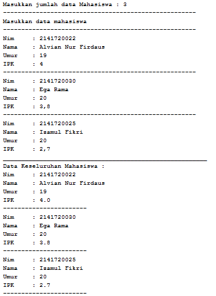<p>
    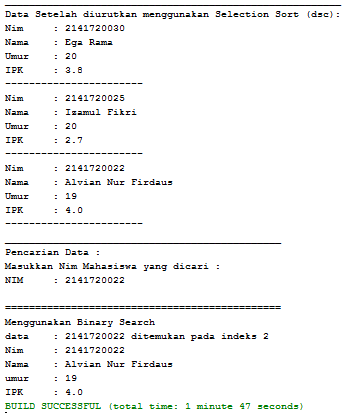<p>

<br>

2. Modifikasi percobaan searching diatas dengan ketentuan berikut ini
    - Pencarian dilakukan berdasarkan Nama Mahasiswa (gunakan Algoritma Sequential Search)
    - Jika terdapat nama yang sama? Bagaimana keluaran dari kode program ketika pencarian dilakukan pada nama yang sama!<p>
    **Jawab**<p>
    **class "tugas2_mahasiswaMain"**<p>
    ```java
    package tugas2;
    /**
    *
    * @author Alvian
    */
    public class tugas2_mahasiswa {
        int nim;
        String nama;
        int umur;
        double ipk;
    
        tugas2_mahasiswa(int ni, String n, int u, double i){
            nim = ni;
            nama = n;
            umur = u;
            ipk = i;
        }
        void tampil(){
            System.out.println("Nim\t: "+nim);
            System.out.println("Nama\t: "+nama);
            System.out.println("Umur\t: "+umur);
            System.out.println("IPK\t: "+ipk);
        }
    }
    ```
    **class "tugas2_pencarianMhs"**<p>
    ```java
    package tugas2;
    /**
    *
    * @author Alvian
    */
    public class tugas2_pencarianMhs {
        tugas2_mahasiswa listMhs[];
        int idx;
    
        void tambah(tugas2_mahasiswa m){
            if(idx < listMhs.length){
                listMhs[idx] = m;
                idx ++;
            }else{
                System.out.println("Data Sudah Penuh !!");
            }
        }
        void tampil(){
            for(tugas2_mahasiswa m : listMhs){
                m.tampil();
                System.out.println("-----------------------");
            }
        }
        public int findSeqSearch(String cari){
            int posisi = -1;
            for(int j=0; j < listMhs.length; j++){
                if(cari.equals(listMhs[j].nama)){
                    posisi = j;
                    break;
                }
            }
            return posisi;
        }
        public void tampilPosisi(String x, int pos){
            if(pos != -1){
                System.out.println("data\t: "+ x +" ditemukan pada indeks "+pos);
            }else {
                System.out.println("data\t"+ x +" tidak ditemukan");
            }
        }
        public void tampilData(String x, int pos){
            if(pos!= -1){
                System.out.println("Nim\t: "+listMhs[pos].nim);
                System.out.println("Nama\t: "+x);
                System.out.println("umur\t: "+listMhs[pos].umur);
                System.out.println("IPK\t: "+listMhs[pos].ipk);
            }else{
                System.out.println("Data "+ x +" Tidak ditemukan" );
            }
        }
    }
    ```
    **main class "tugas2_mahasiswaMain"**<p>
    ```java
    package tugas2;
    import java.util.Scanner;
    /**
    *
    * @author Alvian
    */
    public class tugas2_mahasiswaMain {
        /**
        * @param args the command line arguments
        */
        public static void main(String[] args) {
            Scanner s = new Scanner(System.in);
            Scanner sl = new Scanner(System.in);
        
            tugas2_pencarianMhs data = new tugas2_pencarianMhs();
            System.out.print("Masukkan jumlah data Mahasiswa : ");
            int jumMhs = s.nextInt();
            tugas2_mahasiswa[] inputan=new tugas2_mahasiswa[jumMhs];
            data.listMhs=inputan;
        
            System.out.println("-----------------------------------------------------");
            System.out.println("Masukkan data mahasiswa");
            for(int i=0; i < jumMhs; i++){
                System.out.println("-----------------------------------------------------");
                System.out.print("Nim\t: ");
                int nim = s.nextInt();
                System.out.print("Nama\t: ");
                String nama = sl.nextLine();
                System.out.print("Umur\t: ");
                int umur = s.nextInt();
                System.out.print("IPK\t: ");
                double ipk = s.nextDouble();
            
                tugas2_mahasiswa m = new tugas2_mahasiswa(nim, nama, umur, ipk);
                data.tambah(m);
            }    
            System.out.println("________________________________________________________");
            System.out.println("Data Keseluruhan Mahasiswa : ");
            data.tampil();
            
            System.out.println("______________________________________________");
            System.out.println("Pencarian Data : ");
            System.out.println("Masukkan Nama Mahasiswa yang dicari : ");
            System.out.print("Nama\t: ");
            String cari = sl.nextLine();

            System.out.println();
            System.out.println("==============================================");
            System.out.println("Menggunakan Sequential Search");
            int posisi = data.findSeqSearch(cari);
        
            data.tampilPosisi(cari, posisi);
            data.tampilData(cari, posisi);
        }
    }
    ```
    **Berikut adalah Hasil Output nya**<p>
    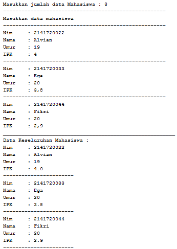<p>
    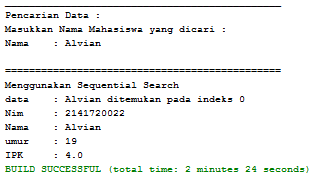<p>

<br>

3. Terdapat sebuah data array 1 dimensi sebagai berikut
    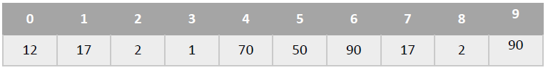<p>

    Buatlah program untuk mengurutkan array tersebut (boleh memilih metode pengurutan) selanjutnya lakukan pencarian dan mencetak isi array yang nilainya terbesar, dan mencetak ada berapa buah nilai terbesar tersebut serta berada dilokasi mana saja nilai terbesar tersebut! (menggunakan binary search)<p>
    **Jawab**<p>
    **Class "tugas3"**<p>
    ```java
    package tugas3;
    /**
    *
    * @author Alvian
    */
    public class tugas3 {
        public int [] data;
        public int maks = 0;
        public int posisi;
        public int jumlah = 0;
    
        tugas3(int nilai[]){
            data = nilai;
        }
        void tampil(){
            for(int i = 0; i < data.length; i++){
                System.out.print(data[i] + " ");
            }
            System.out.println();
        }
        void bubbleSort(){
            for(int i=0; i<data.length -1; i++){
                for(int j = 1; j < data.length -i; j++){
                    if(data[j] > data[j-1]){
                        int tmp = data[j];
                        data[j] = data[j-1];
                        data[j-1]= tmp;
                    }
                }
            }
        }
        public int searching(int cari, int kiri, int kanan){
            int mid;
            if(kanan >= kiri){
                mid = (kiri + kanan)/2;
                if(cari == data[mid]){
                    return (mid);
                }else if(data[mid] > cari){
                    return searching(cari, mid +1, kanan);
                }else{
                    return searching(cari, kiri, mid -1);
                }
            }
            return -1;
        }
        public int nilaiTerbesar(){
            for(int i=0; i<data.length; i++){
                if(data[i] > maks){
                    maks = data[i];
                }
            }
            System.out.println("Nilai terbesar adalah\t\t: "+maks);
            return maks;
        }
        public void tampilPosisi(int pos){
            for(int i=0; i<data.length; i++){
                if(data[i] == maks){
                    jumlah++;
                }
            }
            System.out.println("Yang Berjumlah\t\t\t: "+jumlah+" Bilangan");
            System.out.println();
            posisi = maks;
            for(int i=0; i<data.length; i++){
                if(posisi == data[i]){
                    pos = i;
                    System.out.println("Data Ditemukan pada Indeks ke-\t: "+pos);
                }
            }
        }
    }
    ```
    **Main Class "tugas3Main"**<p>
    ```java
    package tugas3;
    /**
    *
    * @author Alvian
    */
    public class tugas3_main {
        /**
        * @param args the command line arguments
        */
        public static void main(String[] args) {
            int bil[] = {12,17, 2, 1, 70, 50, 90, 17, 2, 90};
        
            tugas3 arry = new tugas3 (bil);
        
            int jum = 10;
            int maks = 0;
        
            System.out.println("------------------------------------------------");
            System.out.println("tampil data sebelum disorting adalah");
            arry.tampil();
            arry.bubbleSort();
            System.out.println("--------------------------------------------------");
            System.out.println("tampil data setelah dishorting dengan bubble short");
            arry.tampil();
            System.out.println("___________________________________________________");
            arry.nilaiTerbesar();
            arry.searching(maks, 0, jum-1);
            arry.tampilPosisi(maks);
        }
    }
    ```
    **Berikut adalah hasil Output dari Tugas 3 diatas**<p>  
    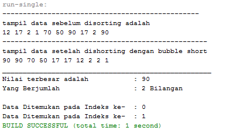<p>