# **Laporan Praktikum**
# **Jobseat 7 STACK**

## **Data Mahasiswa**
><p>Nama : Alvian Nur Firdaus<p>
>Kelas : 1F<p>
>Prodi : D-IV Teknik Inormatika<p>
>Jurusan : Teknologi Inormasi<p>
>Politeknik Negri Malang

<br>

## **7.1 Tujuan Praktikum**
Setelah melakukan materi praktikum ini, mahasiswa mampu:
1. Mengenal struktur data Stack
2. Membuat dan mendeklarasikan struktur data Stack
3. Menerapkan algoritma Stack dengan menggunakan array

<br>

## **7.2 Praktikum 1**
Waktu percobaan : 45 menit<p>
Pada percobaan ini, kita akan membuat program yang mengilustrasikan tumpukan pakaian yang disimpan ke dalam stack. Karena sebuah pakaian mempunyai beberapa informasi, maka implementasi Stack dilakukan dengan menggunakan array of object untuk mewakili setiap elemennya.<p>

### **7.2.1 Langkah-langkah Percobaan**
1. Perhatikan Diagram Class Pakaian berikut ini:<p>
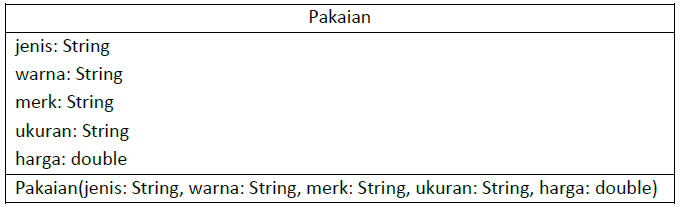<p>
Berdasarkan diagram class tersebut, akan dibuat program class Pakaian dalam Java.<p>

2. Buat package dengan nama Praktikum1, kemudian buat class baru dengan nama Pakaian.<p>
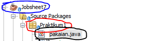<p>

3. Tambahkan atribut-atribut Pakaian seperti pada Class Diagram Pakaian, kemudian tambahkan pula konstruktornya seperti gambar berikut ini.
    ```java
    package Praktikum1;
    /**
    *
    * @author Alvian
    */
    public class pakaian {
        String jenis, warna, merk, ukuran;
        double harga;
    
        pakaian(String jenis, String warna, String merk, String ukuran, double harga){
            this.jenis = jenis;
            this.warna = warna;
            this.merk = merk;
            this.ukuran = ukuran;
            this.harga = harga;
        }
    }
    ```

4. Setelah membuat class Pakaian, selanjutnya perlu dibuat class Stack yang berisi atribut dan method sesuai diagram Class Stack berikut ini:
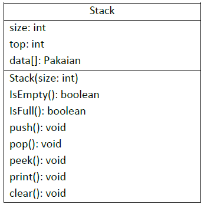<p>
Keterangan: Tipe data pada variabell data menyesuaikan dengan data yang akan akan disimpan di dalam Stack. Pada praktikum ini, data yang akan disimpan merupakan array of object dari Pakaian, sehingga tipe data yang digunakan adalah Pakaian<p>

5. Buat class baru dengan nama Stack. Kemudian tambahkan atribut dan konstruktor seperti gambar berikut ini.<p>
    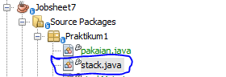<p>
    
    ```java
    package Praktikum1;
    /**
    *
    * @author Alvian
    */
    public class stack {
        int size, top;
        pakaian data[];
    
        public stack(int size){
            this.size = size;
            data = new pakaian[size];
            top = -1;
        }
    ```

6. Buat method IsEmpty bertipe boolean yang digunakan untuk mengecek apakah stack kosong.
    ```java
    public boolean IsEmpty(){
        if(top == -1){
            return true;
        }else{
            return false;
        }
    }
    ```
7. Buat method IsFull bertipe boolean yang digunakan untuk mengecek apakah stack sudah terisi penuh.
    ```java
    public boolean IsFull(){
        if(top == size -1){
            return true;
        }else{
            return false;
        }
    }
    ```
8. Buat method push bertipe void untuk menambahkan isi elemen stack dengan parameter pkn yang berupa object Pakaian
    ```java
    public void push(pakaian pkn){
        if(!IsFull()){
            top++;
            data[top] = pkn;
        }else{
            System.out.println("Isi stack Penuh");
        }
    }
    ```
9. Buat method Pop bertipe void untuk mengeluarkan isi elemen stack. Karena satu elemen stack terdiri dari beberapa informasi (jenis, warna, merk, ukuran, dan harga), maka ketika mencetak data juga perlu ditampilkan semua informasi tersebut
    ```java
    public void pop(){
        if(!IsEmpty()){
            pakaian x = data[top];
            top--;
            System.out.println("Data yang keluar : "+ x.jenis +" "+ x.warna +" "+ x.merk +" "+ x.ukuran +" "+ x.harga);
        }else{
            System.out.println("Stack masih kosong");
        }
    }
    ```
10. Buat method peek bertipe void untuk memeriksa elemen stack pada posisi paling atas.
    ```java
    public void peek(){
        System.out.println("Elemen teratas: "+ data[top].jenis  +" "+ data[top].warna +" "+ data[top].merk +" "+ data[top].ukuran +" "+ data[top].harga);
    }
    ```
11. Buat method print bertipe void untuk menampilkan seluruh elemen pada stack.
    ```java
    public void print(){
        System.out.println();
        System.out.println("Isi stack : ");
        for(int i=top; i >= 0; i--){
            System.out.println(data[i].jenis + " "+ data[i].warna +" "+ data[i].merk +" "+ data[i].ukuran +" "+ data[i].harga +" ");
        }
        System.out.println("");
    }
    ```
12. Buat method clear bertipe void untuk menghapus seluruh isi stack.
    ```java
    public void clear(){
        if(!IsEmpty()){
            for(int i=top; i >= 0; i--){
                top--;
            }
            System.out.println("Stack sudah dikosongkan");
        }else{
            System.out.println("Gagal! Stack masih kosong");
        }
    }
    ```
13. Selanjutnya, buat class baru dengan nama StackMain. Buat fungsi main, kemudian lakukan instansiasi objek dari class Stack dengan nama stk dan nilai parameternya adalah 5.<p>
    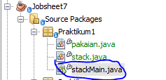<p>

14. Deklarasikan Scanner dengan nama sc
    ```java
    package Praktikum1;
    import java.util.Scanner;
    /**
    *
    * @author Alvian
    */
    public class stackMain {
        /**
        * @param args the command line arguments
        */
        public static void main(String[] args) {
            stack stk = new stack(5);
        
            Scanner sc = new Scanner(System.in);
    ```
15. Tambahkan kode berikut ini untuk menerima input data Pakaian, kemudian semua informasi tersebut dimasukkan ke dalam stack<p>
    ```java
    char pilih;
        do{
            System.out.println("");
            System.out.print("Jenis\t\t: ");
            String jenis = sc.nextLine();
            System.out.print("Warna\t\t: ");
            String warna = sc.nextLine();
            System.out.print("Merk\t\t: ");
            String merk = sc.nextLine();
            System.out.print("Ukuran\t\t: ");
            String ukuran = sc.nextLine();
            System.out.print("Harga\t\t: ");
            double harga = sc.nextInt();
            System.out.println("");
            
            pakaian p = new pakaian(jenis, warna, merk, ukuran, harga);
            System.out.print("Apakah anda akan menambahkan data baru ke stack (y/n)? ");
            pilih = sc.next().charAt(0);
            sc.nextLine();
            stk.push(p);
        }while (pilih == 'y');
    ```
    **Catatan:** sintaks sc.nextLine() sebelum sintaks st.push(p) digunakan untuk mengabaikan karakter new line<p>

16. Lakukan pemanggilan method print, method pop, dan method peek dengan urutan sebagai berikut.
    
    ```java
    stk.print();
    stk.pop();
    stk.peek();
    stk.print();
    ```
17. Compile dan jalankan class StackMain, kemudian amati hasilnya.

<br>

### **7.2.2 Verifikasi Hasil Percobaan**
Setelah saya melakukan RUN kode program diatas didapatkan hasil run sama seperti di Jobseat, menandakan sudah berhasil<p>

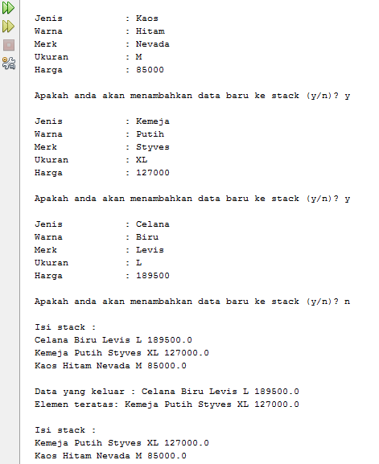<p>

<br>

### **7.2.3 Pertanyaan**
1. Berapa banyak data pakaian yang dapat ditampung di dalam stack? Tunjukkan potongan kode program untuk mendukung jawaban Anda tersebut!<p>
    > **Jawab**<p>
    > Banyak data pakaian yang dapat ditampung didalam stack berjumlah 5 elemen, adapun potongan kodenya terdapat pada Main class "stackMain" berikut ini<p>
    >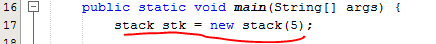<p>

2. Perhatikan class StackMain, pada saat memanggil fungsi push, parameter yang dikirimkan adalah p. Data apa yang tersimpan pada variabel p tersebut?<p>
    > **Jawab**<p>
    >Data yang tersimpan pada variabel p adalah data data yang dimasukkan melalui scanner

3. Apakah fungsi penggunaan do-while yang terdapat pada class StackMain?<p>
    > **Jawab**<p>
    >berfungsi untuk melakukan perulangan agar nantinya user dapat menginputkan data yang meliputi judul, nama pengarang, tahun terbit, jumlah halaman, dan harga. Maka setelah melakukan penginputan, user akan diberi pilihan untuk menambahkan data baru atau tidak, jika "y" maka user akan diminta untuk menginputkan data data lagi, dan jika user memilih "n" maka program akan berhenti<p>

4. Modifikasi kode program pada class StackMain sehingga pengguna dapat memilih operasi-operasi pada stack (push, pop, peek, atau print) melalui pilihan menu program dengan memanfaatkan kondisi IF-ELSE atau SWITCH-CASE!<p>
    > **Jawab**<p>
    >disini saya memodifikasi dibagian main class "stack Main" seperti berikut ini

    ```java
    package Praktikum1;
    import java.util.Scanner;
    /**
    *
    * @author Alvian
    */
    public class stackMain {
        /**
        * @param args the command line arguments
        */
        public static void main(String[] args) {
            stack stk = new stack(5);
        
            Scanner sc = new Scanner(System.in);
            Scanner sd = new Scanner(System.in);
        
            char pilih;
            do{
                System.out.println("------------------------------------");
                System.out.println("             PILIHAN MENU           ");
                System.out.println("------------------------------------");
                System.out.println(" 1. Push\n 2. Pop\n 3. Peek\n 4.Print\n");
                int pilihan;
                System.out.print("Pilih Menu (masukkan angka 1-4)");
                pilihan = sd.nextInt();
            
                switch (pilihan){
                    case 1:
                        do{
                            System.out.print("Jenis\t\t: ");
                            String jenis = sc.nextLine();
                            System.out.print("Warna\t\t: ");
                            String warna = sc.nextLine();
                            System.out.print("Merk\t\t: ");
                            String merk = sc.nextLine();
                            System.out.print("Ukuran\t\t: ");
                            String ukuran = sc.nextLine();
                            System.out.print("Harga\t\t: ");
                            double harga = sd.nextInt();
                            System.out.println("");
            
                            pakaian p = new pakaian(jenis, warna, merk, ukuran, harga);
                            System.out.print("Apakah anda akan menambahkan data baru ke stack (y/n)? ");
                            pilih = sc.next().charAt(0);
                            sc.nextLine();
                            stk.push(p);
                        }while (pilih == 'y');
                        break;
                
                    case 2:
                        stk.pop();
                        break;
                
                    case 3:
                        stk.peek();
                        break;
                
                    case 4:
                        stk.print();
                        break;
                
                    default:
                        System.out.println("Input yang anda masukkan salah");
                        System.exit(0);

                    }if(pilihan == 5){
                        pilih ='t';
                    }else{
                    System.out.print("Kembali ke menu Utama (y/t) ");
                    pilih = sc.next().charAt(0);
                }
            }while (pilih == 'y');
        }
    }
    ```
    >Setelah melakukan modifikasi didapati otput program dengan bebberapa pilihan yang ditentukan seperti berikut<p>
    >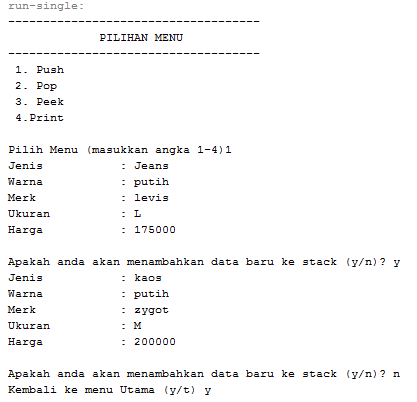<p>
    >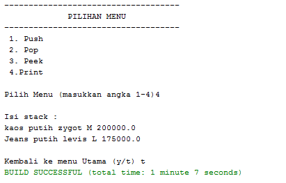<p>

<br>

## **7.3 Praktikum 2**
Waktu percobaan : 30 menit<p>
Pada percobaan ini, kita akan membuat program untuk melakukan konversi notasi infix menjadi notasi postfix.<p>

### **7.3.1 Langkah-langkah Percobaan**
1. Perhatikan Diagram Class berikut ini:<p>
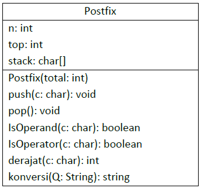<p>
Berdasarkan diagram class tersebut, akan dibuat program class Postfix dalam Java.<p>

2. Buat package dengan nama Praktikum2, kemudian buat class baru dengan nama Postfix. Tambahkan atribut n, top, dan stack sesuai diagram class Postfix tersebut.<p>
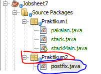<p>

3. Tambahkan pula konstruktor berparameter seperti gambar berikut ini.<p>

    ```java
    package Praktikum2;
    /**
    *
    * @author Alvian
    */
    public class postfix {
        int n, top; 
        char stack[];

        public postfix(int total){
            n = total;
            top = -1;
            stack = new char[n];
            push('(');
        }
    ```

4. Buat method push dan pop bertipe void.

    ```java
    public void push(char c){
        top++;
        stack[top] = c;
    }
    public char pop(){
        char item = stack[top];
        top--;
        return item;
    }
    ```

5. Buat method IsOperand dengan tipe boolean yang digunakan untuk mengecek apakah elemen data berupa operand.
    ```java
    public boolean IsOperand(char c){
        if((c >= 'A' && c <= 'z') || (c >= 'A' && c <= 'z') || (c >= '0' && c <= '9') || c == ' ' || c == '.'){
            return true;
        }else{
            return false;
        }
    }
    ```
6. Buat method IsOperator dengan tipe boolean yang digunakan untuk mengecek apakah elemen data berupa operator.
    ```java
    public boolean IsOperator(char c){
        if(c == '^' || c == '%' || c == '/' || c == '*' || c == '-' || c == '+'){
            return true;
        }else{
            return false;
        }
    }
    ```
7. Buat method derajat yang mempunyai nilai kembalian integer untuk menentukan derajat operator.
    ```java
    public int derajat(char c){
        switch(c){
            case '^':
                return 3;
            case '%':
                return 2;
            case '/':
                return 2;
            case '*':
                return 2;
            case '-':
                return 1;
            case '+':
                return 1;
            default:
                return 0;
        }
    }
    ```
8. Buat method konversi untuk melakukan konversi notasi infix menjadi notasi postfix dengan cara mengecek satu persatu elemen data pada String Q sebagai parameter masukan.
    ```java
    public String konversi(String Q){
        String P = "";
        char c;
        for(int i=0; i<n; i++){
            c = Q.charAt(i);
            if(IsOperand(c)){
                P = P + c;
            }if(c == '('){
                push(c);
            }if(c == ')'){
                while (stack[top] != '('){
                    P = P + pop();
                }
                pop();
            }if(IsOperator(c)){
                while(derajat(stack[top]) >= derajat(c)){
                    P = P + pop();
                }
                push(c);
            }
        }
        return P;
    }
    ```

9. Selanjutnya, buat class baru dengan nama PostfixMain tetap pada package Praktikum2. Buat class main, kemudian buat variabel P dan Q. Variabel P digunakan untuk menyimpan hasil akhir notasi postfix setelah dikonversi, sedangkan variabel Q digunakan untuk menyimpan masukan dari pengguna berupa ekspresi matematika dengan notasi infix. Deklarasikan variabel Scanner dengan nama sc, kemudian panggil fungsi built-in trim yang digunakan untuk menghapus adanya spasi di depan atau di belakang teks dari teks persamaan yang dimasukkan oleh pengguna.<p>
Penambahan string “)” digunakan untuk memastikan semua simbol/karakter yang masih berada di stack setelah semua persamaan terbaca, akan dikeluarkan dan dipindahkan ke postfix.<p>
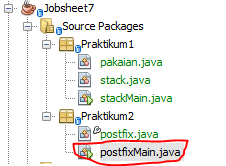<p>

    ```java
    package Praktikum2;
    import java.util.Scanner;
    /**
     *
    * @author Alvian
    */
    public class postfixMain {
        /**
        * @param args the command line arguments
        */
        public static void main(String[] args) {
            Scanner sc = new Scanner(System.in);
            String P,Q;
            System.out.print("Masukkan ekspresi matematika (infix)\t: ");
            Q = sc.nextLine();
            Q = Q.trim();
            Q = Q + ")";
    ```
10. Buat variabel total untuk menghitung banyaknya karaketer pada variabel Q.

11. Lakukan instansiasi objek dengan nama post dan nilai parameternya adalah total. Kemudian panggil method konversi untuk melakukan konversi notasi infix Q menjadi notasi postfix P.

    ```java
    int total = Q.length();
    postfix post = new postfix(total);
    P = post.konversi(Q);
    System.out.println();
    System.out.println("Postfix\t\t\t\t\t: "+ P);
    ```
12. Compile dan jalankan class PostfixMain dan amati hasilnya.

<br>

### **7.3.2 Verifikasi Hasil Percobaan**
Setelah saya melakukan RUN kode program diatas didapatkan hasil run sama seperti di Jobseat, menandakan sudah berhasil<p>
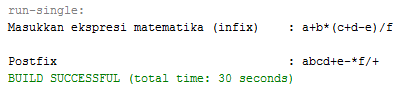<p>

<br>

### **7.3.3 Pertanyaan**
1. Perhatikan class Postfix, jelaskan alur kerja method derajat!
    > **Jawab**<p>
    >pada class "postix", method derajat memiliki alur seperti berikut ini ketika operator tersebut adalah '^' maka akan mereturn nilai 3, jika operator '%','/','*' maka akan mereturn nilai 2. dan sedangkan operator '-', '+' maka akan mereturn nilai 1 dengan menggunakan perintah switch case yang telah tersedia

2. Apa fungsi kode program berikut?<p>
    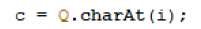<p>
    > **Jawab**<p>
    >variabel c digunakan untuk menyimpan data char i ke dalam variabel Q dengan menggunakan perintah charAt(i)

3. Jalankan kembali program tersebut, masukkan ekspresi 3*5^(8-6)%3. Tampilkan hasilnya!
    > **Jawab**<p>
    >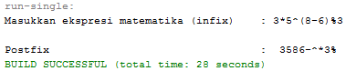<p>

4. Pada soal nomor 3, mengapa tanda kurung tidak ditampilkan pada hasil konversi? Jelaskan!
    > **Jawab**<p>
    >karena ketika terdapat tanda kurung pada ekspresi matematika, maka tanda kurung tersebut akan langsung di pop tanpa dimasukkan kedalam postfix

<br>

## **7.4 Tugas**
1. Perhatikan dan gunakan kembali kode program pada Praktikum 1. Tambahkan method getMin pada class Stack yang digunakan untuk mencari dan menampilkan data pakaian dengan harga terendah dari semua data pakaian yang tersimpan di dalam stack!<p>

    **Jawab**<p>
    disini saya memodifikasi di class "stack" terlebih dahulu seperti berikut !

    ```java
    package Praktikum1;
    /**
    *
    * @author Alvian
    */
    public class stack {
        int size, top;
        pakaian data[];
    
        public stack(int size){
            this.size = size;
            data = new pakaian[size];
            top = -1;
        }
        public boolean IsEmpty(){
            if(top == -1){
                return true;
            }else{
                return false;
            }
        }
        public boolean IsFull(){
            if(top == size -1){
                return true;
            }else{
                return false;
            }
        }
        public void push(pakaian pkn){
            if(!IsFull()){
                top++;
                data[top] = pkn;
            }else{
                System.out.println("Isi stack Penuh");
            }
        }
        public void pop(){
            if(!IsEmpty()){
                pakaian x = data[top];
                top--;
                System.out.println("Data yang keluar : "+ x.jenis +" "+ x.warna +" "+ x.merk +" "+ x.ukuran +" "+ x.harga);
            }else{
                System.out.println("Stack masih kosong");
            }
        }
        public void peek(){
            System.out.println("Elemen teratas: "+ data[top].jenis  +" "+ data[top].warna +" "+ data[top].merk +" "+ data[top].ukuran +" "+ data[top].harga);
        }
        public void print(){
            System.out.println();
            System.out.println("Isi stack : ");
            for(int i=top; i >= 0; i--){
                System.out.println(data[i].jenis + " "+ data[i].warna +" "+ data[i].merk +" "+ data[i].ukuran +" "+ data[i].harga +" ");
            }
            System.out.println("");
        }
        public void clear(){
            if(!IsEmpty()){
                for(int i=top; i >= 0; i--){
                    top--;
                }
                System.out.println("Stack sudah dikosongkan");
            }else{
                System.out.println("Gagal! Stack masih kosong");
            }
        }
        public void getMin(){
            double hrgMin = data[0].harga;
            int idn = 0;
            for(int i = 1; i <= top; i++){
                if (hrgMin > data[i].harga){
                    idn = i;
                    hrgMin = data[i].harga;
                }
            }
            System.out.println("Harga Pakaian Terendah adalah\t: "+data[idn].harga);
            System.out.println("Dengan merk\t\t\t: "+data[idn].merk);
        }
    }
    ```
    setelah itu saya melakukan modifikasi pada main class "stackMain" seperti berikut <p>

    ```java
    package Praktikum1;
    import java.util.Scanner;
    /**
    *
    * @author Alvian
    */
    public class stackMain {
        /**
        * @param args the command line arguments
        */
        public static void main(String[] args) {
            stack stk = new stack(5);
        
            Scanner sc = new Scanner(System.in);
            Scanner sd = new Scanner(System.in);
        
            char pilih;
            do{
                System.out.println("------------------------------------");
                System.out.println("             PILIHAN MENU           ");
                System.out.println("------------------------------------");
                System.out.println(" 1. Push\n 2. Pop\n 3. Peek\n 4. Print\n 5. Harga Terendah\n");
                int pilihan;
                System.out.print("Pilih Menu (masukkan angka 1-4)");
                pilihan = sd.nextInt();
            
                switch (pilihan){
                    case 1:
                        do{
                            System.out.print("Jenis\t\t: ");
                            String jenis = sc.nextLine();
                            System.out.print("Warna\t\t: ");
                            String warna = sc.nextLine();
                            System.out.print("Merk\t\t: ");
                            String merk = sc.nextLine();
                            System.out.print("Ukuran\t\t: ");
                            String ukuran = sc.nextLine();
                            System.out.print("Harga\t\t: ");
                            double harga = sd.nextInt();
                            System.out.println("");
            
                            pakaian p = new pakaian(jenis, warna, merk, ukuran, harga);
                            System.out.print("Apakah anda akan menambahkan data baru ke stack (y/n)? ");
                            pilih = sc.next().charAt(0);
                            sc.nextLine();
                            stk.push(p);
                        }while (pilih == 'y');
                        break;
                
                    case 2:
                        stk.pop();
                        break;
                
                    case 3:
                        stk.peek();
                        break;
                
                    case 4:
                        stk.print();
                        break;
                
                    case 5:
                        stk.getMin();
                        break;
                    
                    default:
                        System.out.println("Input yang anda masukkan salah");
                        System.exit(0);
                }if(pilihan == 5){
                    pilih ='t';
                }else{
                    System.out.print("Kembali ke menu Utama (y/t) ");
                    pilih = sc.next().charAt(0);
                }
            }while (pilih == 'y');
        }
    }
    ```

    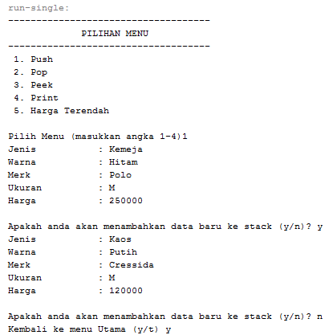<p>
    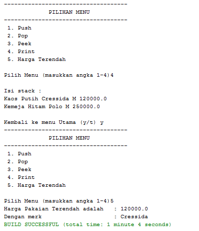<p>

2. Setiap hari Minggu, Dewi pergi berbelanja ke salah satu supermarket yang berada di area rumahnya. Setiap kali selesai berbelanja, Dewi menyimpan struk belanjaannya di dalam laci. Setelah dua bulan, ternyata Dewi sudah mempunyai delapan struk belanja. Dewi berencana mengambil lima struk belanja untuk ditukarkan dengan voucher belanja.
Buat sebuah program stack untuk menyimpan data struk belanja Dewi, kemudian lakukan juga proses pengambilan data struk belanja sesuai dengan jumlah struk yang akan ditukarkan dengan voucher. Informasi yang tersimpan pada struk belanja terdiri dari:<p>
    - Nomor transaksi
    - Tanggal pembelian
    - Jumlah barang yang dibeli
    - Total harga bayar<p>

    Tampilkan informasi struk belanja yang masih tersimpan di dalam stack!

    **Jawab**
    Class "strukBelanja"

    ```java
    package Tugas2;
    /**
    *
    * @author Alvian
    */
    public class strukBelanja {
        String tanggal, namaBarang;
        int noTransaksi, jmlh, total;

        strukBelanja(int nt, String tgl, String nb, int j, int t){
        noTransaksi =nt;
        tanggal =tgl;
        namaBarang =nb;
        jmlh =j;
        total =t;
        }
    }
    ```

    Class "belanja"

    ```java
    package Tugas2;
    /**
    *
    * @author Alvian
    */
    public class belanja {
        int size;
        int top;
        strukBelanja data[];
    
        public belanja(int size){
            this.size = size;
            data = new strukBelanja[size];
            top = -1;
        }
        public boolean IsEmpty(){
            if(top == -1){
                return true;
            }else{
                return false;
            }
        }
        public boolean IsFull(){
            if(top == size - 1){
                return true;
            }else{
                return false;
            }
        }

        public void push(strukBelanja sb){
            if(!IsFull()){
                top++;
                data[top] = sb;
            }else{
                System.out.println("Isi stack penuh!");
            }
        }
        public void pop(){
            if(!IsEmpty()){
                strukBelanja x = data[top];
                top--;
                System.out.println("Data yang keluar: " + x.noTransaksi + " " + x.tanggal + " " + x.namaBarang + " " + x.jmlh + " " + x.total);
            }else{
                System.out.println("Stock masih kosong");
            }
        }
        public void peek(){
            System.out.println("Elemen teratas: " + data[top].noTransaksi +"."+ " " + data[top].tanggal + " " + data[top].namaBarang + " " + data[top].jmlh + " " + data[top].total);
        }
        public void print(){
            System.out.println("Isi stack: ");
            for(int i = top; i >= 0; i--){
                System.out.println(data[i].noTransaksi + " " + data[i].tanggal + " " + data[i].namaBarang + " " + data[i].jmlh + " " + data[i].total);
            }
            System.out.println("");
        }
        public void clear(){
            if(!IsEmpty()){
                for(int i = top; i >= 0; i--){
                    top--;
                }
                System.out.println("Stock sudah dikosongkan");
            }else{
                System.out.println("Stock masih kosong");
            }
        }
    }
    ```

    Main class "strukBelanjaMain"

    ```java
    package Tugas2;
    import java.util.Scanner;
    /**
    *
    * @author Alvian
    */
    public class strukBelanjaMain {
        /**
        * @param args the command line arguments
        */
        public static void main(String[] args) {
            Scanner sc =new Scanner(System.in);
            Scanner sd =new Scanner(System.in);

            System.out.println("----------------------------------");
            System.out.println("      History Struk Belanja       ");
            System.out.println("----------------------------------");
            System.out.println();
            System.out.print("Masukkan Banyak Struk\t: ");
            int banyak = sc.nextInt();
            System.out.println();
            belanja blj = new belanja(banyak);

            int totalHarga = 0;
            int jml, harga;
            for (int i = 0; i < banyak; i++) {
            System.out.print("Nomor Transaksi\t\t: ");
            int nt =sc.nextInt();
            System.out.print("Tanggal Pembelian\t: ");
            String tanggal =sd.nextLine();
            System.out.print("Nama Barang\t\t: ");
            String nb =sd.nextLine();
            System.out.print("Jumlah Barang\t\t: ");
            jml = sc.nextInt();
            System.out.print("Harga Barang\t\t: ");
            harga = sc.nextInt();
            totalHarga =jml * harga;
            strukBelanja sb =new strukBelanja(nt, tanggal, nb, jml,harga);
            blj.push(sb);
            System.out.print("Total Harga\t\t: "+ totalHarga);
            System.out.println("\n");
            }

        char pilih;
        do{
            System.out.println("------------------------------------");
            System.out.println("             PILIHAN MENU           ");
            System.out.println("------------------------------------");
            System.out.println(" 1. menampilkan struk teratas\n 2. ambil 5 struk untuk mendapatkan kupon\n 3. lihat sisa struk\n 4. keluar\n");
            
            System.out.print("Pilih Menu (masukkan angka 1-4)");
            int pilihan =sc.nextInt();
            System.out.println("------------------------------------------------");
        
            switch (pilihan){
                case 1:
                    blj.peek();
                    blj.print();
                    break;
                case 2:
                    blj.pop();
                    blj.pop();
                    blj.pop();
                    blj.pop();
                    blj.pop();
                    break;
                case 3:
                    blj.print();
                    break;
                case 4:
                    System.out.println("Terima Kasih");
                    break;
                default:
                    System.out.println("Menu yang anda masukkan salah");
                    break;
            }if(pilihan == 4) {
                pilih = 't';
            }else{
                System.out.print("Kembali ke menu Utama (y/t) : ");
                pilih = sc.next().charAt(0);
            }
        }while(pilih == 'y');
        }
    }
    ```
    
    Hasil output program<p>

    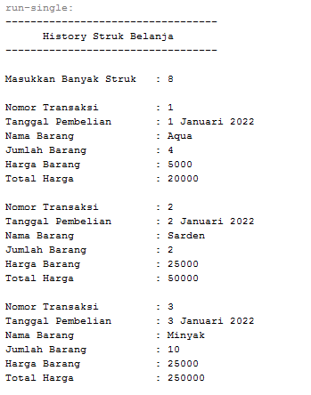<p>
    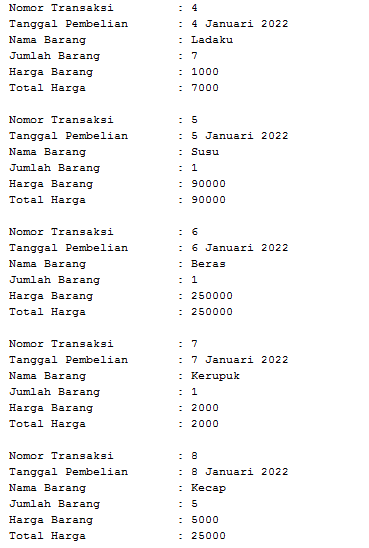<p>
    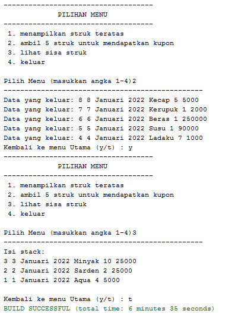<p>