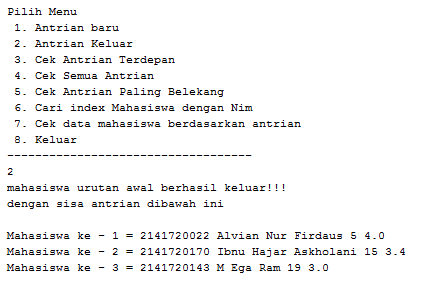

# **Laporan Praktikum**
# **Jobseat 9 Linked List**

## **Data Mahasiswa**
><p>Nama : Alvian Nur Firdaus<p>
>Kelas : 1F<p>
>Prodi : D-IV Teknik Inormatika<p>
>Jurusan : Teknologi Inormasi<p>
>Politeknik Negri Malang

<br>

## **9.1 Tujuan Praktikum**
Setelah melakukan materi praktikum ini, mahasiswa mampu:
1. Membuat struktur data linked list
2. Membuat linked list pada program
3. Membedakan permasalahan apa yang dapat diselesaikan menggunakan linked list

<br>

## **9.2 Praktikum 1**
Waktu percobaan : 30 menit<p>
Didalam praktikum ini, kita akan mempraktekkan bagaimana membuat Single Linked List dengan representasi data berupa Node, pengaksesan linked list dan metode penambahan data.

### **9.2.1 Langkah-langkah Percobaan**
1. Pada Project StrukturData yang sudah dibuat pada Minggu sebelumnya, buat package dengan nama minggu11
2. Tambahkan class-class berikut:
    + Node.java
    + SingleLinkedList.java
    + SLLMain.java<p>
    <p>
3. Implementasi class Node
    ```java
    package Praktikum1;
    /**
    *
    * @author Alvian
    */
    public class node {
        int data;
        node next;
    
        public node(int nilai, node berikutnya){
            this.data = nilai;
            this.next = berikutnya;
        }
    }
    ```
4. Tambahkan atribut pada class SingleLinkedList
    ```java
    package Praktikum1;
    /**
    *
    * @author Alvian
    */
    public class singleLinkedList {
        node head; //posisi awal linked list
        node tail; //posisi akhir linked list
    ```
5. Sebagai langkah berikutnya, akan diimplementasikan method-method yang terdapat pada SingleLinkedList.

6. Tambahkan method isEmpty().
    ```java
    public boolean isEmpty() {
    return head == null;
    }
    ```
7. Implementasi method untuk mencetak dengan menggunakan proses traverse.
    ```java
    public void print(){
        if(!isEmpty()){
            node tmp = head;
            System.out.print("Isi Linked List\t\t\t: ");
            while(tmp != null){
                System.out.print(tmp.data +"\t\t");
                tmp = tmp.next;
            }
            System.out.println("");
        }else{
            System.out.println("Linked List Kosong");
        }
    }
    ```
8. Implementasikan method addFirst().
    ```java
    public void addFirst(int input){
        node ndInput = new node(input, null);
        if(isEmpty()){ //jika linked list kosong
            head = ndInput; //head dan tail sama dengan node input
            tail = ndInput;
        }else{
            ndInput.next = head;
                head = ndInput;
        }
    }
    ```
9. Implementasikan method addLast().
    ```java
    public void addLast(int input){
        node ndInput = new node(input, null);
        if(isEmpty()){
            head = ndInput; //head dan tail sama dengan node input
            tail = ndInput;
        }else{
            tail.next = ndInput;
            tail = ndInput;
        }
    }
    ```
10. Implementasikan method insertAfter, untuk memasukkan node yang memiliki data input setelah node yang memiliki data key.
    ```java
    public void insertAfter(int key, int input){
        node ndInput = new node(input, null);
        node temp = head;
        do {
            if (temp.data == key) {
                ndInput.next = temp.next;
                temp.next = ndInput;
                if(ndInput.next == null) tail = ndInput;
                break;
            }
            temp = temp.next;
        }while (temp != null);
    }
    ```
11. Tambahkan method penambahan node pada indeks tertentu.
    ```java
    public void insertAt(int index, int input){
        if (index < 0){
            System.out.println("Indeks salah");
        }else if (index == 0){
            addFirst(input);
        }else {
            node temp = head;
            for(int i=0; i<index-1; i++){
                temp = temp.next;
            }
            temp.next = new node(input, temp.next);
            if(temp.next.next == null) tail=temp.next;
        }
    }
    ```
12. Pada class SLLMain, buatlah fungsi main, kemudian buat object dari class SingleLinkedList.
    ```java
    package Praktikum1;
    /**
    *
    * @author Alvian
    */ 
    public class sllMain {
        /**
        * @param args the command line arguments
        */
        public static void main(String[] args) {
            singleLinkedList singLL = new singleLinkedList(); 
    ```
13. Tambahkan Method penambahan data dan pencetakan data di setiap penambahannya agar terlihat perubahannya.
    ```java
    package Praktikum1;
    /**
    *
    * @author Alvian
    */
    public class sllMain {
        /**
        * @param args the command line arguments
        */
        public static void main(String[] args) {
            singleLinkedList singLL = new singleLinkedList();
        
            singLL.print();
            singLL.addFirst(890);
            singLL.print();
            singLL.addLast(760);
            singLL.print();
            singLL.addFirst(700);
            singLL.print();
            singLL.insertAfter(700, 999);
            singLL.print();
            singLL.insertAt(3, 833);
            singLL.print();
        }
    }
    ```

<br>

### **9.3.2 Verifikasi Hasil Percobaan**
Setelah saya melakukan RUN kode program diatas didapatkan hasil run sama seperti di Jobseat, menandakan sudah berhasil<p>
<p>

<br>

### **8.2.3 Pertanyaan**
1. Mengapa hasil compile kode program di baris pertama menghasilkan “Linked List Kosong”?<p>
    >**Jawab**<p>
    >karena linked list (node) masih belum memiliki isi / data, dimana pada sllMain langsung dilakukan pemanggilan method print diawal pemanggilan yang mana node masih belum di isi data sama sekali, sehingga system akan menampilkan "Linked List Kosong"

2. Pada step 10, jelaskan kegunaan kode berikut<p>
    <p>
    > **Jawab**<p>
    >kegunaan potongan kode diatas adalah jika temp.data sama dengan key, maka kode program otomatis mengubah nilai variabel ndInput.next menjadi variabel temp.next serta nantinya pada variable ndInput untuk menyimpan nilainya

3. Perhatikan class SingleLinkedList, pada method insertAt Jelaskan kegunaan kode berikut<p>
    <p>
    >**Jawab**<p>
    >kegunaan potongan kode diatas adalah jika temp.next.next == nul maka akan mengembalikan nilai -1 atau data kosong, dan jika tidak ada kondisi yang terpenuhi sama sekali maka akan mengembalikan nilai dari index yaitu 0

<br>

## **9.3  Modifikasi Elemen pada single linked list**
Waktu percobaan : 30 menit<p>
Didalam praktikum ini, kita akan mempraktekkan bagaimana mengakses elemen, mendapatkan indeks dan melakukan penghapusan data pada Single Linked List.:

<br>

### **9.3.1 Langkah-langkah Percobaan**
1. Implementasikan method untuk mengakses data dan indeks pada linked list
2. Tambahkan method untuk mendapatkan data pada indeks tertentu pada class Single Linked List
    ```java
    public int getData(int index){
        node tmp = head;
        for (int i=0; i<index; i++){
            tmp =  tmp.next;
        }
        return tmp.data;
    }
    ```

3. Implementasikan method indexOf.<p>
    ```java
    public int indexOf(int key){
        node tmp = head;
        int index = 0;
        while (tmp != null && tmp.data != key) {
            tmp = tmp.next;
            index++;
        }
        if (tmp == null){
            return -1;
        }else{
            return index;
        }
    }
    ```

4. Tambahkan method removeFirst pada class SingleLinkedList
    ```java
    public void removeFirst(){
        if(isEmpty()){
            System.out.println("Linked List Masih Kosong");
        }else if (head == tail){
            head = tail = null;
        }else{
            head = head.next;
        }
    }
    ```
5. Tambahkan method untuk menghapus data pada bagian belakang pada class SingleLinkedList
    ```java
    public void removeLast() {
        if (isEmpty()){
            System.out.println("Linked List Masih kosong, tidak dapat dihapus!");
        }else if (head == tail){
            head = tail = null;
        }else{
            node temp = head;
            while (temp.next != tail){
                temp = temp.next;
            }
            temp.next = null;
            tail = temp;
        }
    }
    ```
6. Sebagai langkah berikutnya, akan diimplementasikan method remove
    ```java
    public void remove(int key){
        if(isEmpty()){
            System.out.println("Linked List Masih kosong, tidak dapat dihapus!");
        }else {
            node temp = head;
            while (temp != null){
                if((temp.data == key) && (temp == head)){
                    this.removeFirst();
                    break;
                }else if (temp.next.data == key){
                    temp.next = temp.next.next;
                    if(temp.next == null){
                        tail = temp;
                    }
                    break;
                }
                temp = temp.next;
            }
        }
    }
    ```
7. Implementasi method untuk menghapus node dengan menggunakan index.
    ```java
    public void removeAt(int index){
        if(index == 0){
            removeFirst();
        }else{
            node temp = head;
            for(int i=0; i < index-1; i++){
                temp = temp.next;
            }
            temp.next = temp.next.next;
            if (temp.next == null){
                tail = temp;
            }
        }
    }
    ```

8. Kemudian, coba lakukan pengaksesan dan penghapusan data di method main pada class SLLMain dengan menambahkan kode berikut
    ```java
    System.out.println("\nData pada index ke-1\t\t: "+singLL.getData(1));
    System.out.println("Data 3 berada pada indeks ke\t: "+singLL.indexOf(760)+"\n");
        
        singLL.remove(999);
        singLL.print();
        singLL.removeAt(0);
        singLL.print();
        singLL.removeFirst();
        singLL.print();
        singLL.removeLast();
        singLL.print();
    ```
9. Method SLLMain menjadi:
    ```java
    package Praktikum2;
    /**
    *
    * @author Alvian
    */
    public class sllMain {
        /**
        * @param args the command line arguments
        */
        public static void main(String[] args) {
            singleLinkedList singLL = new singleLinkedList();
        
            singLL.print();
            singLL.addFirst(890);
            singLL.print();
            singLL.addLast(760);
            singLL.print();
            singLL.addFirst(700);
            singLL.print();
            singLL.insertAfter(700, 999);
            singLL.print();
            singLL.insertAt(3, 833);
            singLL.print();
        
            System.out.println("\nData pada index ke-1\t\t: "+singLL.getData(1));
            System.out.println("Data 3 berada pada indeks ke\t: "+singLL.indexOf(760)+"\n");
        
            singLL.remove(999);
            singLL.print();
            singLL.removeAt(0);
            singLL.print();
            singLL.removeFirst();
            singLL.print();
            singLL.removeLast();
            singLL.print();
        }
    }
    ```
10. Jalankan class SLLMain

<br>

### **9.3.2 Verifikasi Hasil Percobaan**
Setelah saya melakukan RUN kode program diatas didapatkan hasil run sama seperti di Jobseat, menandakan sudah berhasil<p>
<p>

<br>

### **8.3.3 Pertanyaan**
1. Mengapa digunakan keyword break pada fungsi remove? Jelaskan!<p>
    > **Jawab**<p>
    >karena keyworad break tersebut berfungsi untuk menghentikan perulangan / loop. terdapat dua break yang ada pada method remove, break yang pertama berfunsgsi untuk jika data yang dihapus ada pada head dan ditemukan maka program akan langsung break, break yang kedua berfungsi untuk jika data yang dihapus berada ditengah dan ditemukan  maka program akan langsung break

2. Jelaskan kegunaan kode dibawah pada method remove<p>
    <p>
    > **Jawab**<p>
    >potongan kode diatas berfungsi untuk jika node yang dipilih memiliki data yang sama (equals) dengan key, maka terjadi perubahan posisi dimana node tersebut akan digantikan oleh node yang selanjutnya

3. Apa saja nilai kembalian yang dapat dikembalikan pada method indexOf? Jelaskan maksud masing-masing kembalian tersebut!<p>
    > **Jawab**<p>
    >didalam method indexOf terdapat 2 return, yaitu :
    > + jika tmp == null maka akan mengembalikan nilai -1 atau data kosong
    > + jika tidak ada kondisi yang terpenuhi sama sekali maka akan mengembalikan nilai index yaitu 0

<br>

## **9.4 Tugas**
**Waktu pengerjaan : 50 menit**<p>
1. Buat method insertBefore untuk menambahkan node sebelum keyword yang diinginkan<p>
    >**Jawab**<p>
    >Berikut adalah penambahan method "insertBefore()" yang berada pada class "singleLinkedList"
    ```java
    package Tugas1;
    /**
    *
    * @author Alvian
    */
    public class singleLinkedList {
        node head; //posisi awal linked list
        node tail; //posisi akhir linked list
    
        public boolean isEmpty() {
        return head == null;
        }
        public void print(){
            if(!isEmpty()){
                node tmp = head;
                System.out.print("Isi Linked List\t\t\t: ");
                while(tmp != null){
                    System.out.print(tmp.data +"\t\t");
                    tmp = tmp.next;
                }
                System.out.println("");
            }else{
                System.out.println("Linked List Kosong");
            }
        }
        public void addFirst(int input){
            node ndInput = new node(input, null);
            if(isEmpty()){ //jika linked list kosong
                head = ndInput; //head dan tail sama dengan node input
                tail = ndInput;
            }else{
                ndInput.next = head;
                head = ndInput;
            }
        }
        public void addLast(int input){
            node ndInput = new node(input, null);
            if(isEmpty()){
                head = ndInput; //head dan tail sama dengan node input
                tail = ndInput;
            }else{
                tail.next = ndInput;
                tail = ndInput;
            }
        }
        public void insertAfter(int key, int input){
            node ndInput = new node(input, null);
            node temp = head;
            do {
                if (temp.data == key) {
                    ndInput.next = temp.next;
                    temp.next = ndInput;
                    if(ndInput.next == null) tail = ndInput;
                    break;
                }
                temp = temp.next;
            }while (temp != null);
        }
        public void insertAt(int index, int input){
            if (index < 0){
                System.out.println("Indeks salah");
            }else if (index == 0){
                addFirst(input);
            }else {
                node temp = head;
                for(int i=0; i<index-1; i++){
                    temp = temp.next;
                }
                temp.next = new node(input, temp.next);
                if(temp.next.next == null) tail=temp.next;
            }
        }
        public int getData(int index){
            node tmp = head;
            for (int i=0; i<index; i++){
                tmp =  tmp.next;
            }
            return tmp.data;
        }
        public int indexOf(int key){
            node tmp = head;
            int index = 0;
            while (tmp != null && tmp.data != key) {
                tmp = tmp.next;
                index++;
            }
            if (tmp == null){
                return -1;
            }else{
                return index;
            }
        }
        public void removeFirst(){
            if(isEmpty()){
                System.out.println("Linked List Masih Kosong");
            }else if (head == tail){
                head = tail = null;
            }else{
                head = head.next;
            }
        }
        public void removeLast() {
            if (isEmpty()){
                System.out.println("Linked List Masih kosong, tidak dapat dihapus!");
            }else if (head == tail){
                head = tail = null;
            }else{
                node temp = head;
                while (temp.next != tail){
                  temp = temp.next;
                }
                temp.next = null;
                tail = temp;
            }
        }
        public void remove(int key){
            if(isEmpty()){
                System.out.println("Linked List Masih kosong, tidak dapat dihapus!");
            }else {
                node temp = head;
                while (temp != null){
                    if((temp.data == key) && (temp == head)){
                        this.removeFirst();
                        break;
                    }else if (temp.next.data == key){
                        temp.next = temp.next.next;
                        if(temp.next == null){
                            tail = temp;
                        }
                        break;
                    }
                    temp = temp.next;
                }
            }
        }
        public void removeAt(int index){
            if(index == 0){
                removeFirst();
            }else{
                node temp = head;
                for(int i=0; i < index-1; i++){
                    temp = temp.next;
                }
                temp.next = temp.next.next;
                if (temp.next == null){
                    tail = temp;
                }
            }
        }
        public void insertBefore(int key, int input){
            node ndInput = new node(input, null);
            node temp = head;
            node prev = null;
        
            do{
                if(head.data == key){
                    addFirst(input);
                    break;
                }else if (temp.data == key){
                    ndInput.next = temp;
                    prev.next = ndInput;
                    if(temp.next == null){
                        tail = ndInput;
                        break;
                    }
                }
                prev = temp;
                temp = temp.next;
            }while (temp != null);
        }
    }
    ```
    >Berikut adalah modifikasi pada main class "sllMain"
    ```java
    package Tugas1;
    /**
    *
    * @author Alvian
    */
    public class sllMain {
        /**
        * @param args the command line arguments
        */
        public static void main(String[] args) {
            singleLinkedList singLL = new singleLinkedList();
        
            singLL.print();
            singLL.addFirst(890);
            singLL.print();
            singLL.addLast(760);
            singLL.print();
            singLL.addFirst(700);
            singLL.print();
            singLL.insertAfter(700, 999);
            singLL.print();
            singLL.insertAt(3, 833);
            singLL.print();
            System.out.println("dibawah ini hasil output penambahan method insertBefore()");
            singLL.insertBefore(760, 450);
            singLL.print();
        
            System.out.println("\nData pada index ke-1\t\t: "+singLL.getData(1));
            System.out.println("Data 3 berada pada indeks ke\t: "+singLL.indexOf(760)+"\n");
        
            singLL.remove(999);
            singLL.print();
            singLL.removeAt(0);
            singLL.print();
            singLL.removeFirst();
            singLL.print();
            singLL.removeLast();
            singLL.print();
        }
    }
    ```
    >dengan hasil output seperti berikut ini<p>
    ><p>

<br>

2. Implementasikan ilustrasi Linked List Berikut. Gunakan 4 macam penambahan data yang telah dipelajari sebelumnya untuk menginputkan data.<p>
    <p>
    >**Jawab**<p>
    >class "node"<p>
    ```java
    package Tugas2;
    /**
    *
    * @author Alvian
    */
    public class node {
        char data;
        node next;
    
        public node(char nilai, node berikutnya){
            this.data = nilai;
            this.next = berikutnya;
        }
    }
    ```
    >class "singleLinkedList"<p>
    ```java
    package Tugas2;
    /**
    *
    * @author Alvian
    */
    public class singleLinkedList {
        node head; //posisi awal linked list
        node tail; //posisi akhir linked list
    
        public boolean isEmpty() {
        return head == null;
        }
        public void print(){
            if(!isEmpty()){
                node tmp = head;
                System.out.print("Isi Linked List\t\t\t: ");
                while(tmp != null){
                    System.out.print(tmp.data +"\t\t");
                    tmp = tmp.next;
                }
                System.out.println("");
            }else{
                System.out.println("Linked List Kosong");
            }
        }
        public void addFirst(char input){
            node ndInput = new node(input, null);
            if(isEmpty()){ //jika linked list kosong
                head = ndInput; //head dan tail sama dengan node input
                tail = ndInput;
            }else{
                ndInput.next = head;
                head = ndInput;
            }
        }
        public void addLast(char input){
            node ndInput = new node(input, null);
            if(isEmpty()){
                head = ndInput; //head dan tail sama dengan node input
                tail = ndInput;
            }else{
                tail.next = ndInput;
                tail = ndInput;
            }
        }
        public void insertAfter(char key, char input){
            node ndInput = new node(input, null);
            node temp = head;
            do {
                if (temp.data == key) {
                    ndInput.next = temp.next;
                    temp.next = ndInput;
                    if(ndInput.next == null) tail = ndInput;
                    break;
                }
                temp = temp.next;
            }while (temp != null);
        }
        public void insertAt(int index, char input){
            if (index < 0){
                System.out.println("Indeks salah");
            }else if (index == 0){
                addFirst(input);
            }else {
                node temp = head;
                for(int i=0; i<index-1; i++){
                    temp = temp.next;
                }
                temp.next = new node(input, temp.next);
                if(temp.next.next == null) tail=temp.next;
            }
        }
        public void insertBefore(char key, char input){
            node ndInput = new node(input, null);
            node temp = head;
            node prev = null;
        
            do{
                if(head.data == key){
                    addFirst(input);
                    break;
                }else if (temp.data == key){
                    ndInput.next = temp;
                    prev.next = ndInput;
                    if(temp.next == null){
                        tail = ndInput;
                        break;
                    }
                }
                prev = temp;
                temp = temp.next;
            }while (temp != null);
        }
    }
    ```
    >main class "sllMain"<p>
    ```java
    package Tugas2;
    /**
    *
    * @author Alvian
    */
    public class sllMain { 
        /**
        * @param args the command line arguments
        */
        public static void main(String[] args) {
            singleLinkedList singLL = new singleLinkedList();
        
            System.out.println("------------------------------------------- LINKED LIST ---------------------------------------------");
            singLL.addFirst('a');
            singLL.print();
            singLL.addLast('e');
            singLL.print();
            singLL.insertAfter('a','b');
            singLL.print();
            singLL.insertAt(2, 'c');
            singLL.print();
            singLL.insertBefore('e', 'd');
            singLL.print();
        
            System.out.println("\nMaka Penambahan data sudah sesuai seperti berikut ini");
            singLL.print();
            System.out.println("\n------------------------------------------- LINKED LIST ---------------------------------------------");
        }
    }
    ```
    >dengan hasil output seperti berikut ini <p>
    ><p>

<br>

3. Buatlah Implementasi Stack berikut menggunakan Single Linked List<p>
    <p>
    **Jawab**
    >Membuat class "node"
    ```java
    package Tugas3;
    /**
    *
    * @author Alvian
    */
    public class node {
        String data;
        node next;
    
        public node(String nilai, node berikutnya){
            this.data = nilai;
            this.next = berikutnya;
        }
    }
    ```
    >membuat class "singleLinkedList" seperti dibawah ini
    ```java
    package Tugas3;
    /**
    *
    * @author Alvian
    */
    public class singleLinkedList {
        node head; //posisi awal linked list
        node tail; //posisi akhir linked list
    
        public boolean isEmpty() {
        return head == null;
        }
        public void pr(){
            if(!isEmpty()){
                node tmp = head;
                System.out.println("Berhasil menambahkan "+ tmp.data);
            }
        }
        public void print(){
            if(!isEmpty()){
                node tmp = head;
                while(tmp != null){
                    System.out.println(tmp.data);
                    tmp = tmp.next;
                }
                System.out.println();
            }else{
                System.out.println("Linked List Kosong");
            }
        }
        public void peek(){
            if(!isEmpty()){
                node tmp = head;
                System.out.println("Elemen Teratas : "+tmp.data);
            }else{
            System.out.println("Stack Masih Kosong");
            }
        }
        public void push(String input){
            node ndInput = new node(input, null);
            if(isEmpty()){ //jika linked list kosong
                head = ndInput; //head dan tail sama dengan node input
                tail = ndInput;
            }else{
                ndInput.next = head;
                head = ndInput;
            }
        }
    }
    ```
    >membuat main class "sllMain" seperti berikut
    ```java
    package Tugas3;
    /**
    *
    * @author Alvian
    */
    public class sllMain {
        /**
        * @param args the command line arguments
        */
        public static void main(String[] args) {
            singleLinkedList singLL = new singleLinkedList();
        
            System.out.println("+Linked List"+" "+"\t+");
            System.out.println("-----------------");
            singLL.push("Bahasa");
            singLL.pr();
            singLL.print();
            singLL.push("Android");
            singLL.pr();
            singLL.print();
            singLL.push("Komputer");
            singLL.pr();
            singLL.print();
            singLL.push("Basis Data");
            singLL.pr();
            singLL.print();
            singLL.push("Matematika");
            singLL.pr();
            singLL.print();
            singLL.push("Algoritma");
            singLL.pr();
            singLL.print();
            singLL.push("Statistika");
            singLL.pr();
            singLL.print();
            singLL.push("Multimedia");
            singLL.pr();
            singLL.print();
        
            System.out.println("\nIsi Stack menjadi");
            singLL.print();
            singLL.peek();
        }
    }
    ```
    >didapati hasil output seperti gambar dibawah ini<p>
    ><p>
    ><p>
    ><p>

<br>

4. Buatlah implementasi program antrian untuk mengilustasikan mahasiswa yang sedang meminta tanda tangan KRS pada dosen DPA di kampus pada tugas jobsheet 8 menggunakan LinkedList. Implementasikan Queue pada antrian mahasiswa dengan menggunakan konsep LinkedList!
            
    **Jawab**
        
    class "node"
        
```java
    package Tugas4;
    /**
    *
    * @author Alvian
    */
    public class node {
        String nim, nama;
        int absen;
        double ipk;
        node next;
    
        public node(String nim, String nama, int absen, double ipk, node berikutnya){
            this.nim = nim;
            this.nama = nama;
            this.absen = absen;
            this.ipk =ipk;
            this.next = berikutnya;
        }
    }
```
        
    class "singleLinkedList"
        
 <br>
        
```java
    package Tugas4;
    /**
    *
    * @author Alvian
    */
    public class singleLinkedList {
        node head; //posisi awal linked list
        node tail; //posisi akhir linked list
    
        public boolean isEmpty() {
            return head == null;
        }
        public void print(){
            if(!isEmpty()){
                node tmp = head;
                int antrian = 0;
                while(tmp != null){
                    System.out.println("Mahasiswa ke - "+(antrian+1)+" = "+tmp.nim+" "+tmp.nama+" "+tmp.absen+" "+tmp.ipk);
                    tmp = tmp.next;
                    antrian ++;
                }
                System.out.println();
            }else{
                System.out.println("Linked List Kosong");
            }
        }
        public void addLast(String nim, String nama, int absen, double ipk){
            node ndInput = new node(nim, nama, absen, ipk, null);
            if(isEmpty()){
                head = ndInput; //head dan tail sama dengan node input
                tail = ndInput;
            }else{
                tail.next = ndInput;
                tail = ndInput;
            }
        }
        public void peek(){
            if(!isEmpty()){
                node tmp = head;
                System.out.println("Elemen terdepan : "+tmp.nim+ " "+tmp.nama+" "+tmp.absen+" "+tmp.ipk);
            }else{
                System.out.println("Queue masih kosong");
            }
        }
        public void peekRear(){
            if(!isEmpty()){
                node tmp = tail;
                System.out.println("Elemen yang belakang : "+tmp.nama+ " "+tmp.nim+" "+tmp.absen+" "+tmp.ipk);
            }else{
                System.out.println("Queue masih kosong");
            }
        }
        public void cariIndex(int index){
            if(isEmpty()){
                System.out.println("Antrian masih kosong");
            }else{
                node tmp = head;
                for(int i=0; i<index; i++){
                    tmp = tmp.next;
                }
                System.out.println("Data pada index ke-"+index+" "+tmp.nim+" "+tmp.nama+" "+tmp.absen+" "+tmp.ipk);
            }
        }
        public void cariNim(String key){
            node tmp = head;
            int index = 0;
            while (tmp != null &&(!(tmp.nim.equals(key)))) {
                tmp = tmp.next;
                index++;
            }
            if (tmp == null){
                System.out.println("Antrian Kosong");
            }else{
                System.out.println("Data "+key+" berada pada index ke "+index);
            }
            System.out.println("Data Mahasiswa : "+tmp.nim+" "+tmp.nama+" "+tmp.absen+" "+tmp.ipk);
        }
        public void removeFirst(){
            if(isEmpty()){
                System.out.println("Linked List Masih Kosong");
            }else if (head == tail){
                head = tail = null;
            }else{
                head = head.next;
            }
        }
    }
```
                                      
 <br>
        
    main class "sllMain"
        
```java
    package Tugas4;
    import java.util.Scanner;
    /**
    *
    * @author Alvian
    */
    public class sllMain {
        /**
        * @param args the command line arguments
        */
        public static void menu(){
            System.out.println("\nPilih Menu ");
            System.out.println(" 1. Antrian baru\n 2. Antrian Keluar\n 3. Cek Antrian Terdepan\n 4. Cek Semua Antrian\n 5. Cek Antrian Paling Belekang\n 6. Cari index Mahasiswa dengan Nim\n 7. Cek data mahasiswa berdasarkan antrian\n 8. Keluar");
            System.out.println("-----------------------------------");
        }
        public static void main(String[] args) {
            Scanner sc = new Scanner(System.in);
            Scanner sd = new Scanner(System.in);
            Scanner sb = new Scanner(System.in);
        
            singleLinkedList singLL = new singleLinkedList();
    
            int pilih;
            do{
                menu();
                pilih = sc.nextInt();
                sc.nextLine();
        
            switch(pilih){
                case 1:
                    System.out.print("Nim Mahasiswa\t: ");
                    String nim = sc.nextLine();
                    System.out.print("Nama Mahasiswa\t: ");
                    String nama = sc.nextLine();
                    System.out.print("Absen Mahasiswa\t: ");
                    int absen = sd.nextInt();
                    System.out.print("IPK Mahasiswa\t: ");
                    double ipk = sb.nextDouble();
                    singLL.addLast(nim, nama, absen, ipk);
                    sc.nextLine();
                break;
                
                case 2:
                    singLL.removeFirst();
                    System.out.println("mahasiswa urutan awal berhasil keluar!!!");
                    System.out.println("dengan sisa antrian dibawah ini\n");
                    singLL.print();
                break;
                
                case 3:
                    System.out.println("Berikut adalah antrian mahasiswa terdepan !");
                    singLL.peek();
                break;
                
                case 4:
                    System.out.println("Berikut adalah data semua antrian");
                    singLL.print();
                break;
                
                case 5:
                    System.out.println("Berikut adalah antrian mahasiswa paling belakang !");
                    singLL.peekRear();
                break;
                
                case 6:
                    System.out.println("Pencarian Index Mahasiswa Dengan Nim");
                    System.out.print("Masukkan Nim mahasiswa : ");
                    String nimm = sc.nextLine();
                    singLL.cariNim(nimm);
                break;
                
                case 7:
                    System.out.println("Pencarian data mahasiswa berdasarkan antrian");
                    System.out.print("Masukkan antrian Mahasiswa : ");
                    int antrian = sd.nextInt();
                    singLL.cariIndex(antrian);
                break;
                
                case 8:
                    System.out.println("Terima Kasih Telah menggunakan layanan kami");
                    System.out.println("----------Alvian Nur Firdaus @ 2022--------");
                    System.exit(0);
                break;
            }
        }while (pilih == 1 || pilih == 2 || pilih == 3 || pilih == 4 || pilih == 5 || pilih == 6 || pilih == 7 || pilih == 8);
    }
    }
```
 <br>
        
    Dengan hasil output seperti berikut<p>
    output menu 1<p> 
    <p>
    <p>
    output menu 2<p>
    <p>
    output menu 3<p>
    <p>
    output menu 4<p>
    <p>
    output menu 5<p>
    <p>
    output menu 6<p>
    <p>
    output menu 7<p>
    <p>
    output menu 8<p>
    <p>

----------------------------
Terima Kasih<p>
Alvian Nur Firdaus | TI-1F | 2141720022 | Politeknik Negeri Malang<p>
copyright @2022 
_______________
