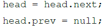
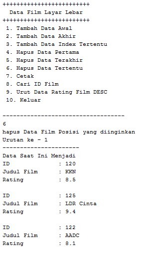

# **Laporan Praktikum**
# **Jobseat 12 Double Linked List**

## **Data Mahasiswa**
><p>Nama : Alvian Nur Firdaus<p>
>Kelas : 1F<p>
>Prodi : D-IV Teknik Inormatika<p>
>Jurusan : Teknologi Inormasi<p>
>Politeknik Negri Malang

<br>

## **12.1 Tujuan Praktikum**
Setelah melakukan praktikum ini, mahasiswa mampu:
1. memahami algoritma double linked lists;
2. membuat dan mendeklarasikan struktur algoritma double linked lists;
3. menerapkan algoritma double linked lists dalam beberapa study case.

<br>

## **12.2 Praktikum 1**
### **12.2.1 Langkah-langkah Percobaan**
Pada percobaan 1 ini akan dibuat class Node dan class DoubleLinkedLists yang didalamnya terdapat operasi-operasi untuk menambahkan data dengan beberapa cara (dari bagian depan linked list, belakang ataupun indeks tertentu pada linked list)

1. Perhatikan diagram class Node dan class DoublelinkedLists di bawah ini! Diagram class ini yang selanjutnya akan dibuat sebagai acuan dalam membuat kode program DoubleLinkedLists.<p>
    <p>
    <p>

2. Buat paket baru dengan nama doublelinkedlists
3. Buat class di dalam paket tersebut dengan nama Node<p>
    <p>

    ```java
    package doublelinkedlist;
    /**
    *
    * @author Alvian
    */
    public class node {
    ```

4. Di dalam class tersebut, deklarasikan atribut sesuai dengan diagram class di atas.

    ```java
    package doublelinkedlist;
    /**
    *
    * @author Alvian
    */
    public class node {
        int data;
        node prev, next;
    ```

5. Selanjutnya tambahkan konstruktor default pada class Node sesuai diagram di atas.

    ```java
    package doublelinkedlist;
    /**
    *
    * @author Alvian
    */
    public class node {
        int data;
        node prev, next;
    
        node(node prev, int data, node next){
            this.prev = prev;
            this.data = data;
            this.next = next;
        }
    }
    ```

6. Buatlah sebuah class baru bernama DoubleLinkedLists pada package yang sama dengan node seperti gambar berikut:<p>
    <p>
    ```java
    package doublelinkedlist;
    /**
    *
    * @author Alvian
    */
    public class doublelinkedlist {
    ```

7. Pada class DoubleLinkedLists tersebut, deklarasikan atribut sesuai dengan diagram class di atas.
    ```java
    package doublelinkedlist;
    /**
    *
    * @author Alvian
    */
    public class doublelinkedlist {
        node head;
        int size;
    ```

8. Selajuntnya, buat konstruktor pada class DoubleLinkedLists sesuai gambar berikut.
    ```java
    public doublelinkedlist(){
        head = null;
        size = 0;
    }
    ```

9. Buat method isEmpty(). Method ini digunakan untuk memastikan kondisi linked list kosong.
    ```java
    public boolean isEmpty(){
        return head == null;
    }
    ```

10. Kemudian, buat method addFirst(). Method ini akan menjalankan penambahan data di bagian depan linked list.
    ```java
    public void addFirst(int item){
        if (isEmpty()){
            head  = new node(null, item, null);
        }else{
            node newNode = new node(null, item, head);
            head.prev = newNode;
            head = newNode;
        }
        size++;
    }
    ```

11. Selain itu pembuatan method addLast() akan menambahkan data pada bagian belakang linked list.
    ```java
    public void addLast(int item){
        if (isEmpty()){
            addFirst(item);
        }else{
            node current = head;
            while (current.next != null){
                current = current.next;
            }
            node newNode = new node(current, item, null);
            current.next = newNode;
            size++;
        }
    }
    ```

12. Untuk menambakan data pada posisi yang telah ditentukan dengan indeks, dapat dibuat dengan method add(int item, int index)
    ```java
    public void add(int item, int index) throws Exception {
        if (isEmpty()){
            addFirst(item);
        }else if (index <0 || index > size){
            throw new Exception("Nilai indeks di luar batas");
        }else{
            node current = head;
            int i = 0;
            while(i<index){
                current = current.next;
                i++;
            }
            if(current.prev == null){
                node newNode = new node(null, item, current);
                current.prev = newNode;
                head = newNode;
            }else{
                node newNode = new node(current.prev, item, current);
                newNode.prev = current.prev;
                newNode.next = current;
                current.prev.next = newNode;
                current.prev = newNode;
            }
        }
        size++;
    }
    ```

13. Jumlah data yang ada di dalam linked lists akan diperbarui secara otomatis, sehingga dapat dibuat method size() untuk mendapatkan nilai dari size.
    ```java
    public int size(){
        return size;
    }
    ```

14. Selanjutnya dibuat method clear() untuk menghapus semua isi linked lists, sehingga linked lists dalam kondisi kosong.
    ```java
    public void clear(){
        head = null;
        size = 0;
    }
    ```

15. Untuk mencetak isi dari linked lists dibuat method print(). Method ini akan mencetak isi linked lists berapapun size-nya. Jika kosong akan dimunculkan suatu pemberitahuan bahwa linked lists dalam kondisi kosong.
    ```java
    public void print(){
        if(!isEmpty()){
            node tmp = head;
            while (tmp != null){
                System.out.print(tmp.data+"\t");;
                tmp = tmp.next;
            }
            System.out.println("\nberhasil diisi");
        }else{
            System.out.println("Linked List Kosong");
        }
    }
    ```

16. Selanjutya dibuat class Main DoubleLinkedListsMain untuk mengeksekusi semua method yang ada pada class DoubleLinkedLists.<p>
    <p>
    ```java
    package doublelinkedlist;
    /**
    *
    * @author Alvian
    */
    public class doublelinkedlistMain {
        /**
        * @param args the command line arguments
        */
        public static void main(String[] args) throws Exception {
    ```

17. Pada main class pada langkah 16 di atas buatlah object dari class DoubleLinkedLists kemudian eksekusi potongan program berikut ini.
    ```java
    package doublelinkedlist;
    /**
    *
    * @author Alvian
    */
    public class doublelinkedlistMain {
        /**
        * @param args the command line arguments
        */
        public static void main(String[] args) throws Exception {
            doublelinkedlist dll = new doublelinkedlist();
            dll.print();
            System.out.println("Size  : "+dll.size());
            System.out.println("===============================");
            dll.addFirst(3);
            dll.addLast(4);
            dll.addFirst(7);
            dll.print();
            System.out.println("Size : "+dll.size());
            System.out.println("===============================");
            dll.add(40, 1);
            dll.print();
            System.out.println("size : "+dll.size());
            System.out.println("===============================");
            dll.clear();
            dll.print();
            System.out.println("Size : "+dll.size());
        }   
    }
    ```

<br>

### **12.3.2 Verifikasi Hasil Percobaan**
Setelah saya melakukan RUN kode program diatas didapatkan hasil run sama seperti di Jobseat, menandakan sudah berhasil<p>
<p>

<br>

### **12.2.3 Pertanyaan Percobaan**
1. Jelaskan perbedaan antara single linked list dengan double linked lists!<p>
    >**Jawab**<p>
    >- Single Linked List : memiliki satu buah pointer yaitu next<p>
    >- Double Linked List : memiliki dua buah pointer yaitu pointer next dan prev.  

2. Perhatikan class Node, didalamnya terdapat atribut next dan prev. Untuk apakah atribut tersebut?<p>
    > **Jawab**<p>
    >Pointer next menunjuk pada node setelahnya, dan pointer prev menunjuk pada node sebelumnya.

3. Perhatikan konstruktor pada class DoubleLinkedLists. Apa kegunaan inisialisasi atribut head dan size seperti pada gambar berikut ini?<p>
    <p>
    >**Jawab**<p>
    >potongan kode diatas berfungsi sebagai kondisi awal dari program tersebut, fungsi inisialisasi "head == null" untuk head belum menyimpan pada node, sedangkan fungsi inisialisasi "size = 0" untuk menyimpan jumlah data pada linked list

4. Pada method addFirst(), kenapa dalam pembuatan object dari konstruktor class Node prev dianggap sama dengan null?<p>
    <p>
    >**Jawab**<p>
    >karena pada method addFirst()diatas digunakan untuk menambah node pada awal atau index ke-0, dimana nantinya node yang dimasukkan tersebut prev nya bernilai null karena tidak merujuk atau menyimpan nilai dari node manapun

5. Perhatikan pada method addFirst(). Apakah arti statement head.prev = newNode ?<p>
    >**Jawab**<p>
    >Potongan kode diatas berfungsi untuk pointer prev pada data yang sudah ada sebelumnya akan menyimpan / merujuk ke node yang baru

6. Perhatikan isi method addLast(), apa arti dari pembuatan object Node dengan mengisikan parameter prev dengan current, dan next dengan null?<p>
    <p>
    >**Jawab**<p>
    >karena pada method addLast() diatas digunakan untuk menambahkan node pada akhir atau index terakhir, dimana parameter prev dengan current digunakan untuk menyimpan node sebelumnya, dimana nantinya terjadi proses penambahan data pada index terakhir, sedangkan pada parameter next dengan null karena tidak merujuk pada node manapun karena sudah berada diakhir

<br>

## **12.3  Kegiatan Praktikum 2**
### **12.3.1 Langkah-langkah Percobaan**
Pada praktikum 2 ini akan dibuat beberapa method untuk menghapus isi LinkedLists pada class DoubleLinkedLists. Penghapusan dilakukan dalam tiga cara di bagian paling depan, paling belakang, dan sesuai indeks yang ditentukan pada linkedLists. Method tambahan tersebut akan ditambahkan sesuai pada diagram class berikut ini.<p>
    <p>

1. Buatlah method removeFirst() di dalam class DoubleLinkedLists.
    ```java
    public void removeFirst() throws Exception{
        if(isEmpty()){
            throw new Exception("Linked List Masih kosong, tidak dapat dihapus!");
        }else if (size == 1){
            removeLast();
        }else{
            head = head.next;
            head.prev = null;
            size--;
        }
    }
    ```

2. Tambahkan method removeLast() di dalam class DoubleLinkedLists.
    ```java
    public void removeLast() throws Exception {
        if(isEmpty()){
            throw new Exception("Linked list masih kosong, tidak dapat dihapus!");
        }else if (head.next == null){
            head = null;
            size--;
            return;
        }
        node current = head;
        while (current.next.next != null){
            current = current.next;
        }
        current.next = null;
        size--;
    }
    ```

3. Tambahkan pula method remove(int index) pada class DoubleLinkedLists dan amati hasilnya.
    ```java
    public void remove(int index) throws Exception {
        if (isEmpty() || index >= size){
            throw new Exception("Nilai indeks di luar batas");
        }else if (index == 0){
            removeFirst();
        }else{
            node current = head;
            int i=0;
            while (i<index){
                current = current.next;
                i++;
            }
            if(current.next == null){
                current.prev.next = null;
            }else if(current.prev == null){
                current = current.next;
                current.prev = null;
                head = current;
            }else{
                current.prev.next = current.next;
                current.next.prev = current.prev;
            }
            size--;
        }
    }
    ```

4. Untuk mengeksekusi method yang baru saja dibuat, tambahkan potongan kode program berikut pada main class.
    ```java
    package Praktikum2;
    /**
    *
    * @author Alvian
    */
    public class doublelinkedlistMain {
        /**
        * @param args the command line arguments
        */
        public static void main(String[] args) throws Exception {
            doublelinkedlist dll = new doublelinkedlist();
            dll.print();
            dll.addLast(50);
            dll.addLast(40);
            dll.addLast(10);
            dll.addLast(20);
            dll.print();
            System.out.println("Size : "+dll.size());
            System.out.println("===============================");
            dll.removeFirst();
            dll.print();
            System.out.println("Size : "+dll.size());
            System.out.println("===============================");
            dll.removeLast();
            dll.print();
            System.out.println("Size : "+dll.size());
            System.out.println("===============================");
            dll.remove(1);
            dll.print();
            System.out.println("Size : "+dll.size());
        }   
    }
    ```

<br>

### **12.3.2 Verifikasi Hasil Percobaan**
Setelah saya melakukan RUN kode program diatas didapatkan hasil run sama seperti di Jobseat, menandakan sudah berhasil<p>
<p>

<br>

### **12.3.3 Pertanyaan Percobaan**
1. Apakah maksud statement berikut pada method removeFirst()?Jelaskan!<p>
    <p>
    > **Jawab**<p>
    >Maksud dari potongan kode diatas adalah penghapusan pada index awal maka posisi head akan berpindah ke posisi node selanjutnya, dan pointer prev pada head akan bernilai null karena tidak menyimpan atau merujuk pada node manapun

2. Bagaimana cara mendeteksi posisi data ada pada bagian akhir pada method removeLast()?<p>
    > **Jawab**<p>
    >dengan cara mencari posisi node yang pointer next nya bernilai null, jika sudah ditemukan maka bisa dipastikan node tersebut berada pada index terakhir

3. Jelaskan alasan potongan kode program di bawah ini tidak cocok untuk perintah remove!<p>
    <p>
    > **Jawab**<p>
    >potongan kode diatas tidak cocok untuk perintah remove, karena potongan kode tersebut cocok digunakan untuk removeFirst dimana tmp menyimpan data setelah head, selanjutnya head.next menyimpan data tmp.next. kemudian pointer prev pada tmp.next menunjuk ke head. maka dari itu dapat saya simpulkan penerapan potongan kode diatas tidak cocok untuk perintah remove

4. Jelaskan fungsi kode program berikut ini pada fungsi remove!<p>
    <p>
    > **Jawab**<p>
    >Fungsi Potongan Kode diatas adalah untuk merubah nilai yang tadinya ada pada current.prev.next atau pointer next pada node sebelumnya akan dipindah pada current.next<p>
    sedangkan pada current.next.prev atau pointer pref pada node selanjutnya akan dipindah pada current.prev

<br>

## **12.4  Kegiatan Praktikum 3**
### **12.4.1 Langkah-langkah Percobaan**
Pada praktikum 3 ini dilakukan uji coba untuk mengambil data pada linked list dalam 3 kondisi, yaitu mengambil data paling awal, paling akhir dan data pada indeks tertentu dalam linked list. Method mengambil data dinamakan dengan get. Ada 3 method get yang dibuat pada praktikum ini sesuai dengan diagram class DoubleLinkedLists.<p>
    <p>

1. Buatlah method getFirst() di dalam class DoubleLinkedLists untuk mendapatkan data pada awal linked lists.
    ```java
    public int getFirst() throws Exception {
        if(isEmpty()){
            throw new Exception("Linked List Kosong");
        }
        return head.data;
    }
    ```

2. Selanjutnya, buatlah method getLast() untuk mendapat data pada akhir linked lists.
    ```java
    public int getLast() throws Exception {
        if(isEmpty()){
            throw new Exception("Linked List Kosong");
        }
        node tmp = head;
        while (tmp.next != null){
            tmp = tmp.next;
        }
        return tmp.data;
    }
    ```

3. Method get(int index) di buat untuk mendapatkan data pada indeks tertentu
    ```java
   public int get(int index) throws Exception{
        if(isEmpty() || index >= size){
            throw new Exception ("nilai indeks diluar batas");
        }
        node tmp = head;
        for (int i =0; i<index; i++){
            tmp = tmp.next;
        }
        return tmp.data;
    }
    ```

4. Pada main class tambahkan potongan program berikut dan amati hasilnya!
    ```java
    package Praktikum3;
    /**
    *
    * @author Alvian
    */
    public class doublelinkedlistMain {
        /**
        * @param args the command line arguments
        */
        public static void main(String[] args) throws Exception {
            doublelinkedlist dll = new doublelinkedlist();
        
            dll.print();
            System.out.println("Size : "+dll.size());
            System.out.println("===============================");
            dll.addFirst(3);
            dll.addLast(4);
            dll.addFirst(7);
            dll.print();
            System.out.println("Size : "+dll.size());
            System.out.println("===============================");
            dll.add(40, 1);
            dll.print();
            System.out.println("Size : "+dll.size());
            System.out.println("===============================");
            System.out.println("Data Awal pada linked list adalah : "+dll.getFirst());
            System.out.println("Data akhir pada linked list adalah : "+ dll.getLast());
            System.out.println("Data Pada indeks ke-1 pada linked list adalah : "+dll.get(1));
        } 
    }
    ```

<br>

### **12.4.2 Verifikasi Hasil Percobaan**
Setelah saya melakukan RUN kode program diatas didapatkan hasil run sama seperti di Jobseat, menandakan sudah berhasil<p>
<p>

<br>

### **12.3.3 Pertanyaan Percobaan**
1. Jelaskan method size() pada class DoubleLinkedLists!<p>
    > **Jawab**<p>
    >methhod size() diatas berfungsi mereturn nilai menjadi 0 jika dalam kondisi tidak ada / kosong

2. Jelaskan cara mengatur indeks pada double linked lists supaya dapat dimulai dari indeks ke- 1!
    > **Jawab**<p>
    >dengan cara melakukan perulangan yang dimana diinisialisasikan dengan index sama dengan 1

3. Jelaskan perbedaan karakteristik fungsi Add pada Double Linked Lists dan Single Linked Lists!
    > **Jawab**<p>
    >- fungsi add pada double linked list hanya aada 1 fungsi  yang berdasarkan indeks sisanya dapat ditambah dari awal atau akhir indeks<p>
    >- fungsi add pada single linked list terdapat 3 fungsi yaitu insertAfter, insertBefore, dan insertAt

4. Jelaskan perbedaan logika dari kedua kode program di bawah ini!<p>
    <p>    
    > **Jawab**<p>
    >pada gambar a terdapat if else yang dimana jika size = 0 maka true sedangkan jika tidak maka false.<p>
    >pada gambar b tidak menggunakan if else hanya langsung apakah head bernilai null jika benar maka kondisi nya adalah true

<br>

## **9.5 Tugas Praktikum**
1. Buat program antrian vaksinasi menggunakan queue berbasis double linked list sesuai ilustrasi dan menu di bawah ini! (counter jumlah antrian tersisa di menu cetak(3) dan data orang yang telah divaksinasi di menu Hapus Data(2) harus ada)

    Ilustrasi Program
    Menu Awal dan Penambahan Data<p>
    <p> 
    Cetak Data (Komponen di area merah harus ada)<P>
    <p> 

    >**Jawab**<p>
    a. class "node"
    ```java
    package Tugas1;
    /**
    *
    * @author Alvian
    */
    public class node {
        int nomor;
        String nama;
    
        node prev, next;
    
        node(node prev, int nomor, String nama, node next){
            this.prev = prev;
            this.nomor = nomor;
            this.nama = nama;
            this.next = next;
        }
    }
    ```

    b. class "doublelinkedlist"
    ```java
    package Tugas1;

    /**
    *
    * @author Alvian
    */
    public class doublelinkedlist {
        node head;
        int size;
    
        public doublelinkedlist(){
            head = null;
            size = 1;    
        }
        public boolean isEmpty(){
            return head == null;
        }
        public void addLast(int nomor, String nama){
            if (isEmpty()){
                head  = new node(null, nomor, nama, null);
            }else{
                node current = head;
                while (current.next != null){
                    current = current.next;
                }
                node newNode = new node(current, nomor, nama,null);
                current.next = newNode;
                size++;
            }
        }
        public void removeFirst() throws Exception{
            if(isEmpty()){
                throw new Exception("Linked List Masih kosong, tidak dapat dihapus!");
            }else if (size == 1){
                removeLast();
            }else{
                System.out.println(head.nama+"Sudah Divaksin");
                head = head.next;
                head.prev = null;
                size--;
            }
        }
        public void removeLast() throws Exception {
            if(isEmpty()){
                throw new Exception("Linked list masih kosong, tidak dapat dihapus!");
            }else if (head.next == null){
                System.out.println(head.nama+"Sudah Divaksin");
                head = null;
                size--;
                return;
            }
            node current = head;
            while (current.next.next != null){
                current = current.next;
            }
            current.next = null;
            size--;
        }
        public void print(){
            System.out.println("+++++++++++++++++++++++++");
            System.out.println(" DAFTAR PENGANTRI VAKSIN ");
            System.out.println("+++++++++++++++++++++++++"); 
            System.out.println("| No\t| Nama"+"\t\t|");
            if(!isEmpty()){
                node tmp = head;
                while (tmp != null){
                    System.out.print("| "+tmp.nomor+"\t| "+tmp.nama+" "+"\t|\n");
                    tmp = tmp.next;
                }
                System.out.println("\nSisa Antrian "+size);
            }else{
                System.out.println("Linked List Kosong");
            }
        }
    }
    ```
    c. main class "doublelinkedlistMain"
    ```java
    package Tugas1;
    import java.util.Scanner;
    /**
    *
    * @author Alvian
    */
    public class doublelinkedlistMain {
        /**
        * @param args the command line arguments
        */
        public static void menu(){
            System.out.println("+++++++++++++++++++++++++");
            System.out.println("PENGANTRI VAKSIN POLINEMA");
            System.out.println("+++++++++++++++++++++++++");
            System.out.println(" 1. Tambah Data Penerima Vaksin\n 2. Hapus Data Pengantri Vaksin\n 3. Daftar Penerima Vaksin\n 4. Keluar");
            System.out.println("-----------------------------------");
        }
        public static void main(String[] args)throws Exception  {
            Scanner sc = new Scanner(System.in);
            Scanner sd = new Scanner(System.in);
        
            doublelinkedlist dll = new doublelinkedlist();
        
            int pilih;
            do{
                menu();
                pilih = sc.nextInt();
                sc.nextLine();
    
                switch(pilih){
                    case 1:
                        System.out.print("Nomor Antrian\t: ");
                        int nim = sd.nextInt();
                        System.out.print("Nama Penerima\t: ");
                        String nama = sc.nextLine();
                        dll.addLast(nim, nama);
                        sc.nextLine();
                    break;
                
                    case 2:
                        dll.removeFirst();
                        dll.print();
                    break;
                
                    case 3:
                        dll.print();
                    break;
                
                    case 4:
                        System.exit(0);
                    break;
                
                } 
            }while (pilih == 1 || pilih == 2 || pilih == 3 || pilih == 4 );
        }
    }
    ```
    Berikut adalah hasil output menu 1<p>
    <p>

    Berikut adalah hasil output menu 2<p>
    <p>

    Berikut adalah hasil output menu 3<p>
    <p>

    Berikut adalah hasil output menu 4<p>
    <p>

2. Buatlah program daftar film yang terdiri dari id, judul dan rating menggunakan double linked lists, bentuk program memiliki fitur pencarian melalui ID Film dan pengurutan Rating secara descending. Class Film wajib diimplementasikan dalam soal ini.

    Contoh Ilustrasi Program
    Menu Awal dan Penambahan Data<p>
    <p>
    Cetak Data<p>
    <p>
    Pencarian Data<p>
    <p>
    
    >**Jawab**<p>
    a. class "node"
    ```java
    package Tugas2;
    /**
    *
    * @author Alvian
    */
    public class node {
        int id;
        String judulFilm;
        double rating;
    
        node prev, next;
    
        node(node prev, int id, String judulFilm, double rating, node next){
            this.prev = prev;
            this.id = id;
            this.judulFilm = judulFilm;
            this.rating = rating;
            this.next = next;
        }
    }
    ```
    b. class "doublelinkedlist"
    ```java
    package Tugas2;
    /**
    *
    * @author Alvian
    */
    public class doublelinkedlist {
        node head;
        int size;
    
        public doublelinkedlist(){
            head = null;
            size = 0;    
        }
        public boolean isEmpty(){
            return head == null;
        }
        public void addFirst(int id, String judulFilm, double rating){
            if (isEmpty()){
                head  = new node(null, id, judulFilm, rating, null);
            }else{
                node newNode = new node(null, id, judulFilm, rating, head);
                head.prev = newNode;
                head = newNode;
            }
            size++;
        }
        public void addLast(int id, String judulFilm, double rating){
            if (isEmpty()){
                addFirst(id, judulFilm, rating);
            }else{
                node current = head;
                while (current.next != null){
                    current = current.next;
                }
                node newNode = new node(current, id, judulFilm, rating, null);
                current.next = newNode;
                size++;
            }
        }
        public void add(int id, String judulFilm, double rating, int index) throws Exception {
            if (isEmpty()){
                addFirst(id, judulFilm, rating);
            }else if (index <0 || index > size){
                throw new Exception("Nilai indeks di luar batas");
            }else{
                node current = head;
                int i = 0;
                while(i<index){
                    current = current.next;
                    i++;
                }
                if(current.prev == null){
                    node newNode = new node(null, id, judulFilm, rating, current);
                    current.prev = newNode;
                    head = newNode;
                }else{
                    node newNode = new node(current.prev, id, judulFilm, rating, current);
                    newNode.prev = current.prev;
                    newNode.next = current;
                    current.prev.next = newNode;
                    current.prev = newNode;
                }
            }
            size++;
        }
        public void removeFirst() throws Exception{
            if(isEmpty()){
                throw new Exception("Linked List Masih kosong, tidak dapat dihapus!");
            }else if (size == 1){
                removeLast();
            }else{
                head = head.next;
                head.prev = null;
                size--;
            }
        }
        public void removeLast() throws Exception {
            if(isEmpty()){
                throw new Exception("Linked list masih kosong, tidak dapat dihapus!");
            }else if (head.next == null){
                head = null;
                size--;
                return;
            }
            node current = head;
            while (current.next.next != null){
                current = current.next;
            }
            current.next = null;
            size--;
        }
        public void remove(int index) throws Exception {
            if (isEmpty() || index >= size){
                throw new Exception("Nilai indeks di luar batas");
            }else if (index == 0){
                removeFirst();
            }else{
                node current = head;
                int i=0;
                while (i<index){
                    current = current.next;
                    i++;
                }
                if(current.next == null){
                    current.prev.next = null;
                }else if(current.prev == null){
                    current = current.next;
                    current.prev = null;
                    head = current;
                }else{
                    current.prev.next = current.next;
                    current.next.prev = current.prev;
                }
                size--;
            }
        }
        public void print(){
            System.out.println("----------------------");
            System.out.println("Data Saat Ini Menjadi"); 
            if(!isEmpty()){
                node tmp = head;
                while (tmp != null){
                    System.out.println("ID \t\t: "+tmp.id);
                    System.out.println("Judul Film \t: "+tmp.judulFilm);
                    System.out.println("Rating \t\t: "+tmp.rating);
                    System.out.println();
                    tmp = tmp.next;
                }
            }else{
                System.out.println("Linked List Kosong");
            }
        }
        public int findSeqSearch(int cari){
            node tmp = head;
            int posisi = -1;
            int index = 0;
            while (tmp != null){
                if(tmp.id == cari){
                    posisi = index;
                    break;
                }
                index++;
                tmp = tmp.next;
            }
            return posisi;
        }
        public void tampilPosisi(int x, int pos){
            if(pos != -1){
                System.out.println("ID\t\t: "+ x +" ditemukan pada indeks "+pos);
            }else {
                System.out.println("ID\t\t"+ x +" tidak ditemukan");
            }
        }
        public void sort(){
            node current = null, index = null;
            int tempID;
            String tempJD;
            Double tempRT;
            if (head == null) {
                return;
            } else {
                for (current = head; current.next != null; current = current.next) {
                    for (index = current.next; index != null; index = index.next) {
                        if (current.rating < index.rating) {
                            tempRT = current.rating;
                            current.rating = index.rating;
                            index.rating = tempRT;
                            tempID = current.id;
                            current.id = index.id;
                            index.id = tempID;
                            tempJD = current.judulFilm;
                            current.judulFilm = index.judulFilm;
                            index.judulFilm = tempJD;
                        }
                    }
                }
                print();
            }
        }
    }
    ```
    c. main class "doublelinkedlistMain"
    ```java
    package Tugas2;
    import java.util.Scanner;
    /**
    *
    * @author Alvian
    */
    public class doublelinkedlistMain {
        /**
        * @param args the command line arguments
        */
        public static void menu(){
            System.out.println("+++++++++++++++++++++++++");
            System.out.println("  Data Film Layar Lebar  ");
            System.out.println("+++++++++++++++++++++++++");
            System.out.println(" 1. Tambah Data Awal\n 2. Tambah Data Akhir\n 3. Tambah Data Index Tertentu\n 4. Hapus Data Pertama\n 5. Hapus Data Terakhir\n 6. Hapus Data Tertentu\n 7. Cetak\n 8. Cari ID Film\n 9. Urut Data Rating Film DESC\n 10. Keluar\n");
            System.out.println("-----------------------------------");
        }

        public static void main(String[] args) throws Exception {
        
            Scanner sc = new Scanner(System.in);
            Scanner sd = new Scanner(System.in);
            Scanner sb = new Scanner(System.in);
       
            doublelinkedlist dll = new doublelinkedlist();
        
            int pilih;
            do{
                menu();
                pilih = sc.nextInt();
                sc.nextLine();
    
                switch(pilih){
                    case 1:
                        System.out.println("Masukkan Data Film Posisi Awal");
                        System.out.print("ID Film\t\t: ");
                        int id = sd.nextInt();
                        System.out.print("Judul Film\t: ");
                        String judulFilm = sc.nextLine();
                        System.out.print("Rating\t\t: ");
                        double rating = sb.nextDouble();
                        dll.addFirst(id, judulFilm, rating);
                        sc.nextLine();
                    break;
                
                    case 2:
                        System.out.println("Masukkan Data Film Posisi Akhir");
                        System.out.print("ID Film\t\t: ");
                        int idD = sd.nextInt();
                        System.out.print("Judul Film\t: ");
                        String judulFilmM = sc.nextLine();
                        System.out.print("Rating\t\t: ");
                        double ratingG = sb.nextDouble();
                        dll.addLast(idD, judulFilmM, ratingG);
                        sc.nextLine();
                    break;
                
                    case 3:
                        System.out.println("Masukkan Data Film Posisi yang diinginkan");
                        System.out.print("Urutan ke - ");
                        int idx = sd.nextInt();
                        System.out.print("ID Film\t\t: ");
                        int idDD = sd.nextInt();
                        System.out.print("Judul Film\t: ");
                        String judulFilmMM = sc.nextLine();
                        System.out.print("Rating\t\t: ");
                        double ratingGG = sb.nextDouble();
                        dll.add(idDD, judulFilmMM, ratingGG, idx);
                        sc.nextLine();
                        break;
                
                    case 4:
                        dll.removeFirst();
                        dll.print();
                    break;
                
                    case 5:
                        ll.removeLast();
                        dll.print();
                    break;
                
                    case 6:
                        System.out.println("hapus Data Film Posisi yang diinginkan");
                        System.out.print("Urutan ke - ");
                        int index = sd.nextInt();
                        dll.remove(index);
                        dll.print();
                    break;
                
                    case 7:
                        ll.print();
                    break;
                
                    case 8:
                        System.out.println("Cari ID Film Yang ingin dicari");
                        System.out.print("Masukkan ID\t: ");
                        int cari = sd.nextInt();
                        int idF = dll.findSeqSearch(cari);
                        dll.tampilPosisi(cari, idF);
                    break;
                
                    case 9:
                        System.out.println("Data Akan diurut secara DESC");
                        dll.sort();
                    break;
                
                    case 10:
                        System.exit(0);
                    break;
                } 
            }while (pilih == 1 || pilih == 2 || pilih == 3 || pilih == 4 || pilih == 5 || pilih == 6 || pilih == 7 || pilih == 8 || pilih == 9 || pilih == 10);
        }
    }
    ```

    Berikut adalah hasil output menu 1<p>
    <p>

    Berikut adalah hasil output menu 2<p>
    <p>

    Berikut adalah hasil output menu 3<p>
    <p>

    Berikut adalah hasil output menu 4<p>
    <p>

    Berikut adalah hasil output menu 5<p>
    <p>

    Berikut adalah hasil output menu 6<p>
    <p>

    Berikut adalah hasil output menu 7<p>
    <p>

    Berikut adalah hasil output menu 8<p>
    <p>

    Berikut adalah hasil output menu 9<p>
    <p>

    Berikut adalah hasil output menu 10<p>
    <p>


----------------------------
Terima Kasih<p>
Alvian Nur Firdaus | TI-1F | 2141720022 | Politeknik Negeri Malang<p>
copyright @2022 
_______________