# **Laporan Praktikum**
# **Jobseat 13 Tree**

## **Data Mahasiswa**
><p>Nama : Alvian Nur Firdaus<p>
>Kelas : 1F<p>
>Prodi : D-IV Teknik Inormatika<p>
>Jurusan : Teknologi Inormasi<p>
>Politeknik Negri Malang

<br>

## **13.1 Tujuan Praktikum**
Setelah melakukan praktikum ini, mahasiswa mampu:
1. memahami model Tree khususnya Binary Tree
2. membuat dan mendeklarasikan struktur algoritma Binary Tree.
3. menerapkan dan mengimplementasikan algoritma Binary Tree dalam kasus
Binary Search Tree

<br>

## **13.2 Implementasi Binary Search Tree menggunakan Linked List**
### **13.2.1 Langkah-langkah Percobaan**
Waktu Percobaan (45 menit)<p>
Pada percobaan ini akan diimplementasikan Binary Search Tree dengan operasi dasar,
dengan menggunakan array (praktikum 2) dan linked list (praktikum 1). Sebelumnya,
akan dibuat class Node, dan Class BinaryTree

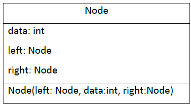<p>
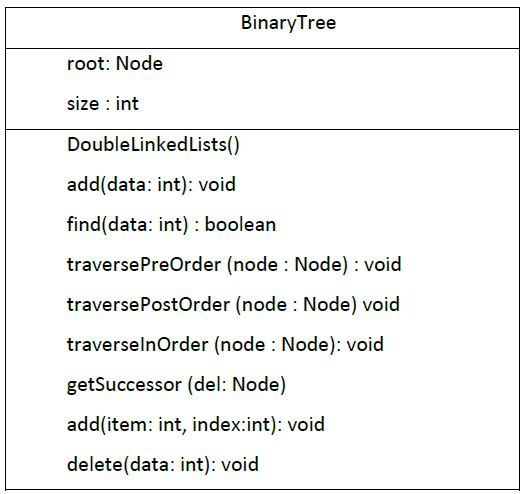<p>

1. Buatlah class Node, BinaryTree dan BinaryTreeMain<p>
    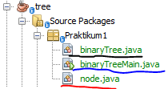<p>
2. Di dalam class Node, tambahkan atribut data, left dan right, serta konstruktor
default dan berparameter.

    ```java
    package Praktikum1;
    /**
    *
    * @author Alvian
    */
    public class node {
        int data;
        node left;
        node right;
    
        public node(){
        
        }
        public node (int data){
            this.left = null;
            this.data = data;
            this.right = null;
        }
    }
    ```

3. Di dalam class BinaryTree, tambahkan atribut root.

    ```java
    package Praktikum1;
    /**
    *
    * @author Alvian
    */
    public class binaryTree {
        node root;
    ```

4. Tambahkan konstruktor default dan method isEmpty() di dalam class BinaryTree

    ```java
    public binaryTree(){
        root = null;
    }
    boolean isEmpty(){
        return root == null;
    }
    ```

5. Tambahkan method add() di dalam class BinaryTree. Di bawah ini proses
penambahan node tidak dilakukan secara rekursif, agar lebih mudah dilihat alur
proses penambahan node dalam tree. Sebenarnya, jika dilakukan dengan proses
rekursif, penulisan kode akan lebih efisien.

    ```java
    void add(int data){
        if(isEmpty()){ //tree is empty
            root = new node(data);
        }else{
            node current = root;
            while(true){
                if(data<current.data){
                    if(current.left != null){
                        current = current.left;
                    }else{
                        current.left = new node(data);
                        break;
                    }
                }else if(data>current.data){
                    if(current.right != null){
                        current = current.right;
                    }else{
                        current.right = new node(data);
                        break;
                    }
                }else{// data is alredy exist
                    break;
                }
            }
        }
    }
    ```

6. Tambahkan method find()

    ```java
    boolean find(int data){
        boolean hasil = false;
        node current = root;
        
        while(current != null){
            if(current.data == data){
                hasil = true;
                break;
            }else if(data < current.data){
                current = current.left;
            }else{
                current = current.right;
            }
        }
        return hasil;
    }
    ```

7. Tambahkan method traversePreOrder(), traverseInOrder() dan
traversePostOrder(). Method traverse digunakan untuk mengunjungi dan
menampilkan node-node dalam tree, baik dalam mode pre-order, in-order
maupun post-order.

    ```java
    void traversePreOrder(node node){
        if(node != null){
            System.out.print(" "+node.data);
            traversePreOrder(node.left);
            traversePreOrder(node.right);
        }
    }
    void traversePostOrder(node node){
        if(node != null){
            traversePostOrder(node.left);
            traversePostOrder(node.right);
            System.out.print(" "+node.data);
        }
    }
    void traverseInOrder(node node){
        if(node != null){
            traverseInOrder(node.left);
            System.out.print(" "+node.data);
            traverseInOrder(node.right);
        }
    }
    ```

8. Tambahkan method getSuccessor(). Method ini akan digunakan ketika proses
penghapusan node yang memiliki 2 child.

    ```java
    node getSuccessor(node del){
        node successor = del.right;
        node successorParent = del;
        while(successor.left != null){
            successorParent = successor;
            successor = successor.left;
        }
        if(successor != del.right){
            successorParent.left = successor.right;
            successor.right = del.right;
        }
        return successor;
    }
    ```

9. Tambahkan method delete().
    ```java
    void delete(int data){
    ```

    Di dalam method delete tambahkan pengecekan apakah tree kosong, dan jika tidak cari posisi node yang akan di hapus.

    ```java
    void delete(int data){
        if(isEmpty()){
            System.out.println("Tree Is Empty!");
            return;
        }
        //find node (current) that will be deleted
        node parent = root;
        node current = root;
        boolean isLeftChild = false;
        while(current != null){
            if(current.data == data){
                break;                
            }else if(data<current.data){
                parent = current;
                current = current.left;
                isLeftChild = true;
            }else if(data>current.data){
                parent = current;
                current = current.right;
                isLeftChild = false;
            }
        }
    ```

    Kemudian tambahkan proses penghapusan terhadap node current yang telah ditemukan.

    ```java
        //deletion
        if(current==null){
            System.out.println("Couldn't find data!");
            return;
        }else{
            //if there is no child, simply delete it
            if(current.left==null &&current.right==null){
                if(current==root){
                    root = null;
                }else{
                    if(isLeftChild){
                        parent.left = null;
                    }else{
                        parent.right = null;
                    }
                }
            }else if(current.left == null){//if there is 1 child(right)
                if(current==root){
                    root = current.right;
                }else{
                    if(isLeftChild){
                        parent.left = current.right;
                    }else{
                        parent.right = current.right;
                    }
                }
            }else if(current.right == null){//if there is 1 child(left)
                if(current==root){
                    root = current.left;
                }else{
                    if(isLeftChild){
                        parent.left = current.left;
                    }else{
                        parent.right = current.left;
                    }
                }
            }else{//if there is 2 childs
                node successor = getSuccessor(current);
                if(current==root){
                    root = successor;
                }else{
                    if(isLeftChild){
                        parent.left = successor;
                    }else{
                        parent.right = successor;
                    }
                    successor.left = current.left;
                }
            }
        }
    ```

10. Buka class BinaryTreeMain dan tambahkan method main().
    ```java
    package Praktikum1;
    /**
    *
    * @author Alvian
    */
    public class binaryTreeMain {
        /**
        * @param args the command line arguments
        */
        public static void main(String[] args) {
            binaryTree bt = new binaryTree();
        
            bt.add(6);
            bt.add(4);
            bt.add(8);
            bt.add(3);
            bt.add(5);
            bt.add(7);
            bt.add(9);
            bt.add(10);
            bt.add(15);
        
            bt.traversePreOrder(bt.root);
            System.out.println("");
            bt.traverseInOrder(bt.root);
            System.out.println("");
            bt.traversePostOrder(bt.root);
            System.out.println("");
            System.out.println("Find "+bt.find(5));
            bt.delete(8);
            bt.traversePreOrder(bt.root);
            System.out.println("");
        }
    }
    ```

11. Compile dan jalankan class BinaryTreeMain untuk mendapatkan simulasi jalannya
program tree yang telah dibuat.
12. Amati hasil running tersebut.

<br>

### **13.3.2 Verifikasi Hasil Percobaan**
Setelah saya melakukan RUN kode program diatas didapatkan hasil run sama seperti gambar dibawah ini<p>
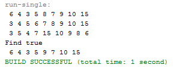<p>

<br>

### **13.2.3 Pertanyaan Percobaan**
1. Mengapa dalam binary search tree proses pencarian data bisa lebih efektif dilakukan dibanding binary tree biasa?<p>
    >**Jawab**<p>
    >Karena pada Binary Search Tree node disusun sudah secara berurutan (Pohon Biner terurut), yang mana penempatan data berdasarkan Left Child akan selalu lebih kecil dari node induk, dan right child akan selalu lebih besar dari node induk<p>

2. Untuk apakah di class Node, kegunaan dari atribut left dan right?<p>
    >**Jawab**<p>
    >pada class node atribut left berfungsi untuk menyimpan "left child" atau nilai yang lebih kecil dari root (node induk) dan atribut right berfungsi untuk menyimpan "right child" atau nilai yang lebih besar dari root (node induk)<p>

3.  a. Untuk apakah kegunaan dari atribut root di dalam class BinaryTree?<p>
    b. Ketika objek tree pertama kali dibuat, apakah nilai dari root?<p>
    >**Jawab**<p>
    >a. untuk menyimpan data yang berada pada bagian paling atas tree (root)<p>
    >b. ketika objek tree pertama kali dibuat nilai dari root bernilai null, karena masih belum ada data yang dimasukan<p>

4. Ketika tree masih kosong, dan akan ditambahkan sebuah node baru, proses apa yang akan terjadi?<p>
    >**Jawab**<p>
    >akan terjadi proses add()<p> 
    >atau juga disebut operasi Insert (Operasi penambahan data/node pada tree)

5. Perhatikan method add(), di dalamnya terdapat baris program seperti di bawah ini. Jelaskan secara detil untuk apa baris program tersebut?<p>
    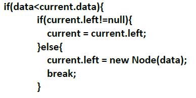<p>
    >**Jawab**<p>
    >jika data yang dinputkan lebih kecil dari data yang sudah ada (current.data), maka atribut current akan menyimpan nilai dari current left atau current left akan menadi induk dari data yang baru dimasukkan, dan apabila current left bersifat kosong maka data baru yang dimasukkan akan menjadi current left atau left-child<p>

<br>

## **13.3  Implementasi binary tree dengan array**
Waktu percobaan: 45 menit

<br>

### **13.3.1 Langkah-langkah Percobaan**
1. Di dalam percobaan implementasi binary tree dengan array ini, data tree disimpan dalam array dan langsung dimasukan dari method main(), dan selanjutnya akan disimulasikan proses traversal secara inOrder.
2. Buatlah class BinaryTreeArray dan BinaryTreeArrayMain<p>
    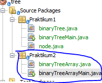<p>
3. Buat atribut data dan idxLast di dalam class BinaryTreeArray. Buat juga method
populateData() dan traverseInOrder().

    ```java
    package Praktikum2;
    /**
    *
    * @author Alvian
    */
    public class binaryTreeArray {
        int[] data;
        int idxLast;
    
        public binaryTreeArray(){
            data = new int [10];
        }
        void populateData(int data[], int idxLast){
            this.data = data;
            this.idxLast = idxLast;
        }
        void traverseInOrder(int idxStart){
            if(idxStart <= idxLast){
                traverseInOrder(2*idxStart+1);
                System.out.print(data[idxStart]+" ");
                traverseInOrder(2*idxStart+2);
            }
        }
    }
    ```

4. Kemudian dalam class BinaryTreeArrayMain buat method main() seperti gambar
berikut ini.

    ```java
    package Praktikum2;
    /**
    *
    * @author Alvian
    */
    public class binaryTreeArrayMain {
        /**
        * @param args the command line arguments
        */
        public static void main(String[] args) {
            binaryTreeArray bta = new binaryTreeArray();
            int [] data = {6,4,8,3,5,7,9,0,0,0};
            int idxLast = 6;
            bta.populateData(data, idxLast);
            bta.traverseInOrder(0);
        }
    }
    ```
5. Jalankan class BinaryTreeArrayMain dan amati hasilnya!

<br>

### **13.3.2 Verifikasi Hasil Percobaan**
Setelah saya melakukan RUN kode program diatas didapatkan hasil run seperti berikut ini<p>
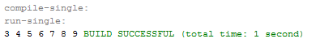<p>

<br>

### **13.3.3 Pertanyaan Percobaan**
1. Apakah kegunaan dari atribut data dan idxLast yang ada di classBinaryTreeArray?<p>
    > **Jawab**<p>
    >- atribut data bergusngi untuk menyimpan data array<p>
    >- idx last berfusngsi untuk menyimpan batas index

2. Apakah kegunaan dari method populateData()?<p>
    > **Jawab**<p>
    >method populateDate() berfungsi untuk menunjukkan data pada idxLast<p>

3. Apakah kegunaan dari method traverseInOrder()?<p>
    > **Jawab**<p>
    >method traverseInOrder() berfungsi untuk menelusuri tree dengan metode in order dengan perinsip (left Visit Right)<p>

4. Jika suatu node binary tree disimpan dalam array indeks 2, maka di indeks berapakah posisi left child dan rigth child masin-masing?<p>
    > **Jawab**<p>
    >jika array dimulai dari 0 maka didapati seperti dibawah ini<p>
    >- Left child = indeks ke 5
    >- Right child = indeks ke 6

5. Apa kegunaan statement int idxLast = 6 pada praktikum 2 percobaan nomor 4?
    > **Jawab**<p>
    >berfungsi untuk menunjukkan idxLast atau batas indeks arraynya adalah 6<p>

<br>


## **13.4 Tugas Praktikum**
Waktu pengerjaan: 90 menit

1. Buat method di dalam class BinaryTree yang akan menambahkan node dengan cara rekursif.
    
    **JAWAB**<p>
    KODE PROGRAM<p>
    ```java
    void addNodeR(int key){
        root = addNodeR(root, key);
    }
    //SOAL NO 1
    public node addNodeR(node current, int data){
        if (current == null){
            return new node(data);
        }
        if (data < current.data){
            current.left = addNodeR(current.left, data);
        }else if(data > current.data){
            current.right = addNodeR(current.right, data);
        }else{
            return current;
        }
        return current;
    }
    ```
    Output<p>
    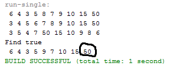<p>

    <br>

2. Buat method di dalam class BinaryTree untuk menampilkan nilai paling kecil dan yang paling besar yang ada di dalam tree.<p>
     **JAWAB**<p>
    KODE PROGRAM<p>
    ```java
    //SOAL NO 2
    void maksimal(){
        node current = root;
        while(current.right != null){
            current = current.right;
        }
        System.out.println(current.data);
    }
    void minimal(){
        node current = root;
        while(current.left != null){
            current = current.left;
        }
        System.out.println(current.data);
    }
    ```
    Output<p>
    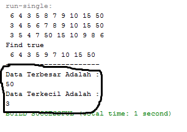<p>
    
    <br>

3. Buat method di dalam class BinaryTree untuk menampilkan data yang ada di leaf.

    **JAWAB**<p>
    KODE PROGRAM<p>
    ```java
    //Soal NO 3
    void printLeft(node root){
        if(root == null){
        return;            
        }
        if(root.left == null && root.right == null){
            System.out.print(" "+ root.data);
            return;
        }if(root.left != null){
            printLeft(root.left);
        }if(root.right != null){
            printLeft(root.right);
        }
    }
    ```
    Output<p>
    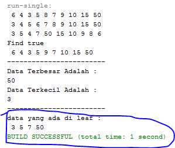<p>

    <br>

4. Buat method di dalam class BinaryTree untuk menampilkan berapa jumlah leaf yang ada di dalam tree.

     **JAWAB**<p>
    KODE PROGRAM<p>
    ```java
     //Soal NO 4
    int jumlahLeft(){
        return jumlahLeft(root);
    }
    int jumlahLeft(node node){
        if(node == null){
            return 0;
        }
        if(node.left == null && node.right == null){
            return 1;
        }else{
            return jumlahLeft(node.left)+jumlahLeft(node.right);
        }
    }
    ```
    Output<p>
    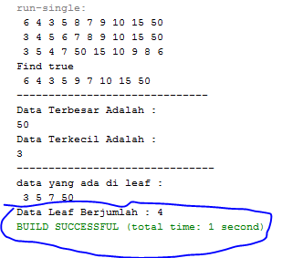<p>

    <br>

5. Modifikasi class BinaryTreeArray, dan tambahkan :
    • method add(int data) untuk memasukan data ke dalam tree
    • method traversePreOrder() dan traversePostOrder()

    **JAWAB**<p>
    KODE PROGRAM<p>
    class "binaryTreeArray" 
    ```java
    package Praktikum2;
    /**
    *
    * @author Alvian
    */
    public class binaryTreeArray {
        int[] data;
        int idxLast;
    
        public binaryTreeArray(){
            data = new int [10];
        }
        void populateData(int data[], int idxLast){
            this.data = data;
            this.idxLast = idxLast;
        }
        void traverseInOrder(int idxStart){
            if(idxStart <= idxLast){
                traverseInOrder(2*idxStart+1);
                System.out.print(data[idxStart]+" ");
                traverseInOrder(2*idxStart+2);
            }
        }
        //SOAL No 5
        void add(int data){
            if(idxLast == this.data.length -1){
                System.out.println("Tree Array sudah Penuh");
            }else{
                this.data[++idxLast] = data;
            }
        }
        void traversePreOrder(int idxStart){
            if(idxStart <= idxLast){
                System.out.print(" "+data[idxStart]);
                traversePreOrder(2 * idxStart + 1);
                traversePreOrder(2 * idxStart + 2);
            }
        }
        void traversePostOrder(int idxStart){
            if(idxStart <= idxLast){
                traversePostOrder(2 * idxStart + 1);
                traversePostOrder(2 * idxStart + 2);
                System.out.print(" "+data[idxStart]);
            }
        }
    }
    ```
    main class "binaryTreeArrayMain"<p>
    ```java
    package Praktikum2;
    /**
    *
    * @author Alvian
    */
    public class binaryTreeArrayMain {
        /**
        * @param args the command line arguments
        */
        public static void main(String[] args) {
            binaryTreeArray bta = new binaryTreeArray();
            int [] data = {6,4,8,3,5,7,9,0,0,0};
            int idxLast = 6;
            bta.populateData(data, idxLast);
            bta.traverseInOrder(0);
        
            System.out.println("\n-------------------------------");
            System.out.println("     Hasil Tugas NO 5          ");
            System.out.println("-------------------------------");
            bta.add(90);
            bta.add(72);
            System.out.println("method traverse PreOrder");
            bta.traversePreOrder(0);
            System.out.println();
            System.out.println("method traverse PostOrder");
            bta.traversePostOrder(0);
            System.out.println();
        }
    }
    ```
    Output<p>
    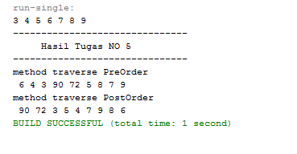<p>

    <br>
   
----------------------------
Terima Kasih<p>
Alvian Nur Firdaus | TI-1F | 2141720022 | Politeknik Negeri Malang<p>
copyright @2022 
_______________
