# **Laporan Praktikum**
# **Jobseat XII Graph**

## **Data Mahasiswa**
><p>Nama : Alvian Nur Firdaus<p>
>Kelas : 1F<p>
>Prodi : D-IV Teknik Inormatika<p>
>Jurusan : Teknologi Inormasi<p>
>Politeknik Negri Malang

<br>

## **14.1 Tujuan Praktikum**
Setelah melakukan praktikum ini, mahasiswa mampu:
1. memahami model graph;
2. membuat dan mendeklarasikan struktur algoritma graph;
3. menerapkan algoritma dasar graph dalam beberapa studi kasus.

<br>

## **14.2 Implementasi Graph menggunakan Linked List**
### **14.2.1 Langkah-langkah Percobaan**
Waktu percobaan (30 menit)<p>
Pada percobaan ini akan diimplementasikan Graph menggunakan Linked Lists untuk
merepresentasikan graph adjacency. Silakan lakukan langkah-langkah praktikum sebagai berikut.<p>

1. Buatlah class Node, dan class Linked Lists sesuai dengan praktikum Double Linked Lists.

    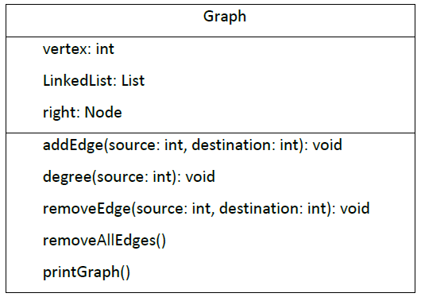<p>
    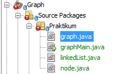<p>

2. Tambahkan class Graph yang akan menyimpan method-method dalam graph dan juga
method main().

    ```java
    public class graph {
    
    }
    ```

3. Di dalam class Graph, tambahkan atribut vertex bertipe integer dan list[] bertipe LinkedList.

    ```java
    public class graph {
        int vertex;
        linkedList list[];
    ```

4. Tambahkan konstruktor default untuk menginisialisasi variabel vertex dan menambahkan perulangan untuk jumlah vertex sesuai dengan jumlah length array yang telah ditentukan.

    ```java
    public graph(int vertex){
        this.vertex = vertex;
        list = new linkedList[vertex];
        for(int i=0; i<vertex; i++){
            list[i] = new linkedList();
        }
    }
    ```

5. Tambahkan method addEdge(). Jika yang akan dibuat adalah graph berarah, maka yang dijalankan hanya baris pertama saja. Jika graph tidak berarah yang dijalankan semua baris pada method addEdge().

    ```java
    public void addEdge(int source, int destination){
        //add edge
        list[source].addFirst(destination);
        
        //add back edge(for undirected)
        list[destination].addFirst(source);
    }
    ```

6. Tambahkan method degree() untuk menampilkan jumlah derajat lintasan pada suatu vertex. Di dalam metode ini juga dibedakan manakah statement yang digunakan untuk graph berarah atau graph tidak berarah. Eksekusi hanya sesuai kebutuhan saja.

    ```java
    public void degree(int source)throws Exception{
        //degree directed graph
        System.out.println("Degree vertex "+source +" : "+list[source].size());
        
        //degree directed graph
            //inDegree
        int k, totalIn =0, totalOut = 0;
        for(int i=0; i<vertex; i++){
            for(int j=0; j<list[i].size(); j++){
                if(list[i].get(j)==source)
                    ++totalIn;
            }
            //outDegree
            for(k=0; k<list[source].size(); k++){
                list[source].get(k);
            }
            totalOut = k;
        }
        System.out.println("Indegree dari vertex "+source+" : "+totalIn);
        System.out.println("Outdegree dari vertex "+ source+" : "+totalOut);
        System.out.println("degree vertex "+source+" : "+(totalIn+totalOut));
    }
    ```

7. Tambahkan method removeEdge(). Method ini akan menghapus lintasan ada suatu graph. Oleh karena itu, dibutuhkan 2 parameter untuk menghapus lintasan yaitu source dan destination.

    ```java
    public void removeEdge(int source, int destination)throws Exception{
        for(int i=0; i<vertex; i++){
            if(i==destination){
                list[source].remove(destination);
            }
        }
    }
    ```

8. Tambahkan method removeAllEdges() untuk menghapus semua vertex yang ada di dalam
graph.

    ```java
    public void removeAllEdges(){
        for(int i=0; i<vertex; i++){
            list[i].clear();
        }
        System.out.println("Graph berhasil dikosongkan");
    }
    ```

9. Tambahkan method printGraph() untuk mencatak graph ter-update.
    ```java
    public void printGraph() throws Exception{
        for(int i=0; i<vertex; i++){
            if(list[i].size()>0){
                System.out.print("Vertex "+ i+ "terhubung dengan : ");
                for(int j=0; j<list[i].size(); j++){
                    System.out.print(list[i].get(j)+" ");
                }
                System.out.println("");
            }
        }
        System.out.println(" ");
    }
    ```

10. Compile dan jalankan method main() dalam class Graph untuk menambahkan beberapa edge pada graph, kemudian tampilkan. Setelah itu keluarkan hasilnya menggunakan pemanggilan method main(). Keterangan: degree harus disesuaikan dengan jenis graph yang telah dibuat (directed/undirected).

    ```java
    package Praktikum;
    /**
    *
    * @author Alvian
    */
    public class graphMain {
        /**
        * @param args the command line arguments
        */
        public static void main(String[] args) throws Exception {
            graph grp = new graph(6);
        
            grp.addEdge(0, 1);
            grp.addEdge(0, 4);
            grp.addEdge(1, 2);
            grp.addEdge(1, 3);
            grp.addEdge(1, 4);
            grp.addEdge(2, 3);
            grp.addEdge(3, 4);
            grp.addEdge(3, 0);
        
            grp.removeEdge(1, 2);
            grp.printGraph();
        
            grp.degree(2);
            System.out.println("");
            grp.printGraph();
        }
    }
    ```

11. Amati hasil running tersebut.

12. Tambahkan pemanggilan method removeEdge() sesuai potongan code di bawah ini pada method main(). Kemudian tampilkan graph tersebut.
    ```java
    grp.removeEdge(1, 2);
    grp.printGraph();
    ```

13. Amati hasil running tersebut.

14. Uji coba penghapusan lintasan yang lain! Amati hasilnya!


<br>

### **14.3.2 Verifikasi Hasil Percobaan**
Setelah saya melakukan RUN kode program diatas didapatkan hasil run sama seperti gambar dibawah ini<p>

>Hasil Runing Langkah ke -11<p>
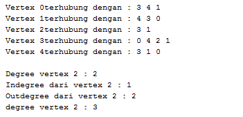<p>

>Hasil Runing Langkah ke -13<p>
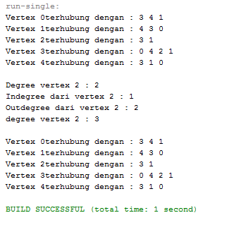<p>

<br>

### **14.2.3 Pertanyaan Percobaan**
1. Sebutkan beberapa jenis (minimal 3) algoritma yang menggunakan dasar Graph, dan apakah kegunaan algoritma-algoritma tersebut?<p>
    >**Jawab**<p>
    >- Algoritma Prim, kegunaannya adalah mencari pohon rentang minimum untuk sebuah graf berbobot yang terhubung. Ini berarti menemukan subset dari tepi yang membentuk sebuah pohon yang mencakup etiap titik, di mana berat total semua tepi di pohon diminimalkan. Jika grafik tidak terhubung, maka ia menemukan hutan rentang minimum (pohon rentang minimum untuk setiap komponen terhubung).<p>
    >- Algoritma Dijkstra, kegunaannya adalah dipakai dalam memecahkan permasalahan jarak terpendek (shortest path problem) untuk sebuah graf berarah (directed graph)<p>
    >- Algoritma Warshall , kegunaannya menghitung jarak terpendek (shortest path) untuk semua pasangan titik pada sebuah graph, dan melakukannya dalam waktu berorde kubik. Algoritma warshall digunakan untuk menyelesaikan permasalahan jalur terpendek multi path<p>

2. Pada class Graph terdapat array bertipe LinkedList, yaitu LinkedList list[]. Apakah tujuan pembuatan variabel tersebut ?<p>
    >**Jawab**<p>
    >berfungsi untuk di Untuk memanggil fungsi linked list dan mengisi list yang berupa vertex pada linked list tersebut.<p>

3.  Apakah alasan pemanggilan method addFirst() untuk menambahkan data, bukan method add jenis lain pada linked list ketika digunakan pada method addEdge pada class Graph?<p>
    >**Jawab**<p>
    >Alasannya adalah Untuk mengenalkan vertex tersebut dan koneksinya

4. Bagaimana cara mendeteksi prev pointer pada saat akan melakukan penghapusan suatu edge pada graph ?<p>
    >**Jawab**<p>
    >dengan cara ketika i == destination maka akan dilihat source dari i atau dengan cara melakukan looping vertex.<p>

5. Kenapa pada praktikum 2.1.1 langkah ke-12 untuk menghapus path yang bukan merupakan lintasan pertama kali menghasilkan output yang salah ? Bagaimana solusinya ?<p>
    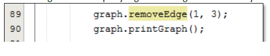<p>
    >**Jawab**<p>
    >output program diatas tidak ada yang eror, akan tetapi vertex yang dilewati mengalami perubahan lintasan<p>

<br>

## **14.3  Implementasi Graph menggunakan Matriks**
Kegiatan praktikum 2 merupakan implementasi Graph dengan Matriks. Silakan lakukan langkahlangkah percobaan praktikum berikut ini, kemudian verifikasi hasilnya. Setelah itu jawablah pertanyaan terkait percobaan yang telah Anda lakukan.

<br>

### **14.3.1 Langkah-langkah Percobaan**
Waktu percobaan: 30 menit<p>
Pada praktikum 2.2 ini akan diimplementasikan Graph menggunakan matriks untuk merepresentasikan graph adjacency. Silakan lakukan langkah-langkah praktikum sebagai berikut.<p>

1. Uji coba graph bagian 2.2 menggunakan array 2 dimensi sebagai representasi graph. Buatlah class graphArray yang didalamnya terdapat variabel vertices dan array twoD_array! <p>

    ```java
    public class graphArray {
        private final int vertices;
        private final int [][] twoD_array;
    ```

2. Buatlah konstruktor graphArray sebagai berikut!

    ```java
    public graphArray(int v){
       vertices = v;
       twoD_array = new int [vertices + 1][vertices + 1];
    }
    ```

3. Untuk membuat suatu lintasan maka dibuat method makeEdge() sebagai berikut..

    ```java
    public void makeEdge(int to, int from, int edge){
       try{
           twoD_array[to][from] = edge;
       }
       catch(ArrayIndexOutOfBoundsException index){
           System.out.println("Vertex Tidak Ada");
       }
   }
    ```
    Untuk menampilkan suatu lintasan diperlukan pembuatan method getEdge() berikut.

    ```java
    public int getEdge(int to, int from){
       try{
           return twoD_array[to][from];
       }
       catch(ArrayIndexOutOfBoundsException index){
           System.out.println("Vertex Tidak Ada");
       }
       return -1;
    }
    ```

4. Kemudian buatlah method main() seperti berikut ini.

    ```java
    package Praktikum2;
    import java.util.Scanner;
    /**
    *
    * @author Alvian
    */
    public class graphArrayMain {
        /**
        * @param args the command line arguments
        */
        public static void main(String[] args) {
            int v, e, count = 1, to = 0, from = 0;
            Scanner sc = new Scanner(System.in);
            graphArray graph;
        
            try{
                System.out.print("Masukkan Jumlah Vertices\t: ");
                v = sc.nextInt();
                System.out.print("Masukkan Jumlah Edges\t\t: ");
                e = sc.nextInt();
            
                graph = new graphArray(v);
            
                System.out.println("Masukkan edges : <to> <from>");
                while (count <= e){
                    to = sc.nextInt();
                    from = sc.nextInt();
                
                    graph.makeEdge(to, from, 1);
                    count++;
                }
                System.out.println("Array 2D sebagai representasi graph sbb: ");
                System.out.print("");
                for(int i =1; i<=v; i++){
                    System.out.print(i+" ");
                }
                System.out.println();
            
                for(int i =1; i<=v; i++){
                    System.out.print(i+" ");
                    for(int j=1; j<=v; j++){
                        System.out.print(graph.getEdge(i, j)+" ");
                    }
                    System.out.println();
                }
            }catch(Exception E){
                System.out.println("Error. Silahkan cek kembali\n"+ E.getMessage());
            }
            sc.close();
        }
    }
    ```
5. Jalankan class graphArray dan amati hasilnya!

<br>

### **14.3.2 Verifikasi Hasil Percobaan**
Setelah saya melakukan RUN kode program diatas didapatkan hasil run seperti berikut ini<p>
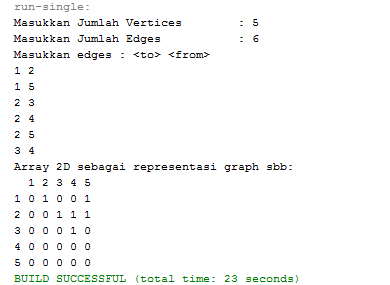<p>

<br>

### **14.3.3 Pertanyaan Percobaan**
1. Apakah perbedaan degree/derajat pada directed dan undirected graph?<p>
    > **Jawab**<p>
    >pada directed graph degree / derajat tidak selalu berhubungan kembali sedangkan pada undirected graph degree/derajat pasti berhubungan <p>

2. Pada implementasi graph menggunakan adjacency matriks. Kenapa jumlah vertices harus ditambahkan dengan 1 pada indeks array berikut?<p>
    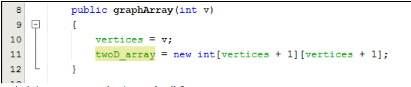<p>
    > **Jawab**<p>
    >karena menggunakan array dan dimulai dari 0, maka harus perlu ditambah dengan 1<p>

3. Apakah kegunaan method getEdge() ?<p>
    > **Jawab**<p>
    >method getEdge berfungsi untuk menampilkan suatu lintasan yang diperlukan <p>

4. Termasuk jenis graph apakah uji coba pada praktikum 2.2?<p>
    > **Jawab**<p>
    >jenis graph diatas adalah "Directed graph" karena 1 berhubungan dengan 2 akan tetapi 2 tidak berhubungan dengan 1<P>

5. Mengapa pada method main harus menggunakan try-catch Exception ?
    > **Jawab**<p>
    >agar saat terjadi eror, eksekusi program dapat terus berjalan tanpa memberhentikan program sehingga meminimalisir terjadinya eror atau output tidak muncul<p>

<br>


## **14.4 Tugas Praktikum**

1. Ubahlah lintasan pada praktikum 2.1 menjadi inputan!
    
    **JAWAB**<p>
    yang saya ubah adalah class main "graphMain" seperti dibawah ini<p>
    ```java
    package Praktikum;
    import java.util.Scanner;
    /**
    *
    * @author Alvian
    */
    public class graphMain {
        /**
        * @param args the command line arguments
        */
        public static void main(String[] args) throws Exception {
            int vertex, edge, source, destination;
            Scanner sc = new Scanner(System.in);
        
            graph grp = new graph(6);
        
            System.out.print("Masukkan Vertex\t\t: ");
            vertex = sc.nextInt();
        
            System.out.print("Masukkan Edge\t\t: ");
            edge = sc.nextInt();

            System.out.println("===========================");
        
            for(int i=0; i<edge; i++){
                System.out.print("Masukkan Source\t\t: ");
                source = sc.nextInt();
                System.out.print("Masukkan Destination\t: ");
                destination = sc.nextInt();
            
                grp.addEdge(source, destination);
            }

            System.out.println("");
            grp.printGraph();
        }
    }
    ```
    Berikut adalah Main class nya 
    ```java
    package Praktikum;
    import java.util.Scanner;
    /**
    *
    * @author Alvian
    */
    public class graphMain {
        /**
        * @param args the command line arguments
        */
        public static void main(String[] args) throws Exception {
            Scanner sc = new Scanner(System.in);
            int vertex, edge, source, destination;
            graph grp = new graph(6);
        
            System.out.print("Masukkan Vertex\t\t: ");
            vertex = sc.nextInt();
        
            System.out.print("Masukkan Edge\t\t: ");
            edge = sc.nextInt();
        
            int menu;
            do{
                System.out.println("Pilih menu dibawah ini");
                System.out.println("1. Directed(Tugas Praktikum 1)\n2. Undirected(Tugas Pratikum 2)");
                System.out.print("Masukkan Menu : ");
                menu = sc.nextInt();
            
                if(menu == 1){
                    
                    for(int i=0; i<edge; i++){
                        System.out.print("Masukkan Source\t\t: ");
                        source = sc.nextInt();
                        System.out.print("Masukkan Destination\t: ");
                        destination = sc.nextInt();
            
                        grp.addEdge(source, destination);
                    }
                    System.out.println("");
                    grp.printGraph();
                }else if(menu == 2){
                
                    for(int i=0; i<edge; i++){
                        System.out.print("Masukkan Source\t\t: ");
                        source = sc.nextInt();
                        System.out.print("Masukkan Destination\t: ");
                        destination = sc.nextInt();
            
                        grp.graphType(source, destination);
                    }
                }
            }while (menu != 1 && menu != 2);
        }
    }
    ```
    Output<p>
    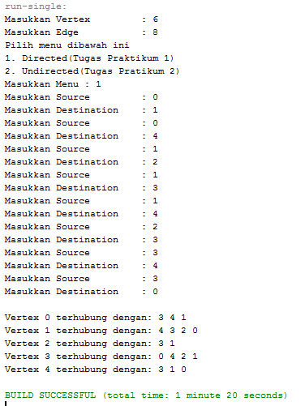<p>

    <br>

2. Tambahkan method graphType dengan tipe boolean yang akan membedakan graph termasuk directed atau undirected graph. Kemudian update seluruh method yang berelasi dengan method graphType tersebut (hanya menjalankan statement sesuai dengan jenis graph) pada praktikum 2.1<p>

     **JAWAB**<p>
    KODE PROGRAM<p>
    ```java
    //no 2
    public boolean graphType(int source, int destination) throws Exception{
        list[source].addFirst(destination);
        return true;
    }
    ```
    Berikut adalah Main class nya
    ```java
        package Praktikum;
    import java.util.Scanner;
    /**
    *
    * @author Alvian
    */
    public class graphMain {
        /**
        * @param args the command line arguments
        */
        public static void main(String[] args) throws Exception {
            Scanner sc = new Scanner(System.in);
            int vertex, edge, source, destination;
            graph grp = new graph(6);
        
            System.out.print("Masukkan Vertex\t\t: ");
            vertex = sc.nextInt();
        
            System.out.print("Masukkan Edge\t\t: ");
            edge = sc.nextInt();
        
            int menu;
            do{
                System.out.println("Pilih menu dibawah ini");
                System.out.println("1. Directed(Tugas Praktikum 1)\n2. Undirected(Tugas Pratikum 2)");
                System.out.print("Masukkan Menu : ");
                menu = sc.nextInt();
            
                if(menu == 1){
                    
                    for(int i=0; i<edge; i++){
                        System.out.print("Masukkan Source\t\t: ");
                        source = sc.nextInt();
                        System.out.print("Masukkan Destination\t: ");
                        destination = sc.nextInt();
            
                        grp.addEdge(source, destination);
                    }
                    System.out.println("");
                    grp.printGraph();
                }else if(menu == 2){
                
                    for(int i=0; i<edge; i++){
                        System.out.print("Masukkan Source\t\t: ");
                        source = sc.nextInt();
                        System.out.print("Masukkan Destination\t: ");
                        destination = sc.nextInt();
            
                        grp.graphType(source, destination);
                    }
                }
            }while (menu != 1 && menu != 2);
        }
    }
    ```
    Output<p>
    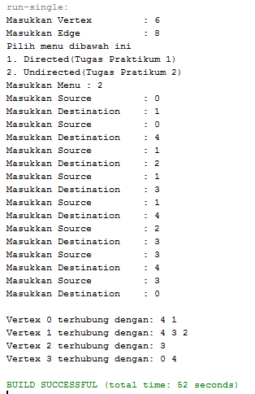<p>
    
    <br>

3. Modifikasi method removeEdge() pada praktikum 2.1 agar tidak menghasilkan output yang salah untuk path selain path pertama kali!

    **JAWAB**<p>
    KODE PROGRAM<p>
    ```java
    //NO 3
    public void removeEdge(int source, int destination) throws Exception {
        for (int i = 0; i< vertex; i++) {
            if (i == destination) {
                list[source].remove(destination);
            }
        }
    }
    ```
    Output<p>
    output program diatas tidak ada yang eror, akan tetapi vertex yang dilewati mengalami perubahan lintasan<p>

    <br>

4. Ubahlah tipe data vertex pada seluruh graph pada praktikum 2.1 dan 2.2 dari Integer menjadi tipe generic agar dapat menerima semua tipe data dasar Java! Misalnya setiap vertex yang awalnya berupa angka 0,1,2,3, dst. selanjutnya ubah menjadi suatu nama daerah seperti Gresik, Bandung, Yogya, Malang, dst.

    **JAWAB**<p>
    ## Tugas 4 A (tipe Generic Linked List)<p>
    ### Class "graph"
    ```java
    package Tugas4A;
    /**
    *
    * @author Alvian
    */
    public class graph <T> {
        T[] vertex;
        linkedList list[];

        public graph(T[] vertex) {
            this.vertex = vertex;
            list = new linkedList[vertex.length];
            for (int i = 0; i < vertex.length; i++) {
                list[i] = new linkedList();
            }
        }
        public void addEdge(int source, int destination) {
            list[source].addFirst(destination);
            list[destination].addFirst(source);
        }
        public void degree(int source) throws Exception {
            System.out.println("degree vertex " + vertex[source] + " : " + list[source].size());

            int k, totalIn = 0, totalOut = 0;
            for (int i = 0; i < vertex.length; i++) {
                for (int j = 0; j < list[i].size(); j++) {
                    if(list[i].get(j) == source)
                    ++totalIn;
                }
                for (k = 0; k < list[source].size(); k++) {
                    list[source].get(k);
                }
                totalOut = k;
            }
            System.out.println("Indegree dari vertex " + vertex[source] + " : " +totalIn);
            System.out.println("Outdegree dari vertex " + vertex[source] + " : " +totalOut);
            System.out.println("Degree vertex " + vertex[source] + " : " +(totalIn + totalOut));
        }
        public void removeEdge(int source, int destination) throws Exception {
            for (int i = 0; i < vertex.length; i++) {
                if(i==destination) {
                    list[source].remove(destination);
                }
            }
        }
        public void removeAllEdges() {
            for (int i = 0; i < vertex.length; i++) {
                list[i].clear();
            }
            System.out.println("Graph berhasil dikosongkan");
        }
        public void printGraph() throws Exception {
            for (int i = 0; i < vertex.length; i++) {
                if(list[i].size() > 0 ) {
                    System.out.print("Vertex " + vertex[i] + " terhubung dengan : ");
                    for(int j = 0; j < list[i].size(); j++) {
                        System.out.print(vertex[list[i].get(j)] + " ");
                    }
                    System.out.println("");
                }
            }
            System.out.println(" "); 
        }
        boolean graphType(int source, int destination){
            list[source].addFirst(destination);
            return true; 
        }
    }
    ```
    ### Main Class "graphMain"

    ```java
    package Tugas4A;
    import java.util.Scanner;
    /**
    *
    * @author Alvian
    */
    public class graphMain {
        /**
        * @param args the command line arguments
        */
        public static void main(String[] args) throws Exception {
            Scanner sc = new Scanner(System.in);
            System.out.print("Masukkan Vertex\t: ");
            String[] vertex = new String[sc.nextInt()];
            sc.nextLine();

            for (int i = 0; i < vertex.length; i++) {
                System.out.print("Masukkan data vertex ke-" + i + " : ");
                vertex[i] = sc.nextLine();
            }

            graph<String> gph = new graph<String>(vertex);

            System.out.print("Masukkan Edge\t\t: ");
            int edge = sc.nextInt();

            int menu;
            do {
                System.out.println("Pilih menu dibawah ini");
                System.out.println("1. Directed\n2. Undirected");
                System.out.print("Masukkan Menu : ");
                menu = sc.nextInt();

                System.out.println("Masukkan Edge: <from> <to>");
                if(menu == 1) { 
                    for (int i = 0; i < edge; i++) {
                        gph.graphType(sc.nextInt(), sc.nextInt());
                    }
                    gph.printGraph();

                } else if (menu == 2) { 
                    for (int i = 0; i < edge; i++) {;
                        gph.addEdge(sc.nextInt(), sc.nextInt());
                    }
                    gph.printGraph();
                }
            } while (menu!=1 && menu!=2);
            sc.close();
        }
    }
    ```

    ### Output 4 A (tipe Generic Linked List)<p>
    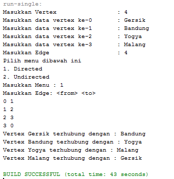<p>

    ## Tugas 4 B (tipe Generic Array)<p>
    ### Class "graphArray"
    ```java
    package Tugas4B;
    /**
    *
    * @author Alvian
    */
    public class graphArray <T> {
        private final T[] vertices;
        private final int[][] twoD_array;

        public graphArray(T[] v) {
            vertices = v;
            twoD_array = new int[vertices.length + 1][vertices.length +1];
        }

        public void makeEdge(int to, int from, int edge) {
            try {
                twoD_array[to][from] = edge;
            }
            catch (ArrayIndexOutOfBoundsException index) {
                System.out.println("Vertex tidak ada");
            }
        }
        public int getEdge(int to, int from) {
            try{
                return twoD_array[to][from];
            }
            catch (ArrayIndexOutOfBoundsException index){
                System.out.println("Vertex tidak ada");
            }
            return -1;
        }
    }
    ```
    ### Main Class "graphArrayMain"
    
    ```java
    package Tugas4B;
    import java.util.Scanner;
    /**
    *
    * @author Alvian
    */
    public class graphArrayMain {
        /**
        * @param args the command line arguments
        */
        public static void main(String[] args) {
            int v, e, count = 1, to = 0, from = 0;
            Scanner sc = new Scanner(System.in);
        
            graphArray <String> graph;
        
            try {
                System.out.print("Masukkan Jumlah Vertices\t: ");
                v = sc.nextInt();
                System.out.print("Masukkan Jumlah Edges\t\t: ");
                e = sc.nextInt();
            
                String[] vertexs = new String[v + 1]; 
                sc.nextLine();
                for (int i = 1; i <= v; i++) {
                    System.out.print("Masukkan data vertex ke-" + i + " : ");
                    vertexs[i] = sc.nextLine();
                }
                graph = new graphArray<String>(vertexs);
            
                System.out.println("Masukkan Edge: <to> <from>");
                while (count <= e) {
                    to = sc.nextInt();
                    from = sc.nextInt();
                    graph.makeEdge(to, from, 1);
                    count++;
                }
                System.out.println("Array 2D sebagai representasi graph sbb: ");
                System.out.print("\t");
                for (int i = 1; i <= v; i++) {
                    System.out.print(vertexs[i] + "\t");
                }
                System.out.println();
            
                for (int i = 1; i <= v; i++) {
                    System.out.print(vertexs[i] + "\t");
                    for (int j = 1; j <= v; j++) {
                        System.out.print(graph.getEdge(i, j) + "\t");
                    }
                    System.out.println();
                }
            } catch (Exception E) {
                System.out.println("Error, Silahkan cek kembali\n" + E.getMessage());
            }
            sc.close(); 
        }
    }
    ```
    ### Output 4 B (tipe Generic Array)<p>
    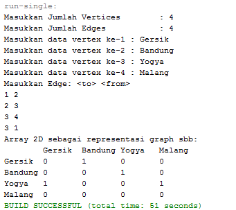<p>

    <br>
----------------------------
Terima Kasih<p>
Alvian Nur Firdaus | TI-1F | 2141720022 | Politeknik Negeri Malang<p>
copyright @2022 
_______________